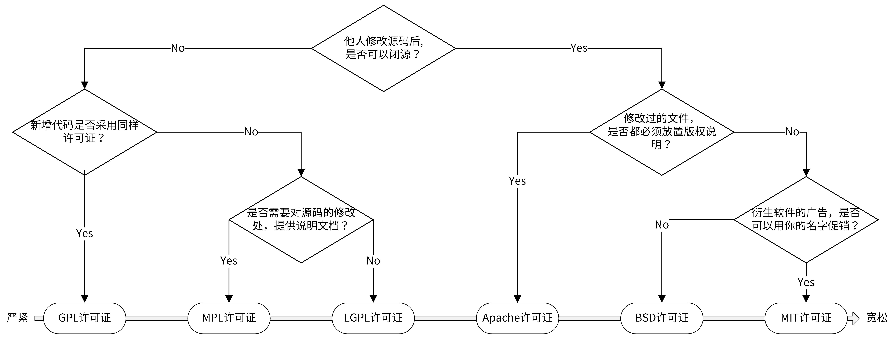

# 《Go 语言项目开发实战》分析笔记

## 第4章 规范设计（上）：项目开发杂乱无章，如何规范？

### Q1：这一章的内容属于哪一类别？

计算机/编程语言/Golang.

### Q2：这一章的内容是什么？

### Q3：这一章的大纲是什么？

- 有哪些地方需要制定规范？
- 开源规范
  - 开源协议概述
  - 开源规范具有哪些特点？
- 文档规范
  - README 规范
  - 项目文档规范
  - API 接口文档规范
- 版本规范
  - 什么是语义化版本规范（SemVer）？
  - 语义化版本控制规范
  - 如何确定版本号？
- 总结

### Q4：作者想要解决什么问题？

### Q5：这一章的关键词是什么？

### Q6：这一章的关键句是什么？

#### 有哪些地方需要制定规范？

- 非编码类规范
  - 开源规范
  - 文档规范
  - 版本规范
  - Commit 规范
  - 发布规范

- 编码类规范
  - 目录规范
  - 代码规范
  - 接口规范
  - 日志规范
  - 错误码规范

#### 开源规范

- [常用的 6 种开源规范][1]：GPL、MPL、LGPL、Apache、BSD 和 MIT。
  - GPL： General Public License，开源项目最常用的许可证，衍生代码的分发需开源并且也要遵守此协议。该协议也有很多变种，不同变种要求会略微不同。
  - MPL： Mozilla Public Licence，MPL 协议允许免费重发布、免费修改，但要求修改后的代码版权归软件的发起者，这种授权维护了商业软件的利益，它要求基于这种软件的修改无偿贡献版权给该软件。
  - LGPL： Lesser General Public Licence，是 GPL 的一个为主要为类库使用设计的开源协议。LGPL 允许商业软件通过类库引用的方式使用 LGPL 类库而不需要开源商业软件的代码。
    但是如果修改 LGPL 协议的代码或者衍生，则所有修改的代码，涉及修改部分的额外代码和衍生的代码都必须采用 LGPL 协议。
  - Apache： Apache 协议是 Apache 软件基金会发布的一个自由软件许可证，Apache 2.0 协议除了为用户提供版权许可之外，还有专利许可，非常适合涉及专利内容的项目。
  - BSD： BSD（Berkeley Software Distribution，伯克利软件发行版）。BSD 协议在软件分发方面，除需要包含一份版权提示和免责声明之外，没有任何限制，该协议还禁止用开源代码的作者/机构名字和原来产品的名字做市场推广。
  - MIT： 协议的主要内容为：该软件及其相关文档对所有人免费，可以任意处置，包括使用，复制，修改，合并，发表，分发，再授权，或者销售。唯一的限制是，软件中必须包含上述版权和许可提示。
    MIT 协议是所有开源许可中最宽松的一个，除了必须包含许可声明外，再无任何限制。

  

- [开源规范详细列表][2]
  - 项目结构：一个开源项目应该有一个合理、专业的、符合语言特色的项目结构。
  - 严格遵循代码规范：开源的代码，面向的人群是所有的开发者，一个不规范的代码，可读性差，不利于其他开发者阅读和贡献代码。
  - 代码质量：开源的代码，一定要保证代码的质量，一个低质量的代码，不仅隐藏了很多性能和功能缺陷，而且还会影响开源项目的品牌，进而影响开源效果。
  - 单元测试覆盖率：一个开源的 Go 项目，要保证整个项目的单元测试覆盖率，这样一方面可以保证代码的质量，另一方面可以使开源项目更专业，也能让你更加安心的发布版本。
  - 版本发布规范：开源项目要遵循既定的版本规范，整个项目的更新迭代，要有版本号，目前用的比较多的是语义化的版本规范。
  - 向下兼容：代码要做到向下兼容，这样可以尽可能减少发布变更的影响，遵循语义化的版本规范，可以在一定程度上保证代码的向下兼容能力。
  - 详细的文档说明：要保证代码能够被其他开发者很容易的阅读和贡献代码，所以不仅要保证文档的质量和数量，还要确保有某些需要的文档：
    - LICENSE（如果是开源项目，LICENSE 是必选的）：软件协议，声明该开源项目遵循什么软件协议。
    - README.md：README 文件，放在项目的根目录下，包含项目的描述、依赖项、安装方法、使用方法、贡献方法、作者和遵循的软件协议等。
    - CHANGELOG：目录，用来存放版本的变更历史，方便其他开发者了解新版本或旧版本的变更内容。
    - Makefile：对于一个复杂的项目，通常也会包含一个 Makefile 文件，用来对项目进行构建、测试、安装等操作。
    - CONTRIBUTING.md：用来说明如何给本项目贡献代码，包含贡献流程和流程中每个环节的详细操作。
    - docs：目录，用来存放本项目所有文档，例如：安装文档、使用文档、开发文档等。一些重要的文档，可以链接到项目根目录的 README.md 文档中。这些文档要确保开发者能够轻松的理解、部署和使用该项目。
    - examples：存放一些示例代码。
  - 安全：开源的代码，要保证整个代码库和提交记录中，不能出现类似内部 IP、内部域名、密码、密钥这类信息。
  - 完善的 examples：完善的 examples，可以帮助用户快速学习和使用开源项目。
  - 好的 Commit Message 记录：开源项目在 commit 时，要遵循一定的规范，这样其他开发者才能够快速浏览和理解变更历史，减小学习成本，本项目遵循 Angular commit message 规范。
  - 发布可用的版本：要确保每一次发布都经过充分的测试，每一个发布的版本都是可用的。
  - 持续的更新：一个好的开源项目，应该能够持续的更新功能，修复 Bug。对于一些已经结项、不维护的开源项目，需要及时的对项目进行归档，并在项目描述中加以说明。
  - 及时的处理 pull request、issue、评论等：当项目被别的开发者提交 pull request、issue、评论时，要及时的处理，一方面可以确保项目不断被更新，另一方面也可以激发其他开发者贡献代码的积极性。
  - 建立讨论小组：如果条件允许，最好和贡献者建立讨论小组，每周或每月组织讨论，共同维护。
  - 做好推广：如果有条件，可以宣传运营开源项目，让更多的人知道，更多的人用，更多的人贡献代码。例如：在掘金、简书等平台发表文章，创建 QQ、微信交流群等。
  - Git 工作流：选择合适的 Git 工作流，并遵循 GIt 工作流使用规范，例如 Gitflow 工作流。

#### 文档规范

- 项目中最重要的3类文档
  - README 文档
  - 项目文档
  - API 接口文档

- [README 文档][3]
  - 用来介绍项目的功能、安装、部署和使用等

- 项目文档
  - 开发文档：用来说明项目的开发流程，比如如何搭建开发环境、构建二进制文件、测试、部署等。
  - 用户文档：软件的使用文档，对象一般是软件的使用者，内容可根据需要添加。比如，可以包括 API 文档、SDK 文档、安装文档、功能介绍文档、最佳实践、操作指南、常见问题等。
  - 为了方便全球开发者和用户使用，开发文档和用户文档，可以预先规划好英文和中文 2 个版本。

  ```bash
  docs
  ├── devel                            # 开发文档，可以提前规划好，英文版文档和中文版文档
  │   ├── en-US/                       # 英文版文档，可以根据需要组织文件结构
  │   └── zh-CN                        # 中文版文档，可以根据需要组织文件结构
  │       └── development.md           # 开发手册，可以说明如何编译、构建、运行项目
  ├── guide                            # 用户文档
  │   ├── en-US/                       # 英文版文档，可以根据需要组织文件结构
  │   └── zh-CN                        # 中文版文档，可以根据需要组织文件结构
  │       ├── api/                     # API文档
  │       ├── best-practice            # 最佳实践，存放一些比较重要的实践文章
  │       │   └── authorization.md
  │       ├── faq                      # 常见问题
  │       │   ├── iam-apiserver
  │       │   └── installation
  │       ├── installation             # 安装文档
  │       │   └── installation.md
  │       ├── introduction/            # 产品介绍文档
  │       ├── operation-guide          # 操作指南，里面可以根据RESTful资源再划分为更细的子目录，用来存放系统核心/全部功能的操作手册
  │       │   ├── policy.md
  │       │   ├── secret.md
  │       │   └── user.md
  │       ├── quickstart               # 快速入门
  │       │   └── quickstart.md
  │       ├── README.md                # 用户文档入口文件
  │       └── sdk                      # SDK文档
  │           └── golang.md
  └── images                           # 图片存放目录
      └── 部署架构v1.png
  ```

- [API 接口文档][4]）
  - [README.md: API 接口介绍文档][5]：提供相关文档的链接、API 概览等。
  - [CHANGELOG.md: API 接口变更历史文档][6]：API 接口文档变更历史，方便进行历史回溯，也可以使调用者决定是否进行功能更新和版本更新。
  - [generic.md: 通用说明][7]：用来说明通用的请求参数、返回参数、认证方法和请求方法等。
  - [struct.md: 数据结构说明][8]：用来列出接口文档中使用的数据结构。这些数据结构可能被多个 API 接口使用，会在 user.md、secret.md、policy.md 文件中被引用。
  - [error_code.md: 错误码描述][9]：错误码描述，通过程序自动生成。
  - [API 接口使用文档][10]
    - 接口描述：描述接口实现了什么功能。
    - 请求方法：接口的请求方法，格式为 HTTP 方法；请求路径，例如 POST /v1/users。在 **通用说明** 中的 **请求方法** 部分，会说明接口的请求协议和请求地址。
    - 请求参数：接口的输入字段，它又分为 Header 参数、Query 参数、Body 参数、Path 参数。每个字段通过： **参数名称、必选、类型 和 描述** 4 个属性来描述。如果参数有限制或者默认值，可以在描述部分注明。
    - 输出参数：接口的返回字段，每个字段通过 参数名称、类型 和 描述 3 个属性来描述。
    - 请求示例：一个真实的 API 接口请求和返回示例。

#### 版本规范

- 在做 Go 项目开发时，我建议你把所有组件都加入版本机制。原因主要有两个：
  - 一是通过版本号，我们可以很明确地知道组件是哪个版本，从而定位到该组件的功能和代码，方便我们定位问题。
  - 二是发布组件时携带版本号，可以让使用者知道目前的项目进度，以及使用版本和上一个版本的功能差别等。

- [语义化版本规范（SemVer）][11]
  - GitHub 起草的一个具有指导意义的、统一的版本号表示规范。
  - 它规定了版本号的表示、增加和比较方式，以及不同版本号代表的含义。
  - 语义化版本格式为：`主版本号.次版本号.修订号（X.Y.Z）`，其中 X、Y 和 Z 为非负的整数，且禁止在数字前方补零。
  - 版本号可按以下规则递增：
    - 主版本号（MAJOR）：当做了不兼容的 API 修改。
    - 次版本号（MINOR）：当做了向下兼容的功能性新增及修改。这里有个不成文的约定需要你注意，偶数为稳定版本，奇数为开发版本。
    - 修订号（PATCH）：当做了向下兼容的问题修正。
  - 先行版本号和编译版本号
    - 举例：`v1.2.3-alpha+001`
    - 格式：`X.Y.Z[-先行版本号][+版本编译元数据]`
    - 先行版本号意味着，该版本不稳定，可能存在兼容性问题，格式为：`X.Y.Z-[一连串以句点分隔的标识符]`
    - 编译版本号，一般是编译器在编译过程中自动生成的，我们只定义其格式，并不进行人为控制。
    - 先行版本号和编译版本号只能是字母、数字，且不可以有空格。

- 语义化版本控制规范
  - 标记版本号的软件发行后，禁止改变该版本软件的内容，任何修改都必须以新版本发行。
  - 主版本号为零（0.y.z）的软件处于开发初始阶段，一切都可能随时被改变，这样的公共 API 不应该被视为稳定版。
  - 1.0.0 的版本号被界定为第一个稳定版本，之后的所有版本号更新都基于该版本进行修改。
  - 修订号 Z（x.y.Z | x > 0）必须在只做了向下兼容的修正时才递增，这里的修正其实就是 Bug 修复。
  - 次版本号 Y（x.Y.z | x > 0）必须在有向下兼容的新功能出现时递增，在任何公共 API 的功能被标记为弃用时也必须递增，当有改进时也可以递增。其中可以包括修订级别的改变。每当次版本号递增时，修订号必须归零。
  - 主版本号 X（X.y.z | X > 0）必须在有任何不兼容的修改被加入公共 API 时递增。其中可以包括次版本号及修订级别的改变。每当主版本号递增时，次版本号和修订号必须归零。

- 确定版本号的实践经验
  - 第一，在实际开发的时候，我建议你使用 0.1.0 作为第一个开发版本号，并在后续的每次发行时递增次版本号。
  - 第二，当我们的版本是一个稳定的版本，并且第一次对外发布时，版本号可以定为 1.0.0。
  - 第三，当我们严格按照 Angular commit message 规范提交代码时，版本号可以这么来确定：
    - fix 类型的 commit 可以将修订号 +1。
    - feat 类型的 commit 可以将次版本号 +1。
    - 带有 BREAKING CHANGE 的 commit 可以将主版本号 +1。

### Q7：作者是怎么论述的？

### Q8：作者解决了什么问题？

### Q9：我有哪些疑问？

### Q10：这一章说得有道理吗？为什么？

### Q11: 这一章讨论的知识的本质是什么？

### Q12: 这一章讨论的知识的第一原则是什么？

### Q13：这一章讨论的知识的结构是怎样的？

### Q14：这一章讨论的知识为什么是这样的？为什么发展成这样？为什么需要它？

### Q15：有哪些相似的知识？它们之间的联系是什么？

### Q16：其他领域/学科有没有相关的知识？日常生活中有没有类似的现象？

### Q17: 这一章对我有哪些用处/帮助/启示？

### Q18: 我如何应用这一章的知识去解决问题？

  [1]: https://github.com/marmotedu/geekbang-go/blob/master/%E5%BC%80%E6%BA%90%E5%8D%8F%E8%AE%AE%E4%BB%8B%E7%BB%8D.md
  [2]: https://github.com/marmotedu/geekbang-go/blob/master/%E5%BC%80%E6%BA%90%E8%A7%84%E8%8C%83%E8%AF%A6%E7%BB%86%E5%88%97%E8%A1%A8.md
  [3]: template_for_README.md
  [4]: https://github.com/marmotedu/iam/tree/master/docs/guide/zh-CN/api
  [5]: https://github.com/marmotedu/iam/blob/master/docs/guide/zh-CN/api/README.md
  [6]: https://github.com/marmotedu/iam/blob/master/docs/guide/zh-CN/api/CHANGELOG.md
  [7]: https://github.com/marmotedu/iam/blob/master/docs/guide/zh-CN/api/generic.md
  [8]: https://github.com/marmotedu/iam/blob/master/docs/guide/zh-CN/api/struct.md
  [9]: https://github.com/marmotedu/iam/blob/master/docs/guide/zh-CN/api/error_code_generated.md
  [10]: https://github.com/marmotedu/iam/blob/master/docs/guide/zh-CN/api/user.md
  [11]: https://semver.org/
