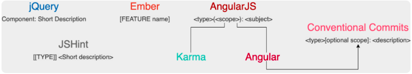

# 《Go 语言项目开发实战》分析笔记

## 第5章 规范设计（下）：commit 信息风格迥异、难以阅读，如何规范？

### Q1：这一章的内容属于哪一类别？

计算机/编程语言/Golang.

### Q2：这一章的内容是什么？

- 为什么好的 Commit Message 至关重要？
- Commit Message 的规范有哪些？
- Angular 规范
  - Header
  - Body
  - Footer
  - Revert Commit
- Commit 相关的3个重要内容
  - 提交频率
  - 合并提交
    - git rebase 命令介绍
    - 合并提交操作示例
  - 修改 Commit Message
    - `git commit --amend`
    - `git rebase -i`
- Commit Message 规范自动化
- 总结

### Q3：这一章的大纲是什么？

### Q4：作者想要解决什么问题？

### Q5：这一章的关键词是什么？

### Q6：这一章的关键句是什么？

#### 为什么好的 Commit Message 至关重要？

- 一个好的 Commit Message 至关重要：
  - 可以使自己或者其他开发人员能够 **清晰地知道每个 commit 的变更内容**，方便快速浏览变更历史，比如可以直接略过文档类型或者格式化类型的代码变更。
  - 可以基于这些 Commit Message **进行过滤查找**，比如只查找某个版本新增的功能：`git log --oneline --grep "^feat|^fix|^perf"`。
  - 可以基于规范化的 Commit Message **生成 Change Log**。
  - 可以依据某些类型的 Commit Message **触发构建或者发布流程**，比如当 type 类型为 feat、fix 时我们才触发 CI 流程。
  - **确定语义化版本的版本号。** 比如 fix 类型可以映射为 PATCH 版本，feat 类型可以映射为 MINOR 版本。带有 BREAKING CHANGE 的 commit，可以映射为 MAJOR 版本。

#### Commit Message 的规范有哪些？



#### Angular 规范

- [Angular 规范][1] 其实是一种语义化的提交规范（Semantic Commit Messages），所谓语义化的提交规范包含以下内容：
  - Commit Message 是语义化的：Commit Message 都会被归为一个有意义的类型，用来说明本次 commit 的类型。
  - Commit Message 是规范化的：Commit Message 遵循预先定义好的规范，比如 Commit Message 格式固定、都属于某个类型，这些规范不仅可被开发者识别也可以被工具识别。

- Angular 规范的 Commit Message 包含三个部分，分别是 **Header**、**Body**和**Footer**。

  ```markdown
  <type>[optional scope]: <description>
  // blank line
  [optional body]
  // blank line
  [optional footer(s)]
  ```

##### Header

- type 主要分为 Development 和 Production 两类：
  - Development：这类修改一般是项目管理类的变更，不会影响最终用户和生产环境的代码，比如 CI 流程、构建方式等的修改。
    遇到这类修改，通常也意味着可以免测发布。
  - Production：这类修改会影响最终的用户和生产环境的代码。所以对于这种改动，我们一定要慎重，并在提交前做好充分的测试。

- type 汇总

  | 类型 | 类别 | 说明 |
  | ---- | ---- | ---- |
  | feat | Production | 新增功能 |
  | fix  | Production | Bug 修复 |
  | perf | Production | 提高代码性能的变更 |
  | style | Development | 代码格式类的变更，比如用 gofmt 格式化代码、删除空行等 |
  | refactor | Production | 其他代码类的变更，这些变更不属于 feat、fix、perf 和 style，例如简化代码、重命名变量、删除冗余代码等 |
  | test | Development | 新增测试用例或更新现有测试用例 |
  |  ci  | Development | 持续集成和部署相关的改动，比如修改 Jenkins、Gitlab CI 等 CI 配置文件或者更新 systemd unit 文件 |
  | docs | Development | 文档类的更新，包括修改用户文档或者开发文档等 |
  | chore | Development | 其他类型，比如构建流程、依赖管理或者辅助工具的变动等 |

- 如何确定一个 commit 所属的 type？
  - 代码类
    - 新增功能：feat
    - 修复缺陷：fix
    - 改进性能：perf
    - 格式化代码：style
    - 其他：refactor
  - 非代码类
    - 更新测试代码：test
    - 部署相关变更：ci
    - 文档类变更：docs
    - 其他：chore

- scope
  - scope 是用来说明 commit 的影响范围的，它必须是名词。
  - 显然，不同项目会有不同的 scope。
  - 在项目初期，我们可以设置一些粒度比较大的 scope，比如可以按组件名或者功能来设置 scope；
    后续，如果项目有变动或者有新功能，我们可以再用追加的方式添加新的 scope。
  - scope 不适合设置太具体的值。
    太具体的话，一方面会导致项目有太多的 scope，难以维护。
    另一方面，开发者也难以确定 commit 属于哪个具体的 scope，导致错放 scope，反而会使 scope 失去了分类的意义。
  - 在指定 scope 时，也需要遵循我们预先规划的 scope，所以我们要将 scope 文档化，放在类似 devel 这类文档中。

- subject
  - subject 是 commit 的简短描述，必须以动词开头、使用现在时。
    比如，我们可以用 change，却不能用 changed 或 changes。
    通过这个动词，我们可以明确地知道 commit 所执行的操作。
  - 这个动词的第一个字母必须是小写。
  - subject 的结尾不能加英文句号。

##### Body

- Body 规范
  - Body 部分可以分成多行，而且格式也比较自由。
  - Body 也要以动词开头，使用现在时。这个和 Header 一样。
  - 此外，Body 还必须要包括修改的动机，以及和跟上一版本相比的改动点。

##### Footer

- Footer 规范
  - Footer 部分不是必选的，可以根据需要来选择，主要用来说明本次 commit 导致的后果。
  - 在实际应用中，Footer 通常用来说明不兼容的改动和关闭的 Issue 列表，格式如下：

  ```markdown
  BREAKING CHANGE: <breaking change summary>
  // blank line
  <breaking change description + migration instructions>
  // blank line
  // blank line
  Fixes #<issue number>
  ```

- 不兼容的改动：
  - 如果当前代码跟上一个版本不兼容，需要在 Footer 部分，以 BREAKING CHANG: 开头，后面跟上不兼容改动的摘要。
  - Footer 的其他部分需要说明变动的描述、变动的理由和迁移方法。

  ```markdown
  BREAKING CHANGE: isolate scope bindings definition has changed and
      the inject option for the directive controller injection was removed.

      To migrate the code follow the example below:

      Before:

      scope: {
        myAttr: 'attribute',
      }

      After:

      scope: {
        myAttr: '@',
      }
      The removed `inject` wasn't generaly useful for directives so there should be no code using it.
  ```

- 关闭的 Issue 列表：
  - 关闭的 Bug 需要在 Footer 部分新建一行，并以 Closes 开头列出，例如：Closes #123。
  - 如果关闭了多个 Issue，可以这样列出：Closes #123, #432, #886。

  ```markdown
  Change pause version value to a constant for image

    Closes #1137
  ```

##### Revert Commit

如果当前 commit 还原了先前的 commit，则应以 revert: 开头，后跟还原的 commit 的 Header。
而且在 Body 中必须写成 This reverts commit ，其中 hash 是要还原的 commit 的 SHA 标识。例如：

```markdown
revert: feat(iam-apiserver): add 'Host' option

This reverts commit 079360c7cfc830ea8a6e13f4c8b8114febc9b48a.
```

#### Commit 相关的3个重要内容

- 提交频率
  - 建议代码下班前固定提交一次。
  - 并且要确保本地未提交的代码，延期不超过 1 天。这样，如果本地代码丢失，可以尽可能减少丢失的代码量。

- 合并提交
  - 建议你把新的 commit 合并到主干时，只保留 2~3 个 commit 记录。
  - 使用`git rebase`命令进行合并提交。

- 修改 Commit Message
  - `git commit --amend`：修改最近一次 commit 的 message
  - `git rebase -i`：修改某次 commit 的 message。

#### Commit Message 规范自动化

- Commit Message 自动化功能可以分为以下 2 类：
  - Commit Message 生成和检查功能
    - 生成符合 Angular 规范的 Commit Message
    - Commit Message 提交前检查
    - 历史 Commit Message 检查
  - 基于 Commit Message 自动生成 CHANGELOG 和 SemVer 的工具

- 5 个自动化工具
  - commitizen-go：使你进入交互模式，并根据提示生成 Commit Message，然后提交。
  - commit-msg：githooks，在 commit-msg 中，指定检查的规则，commit-msg 是个脚本，可以根据需要自己写脚本实现。
    这门课的 commit-msg 调用了 go-gitlint 来进行检查。
  - go-gitlint：检查历史提交的 Commit Message 是否符合 Angular 规范，可以将该工具添加在 CI 流程中，确保 Commit Message 都是符合规范的。
  - gsemver：语义化版本自动生成工具。
  - git-chglog：根据 Commit Message 生成 CHANGELOG。

### Q7：作者是怎么论述的？

### Q8：作者解决了什么问题？

### Q9：我有哪些疑问？

### Q10：这一章说得有道理吗？为什么？

### Q11: 这一章讨论的知识的本质是什么？

### Q12: 这一章讨论的知识的第一原则是什么？

### Q13：这一章讨论的知识的结构是怎样的？

### Q14：这一章讨论的知识为什么是这样的？为什么发展成这样？为什么需要它？

### Q15：有哪些相似的知识？它们之间的联系是什么？

### Q16：其他领域/学科有没有相关的知识？日常生活中有没有类似的现象？

### Q17: 这一章对我有哪些用处/帮助/启示？

### Q18: 我如何应用这一章的知识去解决问题？

  [1]: https://www.conventionalcommits.org/en/v1.0.0/
