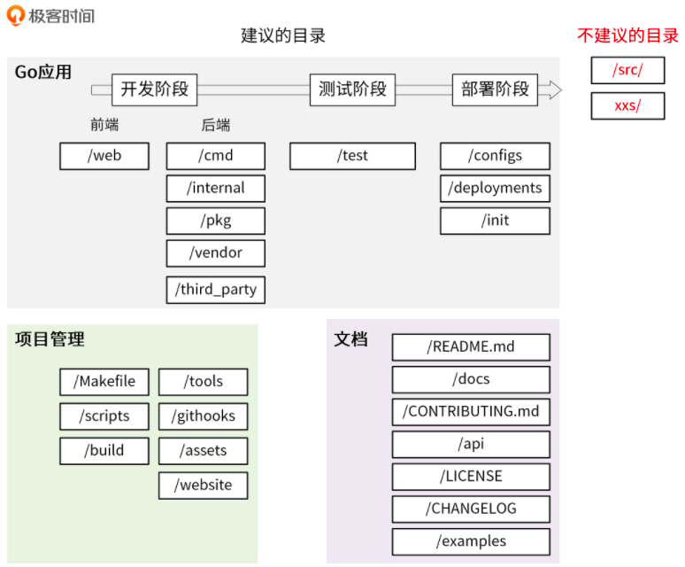

# 《Go 语言项目开发实战》分析笔记

## 第6章 目录结构设计：如何组织一个可维护、可扩展的代码目录？

### Q1：这一章的内容属于哪一类别？

计算机/编程语言/Golang.

### Q2：这一章的内容是什么？

### Q3：这一章的大纲是什么？

- 如何规范目录？
- 平铺式目录结构
- 结构化目录结构
- Go 应用：主要存放前后端代码
  - web/
  - cmd/
  - internal/
  - pkg/
  - vendor/
  - third_party/
- Go 应用：主要存放测试相关的文件和代码
  - test/
- Go 应用：存放跟应用部署相关的文件
  - configs/
  - deployments/
  - init/
- 项目管理：存放用来管理 Go 项目的各类文件
  - Makefile
  - assets/
  - build/
  - githooks/
  - scripts/
  - tools/
  - website/
- 文档：主要存放项目的各类文档
  - README.md
  - api/
  - docs/
  - examples/
  - CHANGELOG
  - CONTRIBUTING.md
  - LICENSE
- 不建议的目录
  - src 目录
  - 带复数的目录或者包
- 一些建议
  - 小型项目的目录结构
  - 在 Git 仓库中提交空目录

### Q4：作者想要解决什么问题？

### Q5：这一章的关键词是什么？

### Q6：这一章的关键句是什么？

#### 如何规范目录？

- 一个好的目录结构至少要满足以下几个要求。
  - **命名清晰**：目录命名要清晰、简洁，不要太长，也不要太短，目录名要能清晰地表达出该目录实现的功能，并且目录名最好用单数。
    一方面是因为单数足以说明这个目录的功能，另一方面可以统一规范，避免单复混用的情况。
  - **功能明确**：一个目录所要实现的功能应该是明确的、并且在整个项目目录中具有很高的辨识度。
    也就是说，当需要新增一个功能时，我们能够非常清楚地知道把这个功能放在哪个目录下。
  - **全面性**：目录结构应该尽可能全面地包含研发过程中需要的功能，例如文档、脚本、源码管理、API 实现、工具、第三方包、测试、编译产物等。
  - **可预测性**：项目规模一定是从小到大的，所以一个好的目录结构应该能够在项目变大时，仍然保持之前的目录结构。
  - **可扩展性**：每个目录下存放了同类的功能，在项目变大时，这些目录应该可以存放更多同类功能。

- 根据功能，我们可以将目录结构分为两种结构：结构化目录结构和平铺式目录结构。
  - 结构化目录结构主要用在 Go 应用中，相对来说比较复杂；
  - 平铺式目录结构主要用在 Go 包中，相对来说比较简单。

#### 平铺式目录结构

- 一个 Go 项目可以是一个应用，也可以是一个代码框架 / 库，当项目是代码框架 / 库时，比较适合采用平铺式目录结构。

- 平铺方式就是在项目的根目录下存放项目的代码，整个目录结构看起来更像是一层的，这种方式在很多框架 / 库中存在。
  - 使用这种方式的好处是引用路径长度明显减少，比如 github.com/marmotedu/log/pkg/options，可缩短为 github.com/marmotedu/log/options。

#### 结构化目录结构

- 当前 Go 社区比较推荐的结构化目录结构是 [project-layout][8] 。

- [一个 Go 项目通常包含的功能][9]。

- 作者对 Go 项目目录的建议
  - 在我看来，一个 Go 项目包含 3 大部分：Go 应用 、项目管理和文档。所以，我们的项目目录也可以分为这 3 大类。
  - 同时，Go 应用又贯穿开发阶段、测试阶段和部署阶段，相应的应用类的目录，又可以按开发流程分为更小的子类。
  - 这些是我建议的目录，Go 项目目录中还有一些不建议的目录。

  

#### Go 应用：主要存放前后端代码

- web/
  - 前端代码存放目录，主要用来存放 Web 静态资源，服务端模板和单页应用（SPAs）。

- cmd/
  - 一个项目有很多组件，可以把组件 main 函数所在的文件夹统一放在/cmd 目录下。
  - 每个组件的目录名应该跟你期望的可执行文件名是一致的。这里要保证 `/cmd/<组件名>` 目录下不要存放太多的代码。
  - 如果你认为代码可以导入并在其他项目中使用，那么它应该位于 pkg 目录中。
  - 如果代码不是可重用的，或者你不希望其他人重用它，请将该代码放到 internal 目录中。

- internal/
  - 存放私有应用和库代码。如果一些代码，你不希望在其他应用和库中被导入，可以将这部分代码放在/internal 目录下。
  - internal 目录建议包含如下目录：
    - `internal/apiserver`：该目录中存放真实的应用代码。这些应用的共享代码存放在 `internal/pkg` 目录下。
    - `internal/pkg`：存放项目内可共享，项目外不共享的包。这些包提供了比较基础、通用的功能，例如工具、错误码、用户验证等功能。
  - 建议一开始将所有的共享代码存放在 `internal/pkg` 目录下，当该共享代码做好了对外开发的准备后，再转存到 pkg 目录下。
  - `internal/apiserver` 目录结构示例
    - `internal/apiserver/api/v1`：HTTP API 接口的具体实现，主要用来做 HTTP 请求的解包、参数校验、业务逻辑处理、返回。
      注意这里的业务逻辑处理应该是轻量级的，如果业务逻辑比较复杂，代码量比较多，建议放到 `internal/apiserver/service` 目录下。该源码文件主要用来串流程。
    - `internal/apiserver/options`：应用的 command flag。
    - `internal/apiserver/config`：根据命令行参数创建应用配置。
    - `internal/apiserver/service`：存放应用复杂业务处理代码。
    - `internal/apiserver/store/mysql`：一个应用可能要持久化的存储一些数据，这里主要存放跟数据库交互的代码，比如 Create、Update、Delete、Get、List 等。
  - `internal/pkg` 目录结构示例
    - `internal/pkg/code`：项目业务 Code 码。
    - `internal/pkg/validation`：一些通用的验证函数。
    - `internal/pkg/middleware`：HTTP 处理链。

- pkg/
  - 该目录中存放可以被外部应用使用的代码库，其他项目可以直接通过 import 导入这里的代码。所以，我们在将代码库放入该目录时一定要慎重。

- vendor/
  - 项目依赖，可通过 `go mod vendor` 创建。
  - 需要注意的是，如果是一个 Go 库，不要提交 vendor 依赖包。

- third_party/
  - 外部帮助工具，分支代码或其他第三方应用（例如 Swagger UI）。
  - 比如我们 fork 了一个第三方 go 包，并做了一些小的改动，我们可以放在目录 /third_party/forked 下。
    一方面可以很清楚的知道该包是 fork 第三方的，另一方面又能够方便地和 upstream 同步。

#### Go 应用：主要存放测试相关的文件和代码

- test/
  - 用于存放其他外部测试应用和测试数据。
  - /test 目录的构建方式比较灵活：对于大的项目，有一个数据子目录是有意义的。
    例如，如果需要 Go 忽略该目录中的内容，可以使用 /test/data 或 /test/testdata 目录。
  - 需要注意的是，Go 也会忽略以 `.` 或 `_` 开头的目录或文件。这样在命名测试数据目录方面，可以具有更大的灵活性。

#### Go 应用：存放跟应用部署相关的文件

- configs/
  - 这个目录用来配置文件模板或默认配置。例如，可以在这里存放 confd 或 consul-template 模板文件。
  - 这里有一点要注意，配置中不能携带敏感信息，这些敏感信息，我们可以用占位符来替代，例如：

  ```yaml
  apiVersion: v1
  user:
    username: ${CONFIG_USER_USERNAME} # iam 用户名
    password: ${CONFIG_USER_PASSWORD} # iam 密码
  ```

- deployments/
  - 用来存放 Iaas、PaaS 系统和容器编排部署配置和模板（Docker-Compose，Kubernetes/Helm，Mesos，Terraform，Bosh）。
  - 在一些项目，特别是用 Kubernetes 部署的项目中，这个目录可能命名为 deploy。

- init/
  - 存放初始化系统（systemd，upstart，sysv）和进程管理配置文件（runit，supervisord）。比如 sysemd 的 unit 文件。
  - 这类文件，在非容器化部署的项目中会用到。

#### 项目管理：存放用来管理 Go 项目的各类文件

- Makefile
  - Makefile 通常用来执行静态代码检查、单元测试、编译等功能。其他常见功能，你可以参考这里： [Makefile 常见管理内容][7]。
  - 在实际开发中，我们可以将一些重复性的工作自动化，并添加到 Makefile 文件中统一管理。
  - 建议：直接执行 make 时，执行如下各项 `format -> lint -> test -> build`；
    如果是有代码生成的操作，还可能需要首先生成代码 `gen -> format -> lint -> test -> build`

- assets/
  - 项目使用的其他资源 (图片、CSS、JavaScript 等)。

- build/

- githooks/
  - Git 钩子。比如，我们可以将 commit-msg 存放在该目录。

- scripts/
  - 该目录主要用来存放脚本文件，实现构建、安装、分析等不同功能。
  - 不同项目，里面可能存放不同的文件，但通常可以考虑包含以下 3 个目录：
    - `scripts/make-rules/`：用来存放 makefile 文件，实现 Makefile 文件中的各个功能。
      Makefile 有很多功能，为了保持它的简洁，我建议你将各个功能的具体实现放在 `scripts/make-rules/` 文件夹下。
    - `scripts/lib/`：shell 库，用来存放 shell 脚本。一个大型项目中有很多自动化任务，比如发布、更新文档、生成代码等，所以要写很多 shell 脚本。
      这些 shell 脚本会有一些通用功能，可以抽象成库，存放在 `scripts/lib/` 目录下，比如 logging.sh，util.sh 等。
    - `scripts/install/`：如果项目支持自动化部署，可以将自动化部署脚本放在此目录下。如果部署脚本简单，也可以直接放在 scripts 目录下。

- tools/
  - 存放这个项目的支持工具。这些工具可导入来自 /pkg 和 /internal 目录的代码。

- website/
  - 如果你不使用 GitHub 页面，那么可以在这里放置项目网站相关的数据。

#### 文档：主要存放项目的各类文档

- README.md
  - 一般包含了项目的介绍、功能、快速安装和使用指引、详细的文档链接以及开发指引等。
  - 有时候 README 文档会比较长，为了能够快速定位到所需内容，需要添加 markdown toc 索引，可以借助工具 [tocenize][6] 来完成索引的添加。

- api/
  - 存放当前项目对外提供的各种不同类型的 API 接口定义文件。
  - 其中可能包含类似 api/protobuf-spec、api/thrift-spec、api/http-spec、openapi、swagger 的目录，
    这些目录包含了当前项目对外提供和依赖的所有 API 文件。

- docs/
  - 存放设计文档、开发文档和用户文档等（除了 godoc 生成的文档）。
  - 推荐存放以下几个子目录：
    - `docs/devel/{en-US,zh-CN}`：存放开发文档、hack 文档等。
    - `docs/guide/{en-US,zh-CN}`: 存放用户手册，安装、quickstart、产品文档等，分为中文文档和英文文档。
    - `docs/images`：存放图片文件。

- examples/
  - 存放应用程序或者公共包的示例代码。这些示例代码可以降低使用者的上手门槛。

- CHANGELOG
  - 当项目有更新时，为了方便了解当前版本的更新内容或者历史更新内容，需要将更新记录存放到 CHANGELOG 目录。
  - 编写 CHANGELOG 是一个复杂、繁琐的工作，我们可以结合 [Angular 规范][1] 和 [git-chglog][2] 来自动生成 CHANGELOG。

- CONTRIBUTING.md
  - 如果是一个开源就绪的项目，最好还要有一个 CONTRIBUTING.md 文件，用来说明如何贡献代码，如何开源协同等等。
  - CONTRIBUTING.md 不仅能够规范协同流程，还能降低第三方开发者贡献代码的难度。

- LICENSE
  - 版权文件可以是私有的，也可以是开源的。常用的开源协议有：Apache 2.0、MIT、BSD、GPL、Mozilla、LGPL。
  - 有时候，公有云产品为了打造品牌影响力，会对外发布一个本产品的开源版本，所以在项目规划初期最好就能规划下未来产品的走向，选择合适的 LICENSE。
  - 为了声明版权，你可能会需要将 LICENSE 头添加到源码文件或者其他文件中，这部分工作可以通过工具实现自动化，推荐工具： [addlicense][3] 。
  - 当代码中引用了其它开源代码时，需要在 LICENSE 中说明对其它源码的引用，这就需要知道代码引用了哪些源码，以及这些源码的开源协议，可以借助工具来进行检查，推荐工具： [glice][4] 。
  - 至于如何说明对其它源码的引用，大家可以参考下 [IAM 项目的 LICENSE 文件][5]。

#### 不建议的目录

- 在 Go 项目中，不建议使用 src 目录。
  - 其中一个重要的原因是：在默认情况下，Go 语言的项目都会被放置到$GOPATH/src 目录下。这个目录中存放着所有代码，如果我们在自己的项目中使用/src 目录，这个包的导入路径中就会出现两个 src，这样看起来非常怪。

- 在 Go 项目中，要避免使用带复数的目录或者包。建议统一使用单数。

#### 一些建议

- 对于小型项目，可以考虑先包含 cmd、pkg、internal 3 个目录，其他目录后面按需创建。

- 在设计目录结构时，一些空目录无法提交到 Git 仓库中，但我们又想将这个空目录上传到 Git 仓库中，以保留目录结构。
  这时候，可以在空目录下加一个 .keep 文件。

### Q7：作者是怎么论述的？

### Q8：作者解决了什么问题？

### Q9：我有哪些疑问？

### Q10：这一章说得有道理吗？为什么？

### Q11: 这一章讨论的知识的本质是什么？

### Q12: 这一章讨论的知识的第一原则是什么？

### Q13：这一章讨论的知识的结构是怎样的？

### Q14：这一章讨论的知识为什么是这样的？为什么发展成这样？为什么需要它？

### Q15：有哪些相似的知识？它们之间的联系是什么？

### Q16：其他领域/学科有没有相关的知识？日常生活中有没有类似的现象？

### Q17: 这一章对我有哪些用处/帮助/启示？

### Q18: 我如何应用这一章的知识去解决问题？

  [1]: https://github.com/angular/angular/blob/22b96b9/CONTRIBUTING.md#-commit-message-guidelines
  [2]: https://github.com/git-chglog/git-chglog
  [3]: https://github.com/marmotedu/addlicense
  [4]: https://github.com/ribice/glice
  [5]: https://github.com/marmotedu/iam/blob/master/LICENSE
  [6]: https://github.com/nochso/tocenize
  [7]: common_functions_of_makefile.md
  [8]: https://github.com/golang-standards/project-layout
  [9]: common_functions_of_go_project.md
