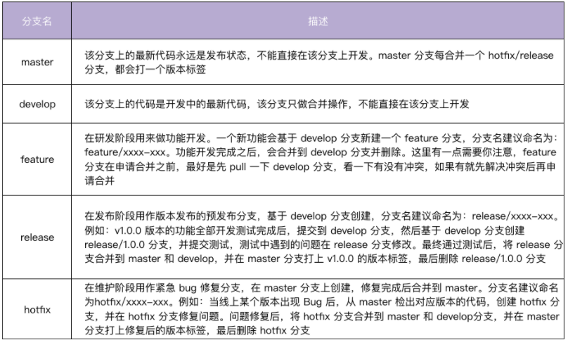

# 《Go 语言项目开发实战》分析笔记

## 第7章 工作流设计：如何设计合理的多人开发模式？

### Q1：这一章的内容属于哪一类别？

计算机/软件工程。

### Q2：这一章的内容是什么？

### Q3：这一章的大纲是什么？

- 集中式工作流
- 功能分支工作流
- Git Flow 工作流
  - Git Flow 的 5 种分支
  - Git Flow 开发流程
- Forking 工作流
- 总结

### Q4：作者想要解决什么问题？

### Q5：这一章的关键词是什么？

### Q6：这一章的关键句是什么？

#### 集中式工作流

- 集中式工作流是最简单的开发模式，但它的缺点也很明显：
  - 不同开发人员的提交日志混杂在一起，难以定位问题。如果同时开发多个功能，不同功能同时往 master 分支合并，代码之间也会相互影响，从而产生代码冲突。

- 和其他工作流相比，集中式工作流程的代码管理较混乱，容易出问题，因此适合用在
  **团队人数少、开发不频繁、不需要同时维护多个版本的小项目中。**

#### 功能分支工作流

- 功能分支工作流基于集中式工作流演进而来。其工作方式如下：
  - 在开发新功能时，基于 master 分支新建一个功能分支，在功能分支上进行开发，而不是直接在本地的 master 分支开发，开发完成之后合并到 master 分支。

- 功能分支工作流的具体开发流程
  - 基于 master 分支新建一个功能分支，功能分支可以取一些有意义的名字，便于理解，例如 feature/rate-limiting。
  - 在功能分支上进行代码开发，开发完成后 commit 到功能分支。
  - 将本地功能分支代码 push 到远程仓库。
  - 在远程仓库上创建 PR（例如：GitHub）。
  - 代码管理员收到 PR 后，可以 CR 代码，CR 通过后，再点击 Merge pull request 将 PR 合并到 master。

- 功能分支工作流的优点
  - 功能分支工作流上手比较简单
  - 可以并行开发多个功能
  - 可以添加 code review，从而保障代码质量。

- 功能分支工作流的缺点
  - 无法给分支分配明确的目的，不利于团队配合。

- 功能分支工作流适合场景：
  - 适合用在开发团队相对固定、规模较小的项目中。

#### Git Flow 工作流

- Git Flow 工作流
  - Git Flow 工作流是一个非常成熟的方案，也是非开源项目中最常用到的工作流。
  - 它定义了一个围绕项目发布的严格分支模型，通过为代码开发、发布和维护分配独立的分支来让项目的迭代流程更加顺畅，比较适合 **大型的项目或者迭代速度快的项目**。

- Git Flow 的 5 种分支
  - Git Flow 中定义了 5 种分支，分别是 master、develop、feature、release 和 hotfix。
  - 其中，master 和 develop 为常驻分支，其他为非常驻分支，不同的研发阶段会用到不同的分支。

  

#### Forking 工作流

- Git Flow vs Forking
  - 在非开源项目中，最常用到的是 Git Flow 工作流
  - 在开源项目中，最常用到的是 Forking 工作流，例如 Kubernetes、Docker 等项目用的就是这种工作流。

- Forking 工作流的工作方式
  - 假设开发者 A 拥有一个远程仓库，如果开发者 B 也想参与 A 项目的开发，B 可以 fork 一份 A 的远程仓库到自己的 GitHub 账号下。
  - 后续 B 可以在自己的项目进行开发，开发完成后，B 可以给 A 提交一个 PR。
  - 这时候 A 会收到通知，得知有新的 PR 被提交，A 会去查看 PR 并 code review。
  - 如果有问题，A 会直接在 PR 页面提交评论，B 看到评论后会做进一步的修改。
  - 最后 A 通过 B 的 PR 请求，将代码合并进了 A 的仓库。这样就完成了 A 代码仓库新特性的开发。
  - 如果有其他开发者想给 A 贡献代码，也会执行相同的操作。

- Github Forking 工作流详细步骤
  - Fork 远程仓库到自己的账号下。
  - 克隆 fork 的仓库到本地。
  - 创建功能分支。
  - 提交 commit。
  - push 功能分支到个人远程仓库。
  - 在个人远程仓库页面创建 pull request。

#### 总结

- 在选择工作流时，我的推荐如下：
  - 非开源项目采用 Git Flow 工作流。
  - 开源项目采用 Forking 工作流。

  

### Q7：作者是怎么论述的？

### Q8：作者解决了什么问题？

### Q9：我有哪些疑问？

### Q10：这一章说得有道理吗？为什么？

### Q11: 这一章讨论的知识的本质是什么？

### Q12: 这一章讨论的知识的第一原则是什么？

### Q13：这一章讨论的知识的结构是怎样的？

### Q14：这一章讨论的知识为什么是这样的？为什么发展成这样？为什么需要它？

### Q15：有哪些相似的知识？它们之间的联系是什么？

### Q16：其他领域/学科有没有相关的知识？日常生活中有没有类似的现象？

### Q17: 这一章对我有哪些用处/帮助/启示？

### Q18: 我如何应用这一章的知识去解决问题？
