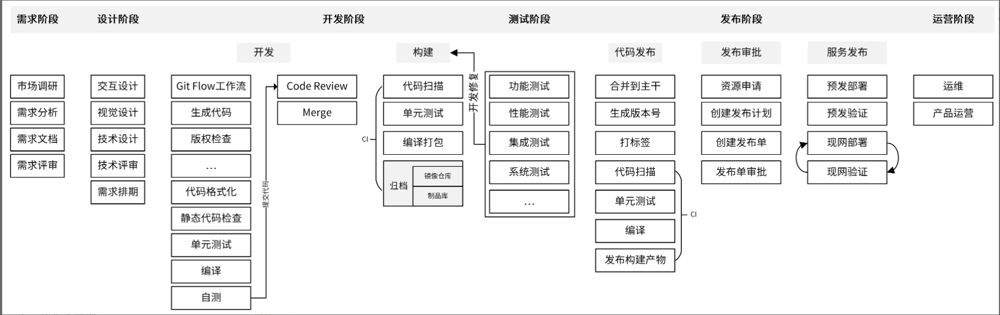
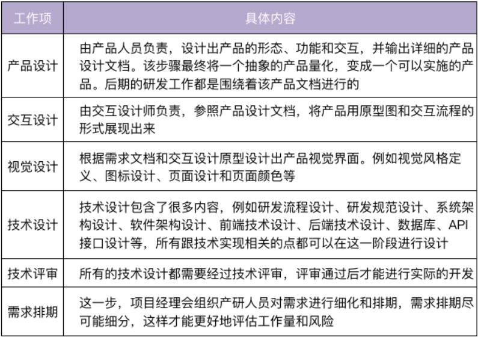
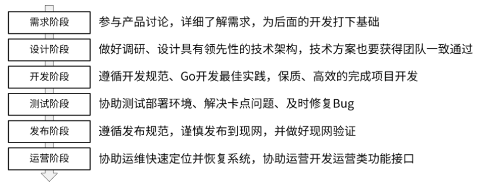

# 《Go 语言项目开发实战》分析笔记

## 第8章 研发流程设计（上）：如何设计 Go 项目的开发流程？

### Q1：这一章的内容属于哪一类别？

计算机/软件工程。

### Q2：这一章的内容是什么？

### Q3：这一章的大纲是什么？

- 在设计研发流程时，需要关注哪些点？
- 业界相对标准的研发流程，长啥样？
- 需求阶段
- 设计阶段
- 开发阶段
- 测试阶段
- 发布阶段
- 运营阶段

### Q4：作者想要解决什么问题？

### Q5：这一章的关键词是什么？

### Q6：这一章的关键句是什么？

#### 在设计研发流程时，需要关注哪些点？

- 研发流程的原则
  - 发布效率高：研发流程应该能提高发布效率，减少发布时间和人工介入的工作量。
  - 发布质量高：研发流程应该能够提高发布质量，确保发布出去的代码是经过充分测试的，并且完全避免人为因素造成的故障。
  - 迭代速度快：整个研发流程要能支持快速迭代，产品迭代速度越快，意味着产品的竞争力越强，在互联网时代越能把握先机。
  - 明确性：整个研发流程中角色的职责、使用的工具、方法和流程都应该是明确的，这可以增强流程的可执行性。
  - 流程合理：研发流程最终是供产品、开发、测试、运维等人员使用的，所以整个流程设计不能是反人类的，要能够被各类参与人员接受并执行。
  - 柔性扩展：研发流程应该是柔性且可扩展的，能够灵活变通，并适应各类场景。
  - 输入输出：研发流程中的每个阶段都应该有明确的输入和输出，这些输入和输出标志着上一个阶段的完成，下一个阶段的开始。

#### 业界相对标准的研发流程，长啥样？

- 业界相对标准的划分，是把研发流程分为六个阶段，分别是：需求阶段、设计阶段、开发阶段、测试阶段、发布阶段、运营阶段。

- 其中，开发人员需要参与的阶段有 4 个：设计阶段、开发阶段、测试阶段和发布阶段。

- 设计研发流程的一个注意点
  - 研发流程也是一种规范，很难靠开发者的自觉性去遵守。为了让项目参与人员尽可能地遵守规范，需要借助一些工具、系统来对他们进行强约束。
  - 在我们设计完整个研发流程之后，需要认真思考下，有哪些地方可以实现自动化，有哪些地方可以靠工具、系统来保障规范的执行。

  

#### 需求阶段

- 需求阶段，一般不需要研发人员参与。但这里，我还是建议你积极参与产品需求的讨论。虽然我们是研发，但我们的视野和对团队的贡献，可以不仅仅局限在研发领域。

- 如果你们团队有测试人员，这个阶段也需要拉测试人员旁听下。因为了解产品设计，对测试阶段测试用例的编写和功能测试等都很有帮助。

#### 设计阶段

- 技术方案和实现都要经过认真讨论，并获得一致通过，否则后面因为技术方案设计不当，需要返工，你要承担大部分责任。

  

#### 开发阶段

- 开发阶段又可以分为「开发」和「构建」两部分。

- **在项目开发中，你要思考怎么尽可能自动生成代码。**这样不仅能提高研发效率，还能减少错误。

- 提高开发效率的两种方法
  - 将开发阶段的步骤通过 Makefile 实现集中管理
  - 将构建阶段的步骤通过 CI/CD 平台实现自动化

- 在最终合并代码到 master 之前，要确保代码是经过充分测试的。
  - 这就要求我们一定要借助代码管理平台提供的 Webhook 能力，在代码提交时触发 CI/CD 作业，对代码进行扫描、测试，最终编译打包，
    并以整个作业的成功执行作为合并代码的先决条件。

#### 测试阶段

- 为了提高整个研发效率，测试计划的创建和测试用例的编写可以跟开发阶段并行。

- **在测试阶段，为了不阻塞测试，确保项目按时发布，研发人员应该优先解决测试同学的 Bug，至少是阻塞类的 Bug。**

- **为了减少不必要的沟通和排障，安装部署文档要尽可能详尽和准确。**

- **你也可以及时跟进测试，了解测试同学当前遇到的卡点。**

#### 发布阶段

- 发布阶段按照时间线排序又分为代码发布、发布审批和服务发布 3 个子阶段。

- 代码发布
  - 开发人员首先需要将经过测试后的代码合并到主干，通常是 master 分支，并生成版本号，然后给最新的 commit 打上版本标签。
  - 之后，可以将代码 push 到代码托管平台，并触发 CI 流程，CI 流程一般会执行代码扫描、单元测试、编译，最后将构建产物发布到制品库。
  - CI 流程中，我们可以根据需要添加任意功能。

- 发布审批
  - 首先需要申请资源
    - **资源申请周期可能会比较久，所以申请得越早越好，甚至资源申请可以在测试阶段发起。**
    - 在资源申请阶段，可以申请诸如服务器、MySQL、Redis、Kafka 之类资源。
    - 建议优先采用容器化部署。
  - 发布之前需要创建发布计划
    - 里面需要详细描述本次的变更详情，例如变更范围、发布方案、测试结果、验证和回滚方案等。
    - 这里需要你注意，在创建发布计划时，一定要全面梳理这次变更的影响点。
      例如，是否有不兼容的变更，是否需要变更配置，是否需要变更数据库等。
    - 任何一个遗漏，都可能造成现网故障，影响产品声誉和用户使用。
  - 需要创建发布单
    - 在发布单中可以附上发布计划，并根据团队需求填写其它发布内容，发布计划需要跟相关参与者对齐流程、明确职责。
    - 发布单最终提交给审批人（通常是技术 leader）对本次发布进行审批，审批通过后，才可以进行部署。

- 服务发布阶段
  - 在正式部署的时候，应用需要先部署到预发环境。
  - 在预发环境，产品人员、测试人员和研发人员会分别对产品进行验证。其中，
    - 产品人员主要验证产品功能的体验是否流畅，
    - 开发和测试人员主要验证产品是否有 Bug。
    - 预发环境验证通过，产品才能正式发布到现网。
  - **编写一些自动化的测试用例，在服务发布到现网之后，对现网服务做一次比较充分的回归测试。**
    通过这个自动化测试，可以以最小的代价，最快速地验证现网功能，从而保障发布质量。
  - **现网可能有多个地域，每个地域发布完成之后都要进行现网验证。**

#### 运营阶段

- 运营阶段主要分为产品运营和运维两个部分。

- 产品运营
  - 通过一系列的运营活动，比如线下的技术沙龙、线上的免费公开课、提高关键词排名或者输出一些技术推广文章等方式，
    来推高整个产品的知名度，提高产品的用户数量，并提高月活和日活。

- 运维
  - 由运维工程师负责，核心目标是确保系统稳定的运行，如果系统异常，能够及时发现并修复问题。
  - 长期目标是通过技术手段或者流程来完善整个系统架构，减少人力投入、提高运维效率，并提高系统的健壮性和恢复能力。

#### 总结

  

### Q7：作者是怎么论述的？

### Q8：作者解决了什么问题？

### Q9：我有哪些疑问？

### Q10：这一章说得有道理吗？为什么？

### Q11: 这一章讨论的知识的本质是什么？

### Q12: 这一章讨论的知识的第一原则是什么？

### Q13：这一章讨论的知识的结构是怎样的？

### Q14：这一章讨论的知识为什么是这样的？为什么发展成这样？为什么需要它？

### Q15：有哪些相似的知识？它们之间的联系是什么？

### Q16：其他领域/学科有没有相关的知识？日常生活中有没有类似的现象？

### Q17: 这一章对我有哪些用处/帮助/启示？

### Q18: 我如何应用这一章的知识去解决问题？
