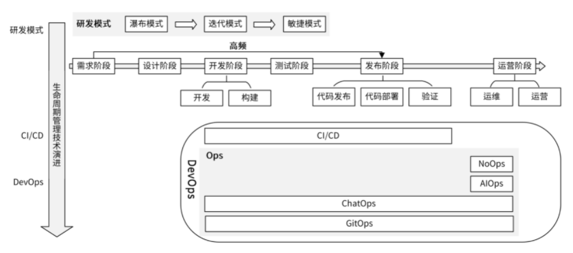

# 《Go 语言项目开发实战》分析笔记

## 第9章 研发流程设计（下）：如何管理应用的生命周期？

### Q1：这一章的内容属于哪一类别？

计算机/软件工程。

### Q2：这一章的内容是什么？

### Q3：这一章的大纲是什么？

- 应用生命周期管理技术有哪些？
- 研发模式
  - 瀑布模式
  - 迭代模式
  - 敏捷模式
- CI/CD：自动化构建和部署应用
- DevOps：研发运维一体化
  - AIOps：智能运维
  - ChatOps：聊着天就把事情给办了
  - GitOps：一种实现云原生的持续交付模型
  - NoOps：无运维
- 如何选择合适的应用生命周期管理技术？

### Q4：作者想要解决什么问题？

### Q5：这一章的关键词是什么？

### Q6：这一章的关键句是什么？

#### 应用生命周期管理技术有哪些？

- 应用的生命周期管理，是指采用一些好的工具或方法在应用的整个生命周期中对应用进行管理，以提高应用的研发效率和质量。

- 我们可以从两个维度来理解应用生命周期管理技术
  - 演进维度
  - 管理技术的类别

- 演进维度
  - 应用生命周期，最开始主要是通过 **研发模式** 来管理的，按时间线先后出现了瀑布模式、迭代模式、敏捷模式。
  - 为了解决研发模式中的一些痛点出现了另一种管理技术，也就是 **CI/CD 技术**。
  - 随着 CI/CD 技术的成熟，又催生了另一种更高级的管理技术 **DevOps**。

- 管理技术的类别
  - 研发模式，用来确保整个研发流程是高效的。
  - DevOps，主要通过协调各个部门之间的合作，来提高软件的发布效率和质量。
    - DevOps 中又包含了很多种技术，主要包括 CI/CD 和多种 Ops，例如 AIOps、ChatOps、GitOps、NoOps 等。
    - 其中，CI/CD 技术提高了软件的发布效率和质量，
    - 而 Ops 技术则提高了软件的运维和运营效率。

- 作者的建议
  - 研发模式建议选择敏捷模式，因为它更能胜任互联网时代快速迭代的诉求。
  - DevOps 则要优先确保落地 CI/CD 技术，接着尝试落地 ChatOps 技术，如果有条件可以积极探索 AIOps 和 GitOps。

  

#### 研发模式

- 瀑布模式
  - 特点
    - 瀑布模式按照预先规划好的研发阶段来推进研发进度。
      比如，按照需求阶段、设计阶段、开发阶段、测试阶段、发布阶段、运营阶段的顺序串行执行开发任务。
    - 每个阶段完美完成之后，才会进入到下一阶段，阶段之间通过文档进行交付。
  - 优点
    - 简单。它严格按照研发阶段来推进研发进度，流程清晰，适合按项目交付的应用。
  - 缺点
    - 只有在项目研发的最后阶段才会交付给客户。交付后，如果客户发现问题，变更就会非常困难，代价很大。
    - 研发周期比较长，很难适应互联网时代对产品快速迭代的诉求。

- 迭代模式
  - 特点
    - 研发任务被切分为一系列轮次，每一个轮次都是一个迭代，每一次迭代都是一个从设计到实现的完整过程。
    - 它不要求每一个阶段的任务都做到最完美，而是先把主要功能搭建起来，然后再通过客户的反馈信息不断完善。
  - 优点
    - 迭代开发可以帮助产品改进和把控进度，它的灵活性极大地提升了适应需求变化的能力，克服了高风险、难变更、复用性低的特点。
  - 缺点
    - 比较专注于开发过程，很少从项目管理的视角去加速和优化项目开发过程。

- 敏捷模式
  - 特点
    - 敏捷模式把一个大的需求分成多个、可分阶段完成的小迭代，每个迭代交付的都是一个可使用的软件。
    - 在开发过程中，软件要一直处于可使用状态。
    - 敏捷模式中具有代表性的开发模式，是 Scrum 开发模型。
  - 优点
    - 相比前两种模式，更容易加速和优化项目开发过程。
  - 缺点
    - 在敏捷模式中，我们会把一个大的需求拆分成很多小的迭代，这意味着开发过程中会有很多个开发、构建、测试、发布和部署的流程。
    - 这种高频度的操作会给研发、运维和测试人员带来很大的工作量，降低了工作效率。为了解决这个问题，CI/CD 技术诞生了。

#### CI/CD：自动化构建和部署应用

- CI/CD 技术通过自动化的手段，来快速执行代码检查、测试、构建、部署等任务，从而提高研发效率，解决敏捷模式带来的弊端。

- CI/CD 包含了 3 个核心概念。
  - CI：Continuous Integration，持续集成。
  - CD：Continuous Delivery，持续交付。
  - CD：Continuous Deployment，持续部署。

- 持续集成
  - 含义：频繁地（一天多次）将开发者的代码合并到主干上。
  - 流程
    - 在开发人员完成代码开发，并 push 到 Git 仓库后，
    - CI 工具可以立即对代码进行扫描、（单元）测试和构建，并将结果反馈给开发者。
    - 持续集成通过后，会将代码合并到主干。

- 持续交付
  - 它指的是一种能够使软件在较短的循环中可靠发布的软件方法。
  - 持续交付在持续集成的基础上，将构建后的产物自动部署在目标环境中。这里的目标环境，可以是测试环境、预发环境或者现网环境。
  - 通常来说，持续部署可以自动地将服务部署到测试环境或者预发环境。
  - 因为部署到现网环境存在一定的风险，所以如果部署到现网环境，需要手工操作。
    手工操作的好处是，可以使相关人员评估发布风险，确保发布的正确性。

- 持续部署
  - 持续部署在持续交付的基础上，将经过充分测试的代码自动部署到生产环境，整个流程不再需要相关人员的审核。
  - 持续部署强调的是自动化部署，是交付的最高阶段。

- CI/CD 3 个核心概念的核心点
  - 持续集成的核心点在 **代码**
  - 持续交付的核心点在 **可交付的产物**
  - 持续部署的核心点在 **自动部署**

#### DevOps：研发运维一体化

- DevOps（Development 和 Operations 的组合）
  - 一组过程、方法与系统的统称
  - 用于促进开发（应用程序 / 软件工程）、技术运营和质量保障（QA）部门之间的沟通、协作与整合。
  - 这 3 个部门的相互协作，可以提高软件质量、快速发布软件。

- DevOps != CI/CD
  - DevOps 是一组过程、方法和系统的统称
  - CI/CD 只是一种软件构建和发布的技术

- AIOps：智能运维
  - 通过 AI 手段，来智能化地运维 IT 系统。
  - AIOps 通过搜集海量的运维数据，并利用机器学习算法，智能地定位并修复故障。

- ChatOps：聊着天就把事情给办了
  - ChatOps 就是在一个聊天工具中，发送一条命令给 ChatBot 机器人，然后 ChatBot 会执行预定义的操作。
  - 这些操作可以是执行某个工具、调用某个接口等，并返回执行结果。

- GitOps：一种实现云原生的持续交付模型
  - 核心思想
    - 它的核心思想是将应用系统的声明性基础架构（YAML）和应用程序存放在 Git 版本库中。
    - 将 Git 作为交付流水线的核心，每个开发人员都可以提交拉取请求（Pull Request），
    - 并使用 Git 来加速和简化 Kubernetes 的应用程序部署和运维任务。
  - 3 个关键概念
    - **声明性容器编排**：通过 Kubernetes YAML 格式的资源定义文件，来定义如何部署应用。
    - **不可变基础设施**：基础设施中的每个组件都可以自动的部署，组件在部署完成后，不能发生变更。
      如果需要变更，则需要重新部署一个新的组件。例如，Kubernetes 中的 Pod 就是一个不可变基础设施。
    - **连续同步**：不断地查看 Git 存储库，将任何状态更改反映到 Kubernetes 集群中。
  - 工作流程
    - 开发人员开发完代码后推送到 Git 仓库，触发 CI 流程，
    - CI 流程通过编译构建出 Docker 镜像，并将镜像 push 到 Docker 镜像仓库中。
    - Push 动作会触发一个 push 事件，通过 webhook 的形式通知到 Config Updater 服务，
    - Config Updater 服务会从 webhook 请求中获取最新 push 的镜像名，并更新 Git 仓库中的 Kubernetes YAML 文件。
    - GitOps 的 Deploy Operator 服务，检测到 YAML 文件的变动，会重新从 Git 仓库中提取变更的文件，并将镜像部署到 Kubernetes 集群中。
    - Config Updater 和 Deploy Operator 两个组件需要开发人员设计开发。

- NoOps：无运维
  - 无运维，完全自动化的运维。
  - 在 NoOps 中不再需要开发人员、运营运维人员的协同，把微服务、低代码、无服务全都结合了起来，开发者在软件生命周期中只需要聚焦业务开发即可，所有的维护都交由云厂商来完成。

#### 如何选择合适的应用生命周期管理技术？

- 大厂普遍采用敏捷开发的模式，来适应互联网对应用快速迭代的诉求。
  - 例如，腾讯的TAPD、Coding的 Scrum 敏捷管理就是一个敏捷开发平台。
  - CI/CD 强制落地，ChatOps 已经广泛使用，AIOps 也有很多落地案例，GitOps 目前还在探索阶段，NoOps 还处在理论阶段。

### Q7：作者是怎么论述的？

### Q8：作者解决了什么问题？

### Q9：我有哪些疑问？

### Q10：这一章说得有道理吗？为什么？

### Q11: 这一章讨论的知识的本质是什么？

### Q12: 这一章讨论的知识的第一原则是什么？

### Q13：这一章讨论的知识的结构是怎样的？

### Q14：这一章讨论的知识为什么是这样的？为什么发展成这样？为什么需要它？

### Q15：有哪些相似的知识？它们之间的联系是什么？

### Q16：其他领域/学科有没有相关的知识？日常生活中有没有类似的现象？

### Q17: 这一章对我有哪些用处/帮助/启示？

### Q18: 我如何应用这一章的知识去解决问题？
