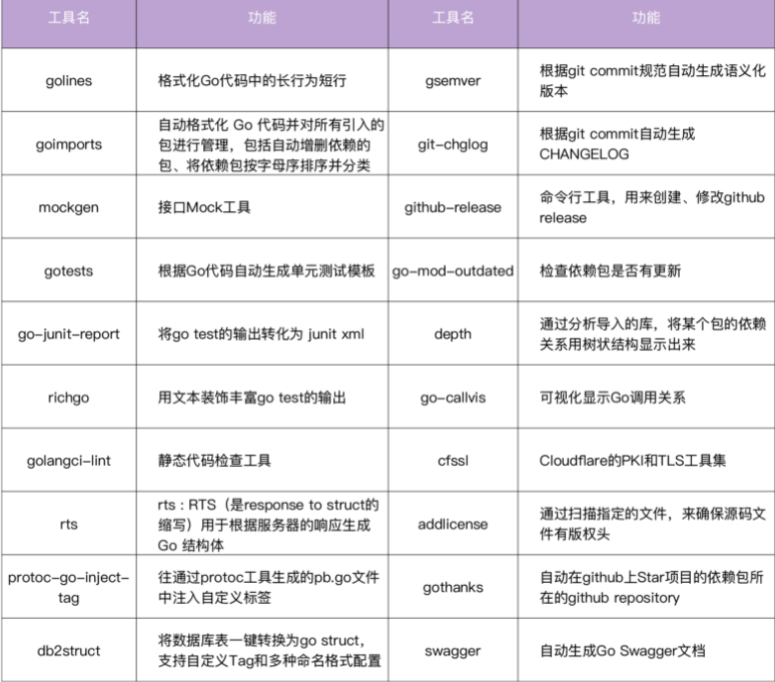

# 《Go 语言项目开发实战》分析笔记

## 第10章 设计方法：怎么写出优雅的 Go 项目

### Q1：这一章的内容属于哪一类别

计算机/编程语言/Golang

### Q2：这一章的内容是什么

### Q3：这一章的大纲是什么

- 如何写出优雅的 Go 项目？
- 编写高质量的 Go 应用
  - 代码结构
  - 代码规范
  - 代码质量
  - 编程哲学
  - 软件设计方法
- 高效管理项目
  - 高效的开发流程
  - 使用 Makefile 管理项目
  - 自动生成代码
  - 善于借助工具
  - 对接 CI/CD
- 编写高质量的项目文档

### Q4：作者想要解决什么问题

### Q5：这一章的关键词是什么

### Q6：这一章的关键句是什么

#### 如何写出优雅的 Go 项目

- Go 项目的构成
  - Go 应用
  - 项目管理
  - 项目文档

- 如何写出一个优雅的 Go 项目
  - 用「最佳实践」的方式去实现 Go 项目中的 Go 应用、项目管理和项目文档。
  - 具体来说，就是编写高质量的 Go 应用、高效管理项目、编写高质量的项目文档。

#### 编写高质量的 Go 应用

- 一个优雅的 Go 应用需要具备的特点
  - 符合 Go 编码规范和最佳实践
  - 易阅读、易理解、易维护
  - 易测试、易扩展
  - 代码质量高

- 编写一个高质量的 Go 应用需要从 5 个方面入手
  - 代码结构
    - 目录结构
    - 按功能拆分模块
  - 代码规范
    - 编码规范
    - 最佳实践
  - 代码质量
    - 编写可测试的代码
    - 高单元测试覆盖率
    - Code Review
  - 编程哲学
    - 面向接口编程
    - 面向「对象」编程
  - 软件设计方法
    - 设计模式
    - 遵循 SOLID 原则

##### 代码结构

- 组织代码结构需要从 2 个方面入手
  - 组织一个好的目录结构
  - 选择一个好的模块拆分方法
    - 建议按功能拆分

- 模块拆分方法
  - 按层拆分
    - 最大的问题是循环引用：相同功能可能在不同层被使用到，而这些功能又分散在不同的层中，很容易造成循环引用。
  - 按功能拆分
    - 不同模块，功能单一，可以实现高内聚低耦合的设计哲学。
    - 因为所有的功能只需要实现一次，引用逻辑清晰，会大大减少出现循环引用的概率。

##### 代码规范

- Go 社区比较受欢迎的 Go 编程规范：[Uber Go 语言编码规范][1]

- Go 的静态代码检查工具：[golangci-lint][2]

- Go 语言最佳实践相关资料
  - [Effective Go][3]: 高效 Go 编程，由 Golang 官方编写，里面包含了编写 Go 代码的一些建议，也可以理解为最佳实践。
  - [Go Code Review Comments][4]: Golang 官方编写的 Go 最佳实践，作为 Effective Go 的补充。
  - [Style guideline for Go packages][5]: 包含了如何组织 Go 包、如何命名 Go 包、如何写 Go 包文档的一些建议。

- [github smallnest/go-best-practices][6] 推荐的其他资料
  - [Go CommonMistakes][7]: 介绍 Golang 的一些常见的错误用法。
  - [Go Proverbs][8]
  - [The Zen of Go][9]
  - [The Zen of Go: Details][10]
  - [Go Styleguide][11]
  - [Go testing style guide][12]
  - [Idiomatic Go][13]
  - [Clean Go Code][14]
  - [Go Advices][15]
  - [go-perfbook][16]
  - [Twelve Go Best Practices][17]
  - [The Evolution of a Go Programmer][18]

- [50 Shades of Go: Traps, Gotchas, and Common Mistakes for New Golang Devs][19]

##### 代码质量

- 提高代码质量的方法
  - 单元测试
  - Code Review

- 单元测试的实践要点
  - 编写可测试的代码
    - 要尽可能减少 function 中的依赖，让 function 只依赖必要的模块。编写一个功能单一、职责分明的函数，会有利于减少依赖。
    - 依赖模块应该是易 Mock 的。
  - 借助常用的 Mock 工具来 Mock 需要的接口
  - 使用 gotests 工具自动生成单元测试代码，减少编写单元测试用例的工作量，将你从重复的劳动中解放出来。
  - 定期检查单元测试覆盖率。你可以通过以下方法来检查：

  ```bash
  go test -race -cover  -coverprofile=./coverage.out -timeout=10m -short -v ./...
  go tool cover -func ./coverage.out
  ```

- 常用的 Mock 工具
  - [golang/mock][20]: 是官方提供的 Mock 框架。
    - 它实现了基于 interface 的 Mock 功能，能够与 Golang 内置的 testing 包做很好的集成，是最常用的 Mock 工具。
    - golang/mock 提供了 mockgen 工具用来生成 interface 对应的 Mock 源文件。
  - [sqlmock][21]，可以用来模拟数据库连接。数据库是项目中比较常见的依赖，在遇到数据库依赖时都可以用它。
  - [httpmock][22]，可以用来 Mock HTTP 请求。
  - [bouk/monkey][23]，猴子补丁，能够通过替换函数指针的方式来修改任意函数的实现。
    - 如果 golang/mock、sqlmock 和 httpmock 这几种方法都不能满足我们的需求，我们可以尝试通过猴子补丁的方式来 Mock 依赖。
    - 可以这么说，猴子补丁提供了单元测试 Mock 依赖的最终解决方案。

- 建立 Code Review 机制的三部曲
  - 首先，确保我们使用的代码托管平台有 Code Review 的功能。比如，GitHub、GitLab 这类代码托管平台都具备这种能力。
  - 接着， **建立一套 Code Review 规范，规定如何进行 Code Review。**
  - 最后，也是最重要的，每次代码变更，相关开发人员都要去落实 Code Review 机制，并形成习惯，直到最后形成团队文化。

##### 编程哲学

- Go 语言有很多设计哲学，对代码质量影响比较大的，我认为有两个：面向接口编程和面向「对象」编程。

- 面向接口编程的优点：解耦
  - 接口的作用，其实就是为不同层级的模块提供一个定义好的中间层。
  - 这样，上游不再需要依赖下游的具体实现，充分地对上下游进行了解耦。
  - 很多流行的 Go 设计模式，就是通过面向接口编程的思想来实现的。

- 面向对象编程中，有几个核心特性：类、实例、抽象，封装、继承、多态、构造函数、析构函数、方法重载、this 指针。

- Go 语言不支持面向对象编程，但是却可以通过一些语言级的特性来实现类似的效果。
  - 类、抽象、封装通过结构体来实现。
  - 实例通过结构体变量来实现。
  - 继承通过组合来实现。
    - 一个结构体嵌到另一个结构体，称作组合。
    - 例如一个结构体包含了一个匿名结构体，就说这个结构体组合了该匿名结构体。多态通过接口来实现。
  - 至于构造函数、析构函数、方法重载和 this 指针等，Go 为了保持语言的简洁性去掉了这些特性。

##### 软件设计方法

- 优秀的软件设计方法有很多，其中有两类方法对我们代码质量的提升特别有帮助，分别是 **设计模式** 和 **SOLID 原则**。

- 如果说设计模式解决的是具体的场景，那么 SOLID 原则就是我们设计应用代码时的指导方针。

- GOF 设计模式：3 大类、共 25 种
  - 创建型模式
    - 单例模式
    - 简单工程模式
    - 抽象工厂模式
    - 建造者模式
    - 原型模式
  - 结构性模式
    - 访问者模式
    - 模板模式
    - 策略模式
    - 状态模式
    - 观察者模式
    - 备忘录模式
    - 中介者模式
    - 迭代器模式
    - 解释器模式
    - 命令模式
    - 责任链模式
  - 行为型模式
    - 适配器模式
    - 桥接模式
    - 组合模式
    - 装饰模式
    - 外观模式
    - 享元模式
    - 代理模式
    - 选项模式

- [SOLID 原则][24]
  - SRP(Single-responsiblity Principle): 单一功能原则。一个类或者模块只负责完成一个职责（或者功能）。
  - OCP(Open-closed Principle): 开闭原则。软件实体应该对扩展开放、对修改关闭。
  - LSP(Liskov Substitution Principle): 如果 S 是 T 的子类型，则类型 T 的对象可以替换为类型 S 的对象，而不会破坏程序。
  - DIP(Interface Segregation Principle): 依赖倒置原则。依赖于抽象而不是一个实例，其本质是要面向接口编程，不要面向实现编程。
  - ISP(Dependency Inversion Principle): 接口分离原则。客户端程序不应该依赖它不需要的方法。

#### 高效管理项目

- 高效管理项目的3个重点
  - 高效的开发流程
  - 使用 Makefile 管理项目
  - 自动生成代码

- IAM 项目的 Makefile 功能示例

  ```bash
   build              Build source code for host platform.
    build.multiarch    Build source code for multiple platforms. See option PLATFORMS.
    image              Build docker images for host arch.
    image.multiarch    Build docker images for multiple platforms. See option PLATFORMS.
    push               Build docker images for host arch and push images to registry.
    push.multiarch     Build docker images for multiple platforms and push images to registry.
    deploy             Deploy updated components to development env.
    clean              Remove all files that are created by building.
    lint               Check syntax and styling of go sources.
    test               Run unit test.
    cover              Run unit test and get test coverage.
    release            Release iam
    format             Gofmt (reformat) package sources (exclude vendor dir if existed).
    verify-copyright   Verify the boilerplate headers for all files.
    add-copyright      Ensures source code files have copyright license headers.
    gen                Generate all necessary files, such as error code files.
    ca                 Generate CA files for all iam components.
    install            Install iam system with all its components.
    swagger            Generate swagger document.
    serve-swagger      Serve swagger spec and docs.
    dependencies       Install necessary dependencies.
    tools              install dependent tools.
    check-updates      Check outdated dependencies of the go projects.
    help               Show this help info.
  ```

- IAM 项目的代码自动生成示例
  - 错误码、错误码说明文档。
  - 自动生成缺失的 doc.go 文件。
  - 利用 gotests 工具，自动生成单元测试用例。
  - 使用 Swagger 工具，自动生成 Swagger 文档。
  - 使用 Mock 工具，自动生成接口的 Mock 实例。

##### 善于借助工具

  

##### 对接 CI/CD

- 当前比较流行的 CI/CD 工具有 Jenkins、GitLab、Argo、Github Actions、JenkinsX 等。

#### 编写高质量的项目文档

- 一个优雅的项目，还应该有完善的文档。例如 README.md、安装文档、开发文档、使用文档、API 接口文档、设计文档等等。

### Q7：作者是怎么论述的

### Q8：作者解决了什么问题

### Q9：我有哪些疑问

### Q10：这一章说得有道理吗？为什么

### Q11: 这一章讨论的知识的本质是什么

### Q12: 这一章讨论的知识的第一原则是什么

### Q13：这一章讨论的知识的结构是怎样的

### Q14：这一章讨论的知识为什么是这样的？为什么发展成这样？为什么需要它

### Q15：有哪些相似的知识？它们之间的联系是什么

### Q16：其他领域/学科有没有相关的知识？日常生活中有没有类似的现象

### Q17: 这一章对我有哪些用处/帮助/启示

### Q18: 我如何应用这一章的知识去解决问题

  [1]: https://github.com/uber-go/guide/blob/master/style.md
  [2]: https://github.com/golangci/golangci-lint
  [3]: https://golang.org/doc/effective_go
  [4]: https://github.com/golang/go/wiki/CodeReviewComments
  [5]: https://rakyll.org/style-packages/
  [6]: https://github.com/smallnest/go-best-practices
  [7]: https://github.com/golang/go/wiki/CommonMistakes
  [8]: https://go-proverbs.github.io/
  [9]: https://the-zen-of-go.netlify.app/
  [10]: https://dave.cheney.net/2020/02/23/the-zen-of-go
  [11]: https://github.com/bahlo/go-styleguide
  [12]: https://www.arp242.net/go-testing-style.html
  [13]: https://dmitri.shuralyov.com/idiomatic-go#use-consistent-spelling-of-certain-words
  [14]: https://github.com/Pungyeon/clean-go-article
  [15]: https://github.com/cristaloleg/go-advice
  [16]: https://github.com/dgryski/go-perfbook
  [17]: https://talks.golang.org/2013/bestpractices.slide#1
  [18]: https://github.com/SuperPaintman/the-evolution-of-a-go-programmer
  [19]: http://devs.cloudimmunity.com/gotchas-and-common-mistakes-in-go-golang/
  [20]: https://github.com/golang/mock
  [21]: https://github.com/DATA-DOG/go-sqlmock
  [22]: https://github.com/jarcoal/httpmock
  [23]: https://github.com/bouk/monkey
  [24]: https://github.com/marmotedu/geekbang-go/blob/master/SOLID%E5%8E%9F%E5%88%99%E4%BB%8B%E7%BB%8D.md
