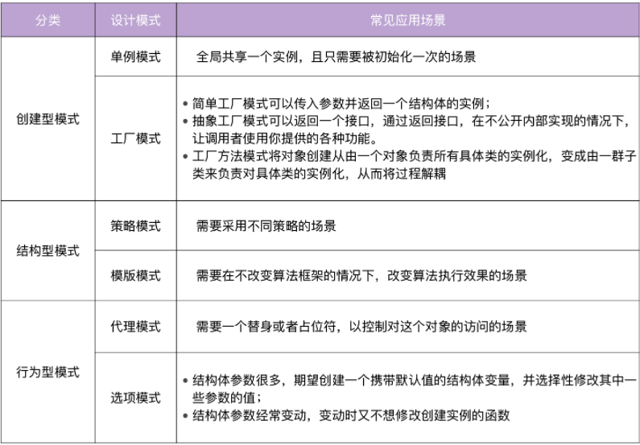

# 《Go 语言项目开发实战》分析笔记

## 第11章 设计模式：Go 常用设计模式概述

### Q1：这一章的内容属于哪一类别？

计算机/设计模式

### Q2：这一章的内容是什么？

### Q3：这一章的大纲是什么？

- 创建型模式
  - 单例模式
  - 工厂模式
- 结构性模式
  - 策略模式
  - 模板模式
- 行为型模式
  - 代理模式
  - 选项模式
- 总结

### Q4：作者想要解决什么问题？

### Q5：这一章的关键词是什么？

### Q6：这一章的关键句是什么？

#### 创建型模式

##### 单例模式

- 单例模式的定义
  - 在 Go 中，单例模式指的是全局只有一个实例，并且它负责创建自己的对象。
  - 单例模式不仅有利于减少内存开支，还有减少系统性能开销、防止多个实例产生冲突等优点。

- 单例模式的应用场景
  - 比较适合全局共享一个实例，且只需要被初始化一次的场景，例如数据库实例、全局配置、全局任务池等。

- 单例模式的分类：饿汉方式和懒汉方式。
  - 饿汉方式指全局的单例实例在包被加载时创建
  - 懒汉方式指全局的单例实例在第一次被使用时创建

- 单例模式的优雅实现

  ```go
  package singleton

  import (
      "sync"
  )

  type singleton struct {
  }

  var ins *singleton
  var once sync.Once

  func GetInsOr() *singleton {
      once.Do(func() {
          ins = &singleton{}
      })
      return ins
  }
  ```

##### 工厂模式

- 工厂模式的分类
  - 简单工厂模式
    - 它就是一个接受一些参数，然后返回 Person 实例的函数
  - 抽象工厂模式
    - 它和简单工厂模式的唯一区别，就是它返回的是接口而不是结构体。
    - 通过返回接口，可以在你不公开内部实现的情况下，让调用者使用你提供的各种功能。
    - 通过返回接口，我们还可以实现多个工厂函数，来返回不同的接口实现。
  - 工厂方法模式
    - 依赖工厂函数，我们可以通过实现工厂函数来创建多种工厂
    - 将对象创建从由一个对象负责所有具体类的实例化，变成由一群子类来负责对具体类的实例化，从而将过程解耦。

- 建议返回非指针
  - 在使用简单工厂模式和抽象工厂模式返回实例对象时，都可以返回指针。
  - 在实际开发中，我建议返回非指针的实例，因为我们主要是想通过创建实例，调用其提供的方法，而不是对实例做更改。
  - 通过返回非指针的实例，可以确保实例的属性，避免属性被意外 / 任意修改。
  - 如果需要对实例做更改，可以实现SetXXX的方法。

#### 结构型模式

- 结构型模式的特点： **关注类和对象的组合**。

##### 策略模式

- 策略模式的定义
  - 定义一组算法，将每个算法都封装起来，并且使它们之间可以互换。

- 策略模式的应用场景
  - 在项目开发中，我们经常要根据不同的场景，采取不同的措施，也就是不同的策略。
  - 在实际应用中，随着功能和体验的不断增长，我们需要经常添加 / 修改策略，
    这样就需要不断修改已有代码，不仅会让这个函数越来越难维护，还可能因为修改带来一些 bug。
  - 所以为了解耦，需要使用策略模式，定义一些独立的类来封装不同的算法，每一个类封装一个具体的算法（即策略）。

##### 模板模式

- 模板模式的定义
  - 定义一个操作中算法的骨架，而将一些步骤延迟到子类中。
  - 这种方法让子类在不改变一个算法结构的情况下，就能重新定义该算法的某些特定步骤。

- 模板模式的简单解释
  - 模板模式就是将一个类中能够公共使用的方法放置在抽象类中实现，将不能公共使用的方法作为抽象方法，强制子类去实现
  - 这样就做到了将一个类作为一个模板，让开发者去填充需要填充的地方。

#### 行为型模式

##### 代理模式

- 代理模式 (Proxy Pattern)，可以为另一个对象提供一个替身或者占位符，以控制对这个对象的访问。

##### 选项模式

- 选项模式的作用
  - 使用选项模式，我们可以创建一个带有默认值的 struct 变量，并选择性地修改其中一些参数的值。
  - 选项模式（Options Pattern）是 Go 项目开发中经常使用到的模式，例如，grpc/grpc-go 的NewServer函数，uber-go/zap 包的New函数都用到了选项模式。

- 选项模式的优点
  - 支持传递多个参数，并且在参数发生变化时保持兼容性；
  - 支持任意顺序传递参数；
  - 支持默认值；
  - 方便扩展；
  - 通过 WithXXX 的函数命名，可以使参数意义更加明确，等等。

- 选项模式的适用场景
  - 结构体参数很多，创建结构体时，我们期望创建一个携带默认值的结构体变量，并选择性修改其中一些参数的值。
  - 结构体参数经常变动，变动时我们又不想修改创建实例的函数。例如：结构体新增一个 retry 参数，但是又不想在 NewConnect 入参列表中添加retry int这样的参数声明。
  - 如果结构体参数比较少，可以慎重考虑要不要采用选项模式。

#### 总结

  

### Q7：作者是怎么论述的？

### Q8：作者解决了什么问题？

### Q9：我有哪些疑问？

### Q10：这一章说得有道理吗？为什么？

### Q11: 这一章讨论的知识的本质是什么？

### Q12: 这一章讨论的知识的第一原则是什么？

### Q13：这一章讨论的知识的结构是怎样的？

### Q14：这一章讨论的知识为什么是这样的？为什么发展成这样？为什么需要它？

### Q15：有哪些相似的知识？它们之间的联系是什么？

### Q16：其他领域/学科有没有相关的知识？日常生活中有没有类似的现象？

### Q17: 这一章对我有哪些用处/帮助/启示？

### Q18: 我如何应用这一章的知识去解决问题？
