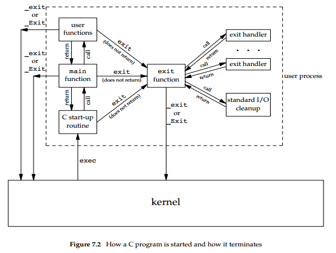
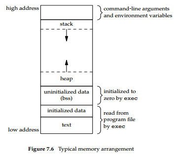

# 《Advanced Programming in the UNIX Environment》分析笔记

## Chapter 7: Process Environment

### Q1：这一章的内容属于哪一类别？

计算机/操作系统

### Q2：这一章的内容是什么？

### Q3：这一章的大纲是什么？

- `main` Function
- Process Termination
- Command-Line Arguments
- Environment List
- Memory Layout of a C Program
- Shared Libraries
- Memory Allocation
- Environment Variables
- `setjmp` and `longjmp` Functions
- `getrlimit` and `setrlimit` Functions

### Q4：作者想要解决什么问题？

### Q5：这一章的关键词是什么？

### Q6：这一章的关键句是什么？

#### 7.2 `main` Function

- set-up routine
  - When a C program is executed by the kernel—by one of the `exec` functions—
    a special start-up routine is called before the main function is called.
  - The executable program file specifies this routine as the starting address for the program;
    this is set up by the link editor when it is invoked by the C compiler.
  - This start-up routine takes values from the kernel—the command-line arguments and the environment —
    and sets things up so that the main function is called.

#### 7.3 Process Termination

- There are 8 ways for a process to terminate.
  - Normal termination occurs in 5 ways:
    - Return from `main`
    - Calling `exit`
    - Calling `_exit` or `_Exit`
    - Return of the last thread from its start routine
    - Calling `pthread_exit` from the last thread
  - Abnormal termination occurs in 3 ways:
    - Calling `abort`
    - Receipt of a signal
    - Response of the last thread to a cancellation request

- The start-up routine
  - The start-up routine is also written so that if the main function returns, the `exit` function is called.
  - If the start-up routine were coded in C (it is often coded in assembly language) the call to `main` could look like

  ```c
  exit(main(argc, argv));
  ```

- 3 functions terminate a program normally:
  - `_exit` and `_Exit`, which return to the kernel immediately,
  - `exit`, which performs certain cleanup processing and then returns to the kernel.

  ```c
  #include <stdlib.h>

  void exit(int status);
  void _Exit(int status);

  #include <unistd.h>

  void _exit(int status);
  ```

- Historically, the exit function has always performed a clean shutdown of the standard I/O library:
  - the `fclose` function is called for all open streams.

- Undefined exit status
  - If (a) any of these functions is called without an exit status,
  - (b) main does a return without a return value,
  - or (c) the main function is not declared to return an integer,
  - the exit status of the process is undefined.

- Returning an integer value from the `main` function is equivalent to calling `exit` with the same value.

- `exit` handlers
  - With ISO C, a process can register at least 32 functions that are automatically called by `exit`.
  - These are called `exit` handlers and are registered by calling the `atexit` function.
  - An `exit` handler is called once for each time it is registered.

  ```c
  #include <stdlib.h>

  int atexit(void (*func)(void));

  // Returns: 0 if OK, nonzero on error
  ```

- How a C program is started and the various ways it can terminate

  

#### 7.4 Command-Line Arguments

- When a program is executed, the process that does the `exec` can pass command-line arguments to the new program.
  - This is part of the normal operation of the UNIX system shells.

#### 7.5 Environment List

- How environment list is stored
  - Each program is also passed an environment list.
  - Like the argument list, the environment list is an array of character pointers,
    with each pointer containing the address of a null-terminated C string.
  - The address of the array of pointers is contained in the global variable environ: `extern char **environ;`

- How environment is represented
  - By convention, the environment consists of `name=value` strings.
  - Most predefined names are entirely uppercase, but this is only a convention.

- How to access to environment variables
  - Access to specific environment variables is normally through the `getenv` and `putenv` functions,
    instead of through the `environ` variable.
  - But to go through the entire environment, the `environ` pointer must be used.

#### 7.6 Memory Layout of a C Program

- Historically, a C program has been composed of the following pieces:
  - Text segment
    - consisting of the machine instructions that the CPU executes.
    - Usually, the text segment is **sharable**
      so that only a single copy needs to be in memory for frequently executed programs,
      such as text editors, the C compiler, the shells, and so on.
    - Also, the text segment is often **read-only**,
      to prevent a program from accidentally modifying its instructions.
  - Initialized data segment
    - usually called simply the data segment,
    - containing variables that are specifically initialized in the program.
  - Uninitialized data segment
    - often called the **"bss"** segment,
      named after an ancient assembler operator that stood for **"block started by symbol"**.
    - Data in this segment is initialized by the kernel to arithmetic 0 or null pointers before the program starts executing.
  - Stack
    - where automatic variables are stored, along with information that is saved each time a function is called.
    - Each time a function is called,
      the address of where to return to and certain information about the caller's environment,
      such as some of the machine registers,
      are saved on the stack.
    - The newly called function then allocates room on the stack for its automatic and temporary variables.
  - Heap
    - where dynamic memory allocation usually takes place.
    - Historically, the heap has been located between the uninitialized data and the stack.

- The typical arrangement of these segments
  - The following image is a logical picture of how a program looks;
    there is no requirement that a given implementation arrange its memory in this fashion.
  - With Linux on a 32-bit Intel x86 processor,
    - the text segment starts at location `0x08048000`,
    - the bottom of the stack starts just below `0xC0000000`.
  - The contents of the uninitialized data segment are not stored in the program file on disk,
    because the kernel sets the contents to 0 before the program starts running.
  - The only portions of the program that need to be saved in the program file are the text segment and the initialized data.

  

- The `size(1)` command reports the sizes (in bytes) of the text, data, and bss segments.

#### 7.7 Shared Libraries

- Benefit and overhead
  - Shared libraries remove the common library routines from the executable file,
    instead maintaining a single copy of the library routine somewhere in memory that all processes reference.
  - This reduces the size of each executable file but may add some runtime overhead,
    either when the program is first executed or the first time each shared library function is called.

- Easier to update libraries
  - library functions can be replaced with new versions without having to relink edit every program that uses the library
    (assuming that the number and type of arguments haven't changed).

#### 7.8 Memory Allocation

- ISO C specifies three functions for memory allocation:
  - `malloc`
    - Allocates a specified number of bytes of memory.
    - The initial value of the memory is **indeterminate**.
  - `calloc`
    - Allocates space for a specified number of objects of a specified size.
    - **The space is initialized to all 0 bits**.
  - `realloc`
    - Increases or decreases the size of a previously allocated area.
    - When the size increases, it may involve moving the previously allocated area somewhere else,
      to provide the additional room at the end.
    - when the size increases,
      the initial value of the space between the old contents and the end of the new area is **indeterminate**.

  ```c
  #include <stdlib.h>

  void *malloc(size_t size);
  void *calloc(size_t nobj, size_t size);
  void *realloc(void *ptr, size_t newsize);

  // All three return: non-null pointer if OK, NULL on error

  void free(void *ptr);
  ```

- Return value
  - The pointer returned by the three allocation functions is guaranteed to be suitably aligned
    so that it can be used for any data object.
  - The default return value for undeclared functions is int,
    so using a cast without the proper function declaration could **hide an error** on systems
    where the size of type int differs from the size of a function's return value.
    (Wu: avoid using a cast.)

- `sbrk`
  - The allocation routines are usually implemented with the `sbrk` system call.
  - This system call expands (or contracts) the heap of the process.

- Lazy free
  - Although sbrk can expand or contract the memory of a process,
    most versions of malloc and free never decrease their memory size.
  - The space that we free is available for a later allocation,
    but the freed space is not usually returned to the kernel;
    instead, that space is kept in the **malloc pool**.

- Writing past the end or before the start of an allocated area
  - May overwrite record-keeping info
    - Most implementations allocate more space than requested and use the additional space for record keeping —
      the size of the block, a pointer to the next allocated block, and the like.
    - As a consequence, writing past the end or before the start of an allocated area
      could overwrite this **record-keeping** information in another block.
    - These types of errors are often catastrophic, but difficult to find,
      because the error may not show up until much later.
  - May overwrite dynamically allocated objects
    - Writing past the end or before the beginning of a dynamically allocated buffer
      can corrupt more than internal record-keeping information.
    - The memory before and after a dynamically allocated buffer
      can potentially be used for other dynamically allocated objects.
    - These objects can be unrelated to the code corrupting them,
      making it even more difficult to find the source of the corruption.

- Other possible errors that can be fatal
  - freeing a block that was already freed
  - calling `free` with a pointer that was not obtained from one of the three `alloc` functions.
  - memory leakage
    - If a process calls `malloc` but forgets to call `free`, its memory usage will continually increase;
      this is called **leakage**.
    - If we do not call `free` to return unused space,
      the size of a process's address space will slowly increase until no free space is left.
    - During this time, performance can degrade from excess paging overhead.

- Because memory allocation errors are difficult to track down,
  some systems provide versions of these functions
  that do additional error checking every time one of the three alloc functions or free is called.
  These versions of the functions are often specified by including a special library for the link editor.
  There are also publicly available sources that you can compile with special flags to enable additional runtime checking.

- Other memory library functions
  - SVR4-based systems, such as Solaris, include the `libmalloc` library,
    which provides a set of interfaces matching the ISO C memory allocation functions.
  - The `libmalloc` library includes `mallopt`,
    a function that allows a process to set certain variables that control the operation of the storage allocator.
  - A function called `mallinfo` is also available to provide statistics on the memory allocator.

- `malloc` algorithm
  - Historically, the standard malloc algorithm used either a best-fit or a first-fit memory allocation strategy.
  - **Quick-fit** is faster than either, but tends to use more memory.
  - Quick-fit is based on splitting up memory into buffers of various sizes
    and maintaining unused buffers on different free lists, depending on the buffer sizes.
  - Most modern allocators are based on quick-fit.

- `alloca`
  - The function `alloca` has the same calling sequence as `malloc`.
  - Instead of allocating memory from the heap, the memory is allocated from the stack frame of the current function.
  - The advantage is that we don't have to free the space; it goes away automatically when the function returns.
    The `alloca` function increases the size of the stack frame.
  - The disadvantage is that some systems can't support `alloca`,
    if it's impossible to increase the size of the stack frame after the function has been called.
  - Nevertheless, many software packages use it, and implementations exist for a wide variety of systems.

#### 7.9 Environment Variables

- Get an environment variable
  - ISO C defines a function that we can use to fetch values from the environment,
  - but this standard says that the contents of the environment are implementation defined.

  ```c
  #include <stdlib.h>

  char *getenv(const char *name);

  // Returns: pointer to value associated with name, NULL if not found
  ```

- Set an environment variable

  ```c
  #include <stdlib.h>

  int putenv(char *str);
  // Returns: 0 if OK, nonzero on error

  int setenv(const char *name, const char *value, int rewrite);
  int unsetenv(const char *name);

  // Both return: 0 if OK, −1 on error
  ```

- The operation of these three functions
  - `putenv`
    - Takes a string of the form `name=value` and places it in the environment list.
    - If name already exists, its old definition is first removed.
  - `setenv`
    - Sets name to value.
    - If name already exists in the environment, then
      - (a) if rewrite is nonzero, the existing definition for name is first removed;
      - or (b) if rewrite is 0,
        an existing definition for name is not removed, name is not set to the new value, and no error occurs.
  - `unsetenv`
    - Removes any definition of name.
    - It is not an error if such a definition does not exist.

- We cannot affect the the environment of the parent process
  - Note that we can affect the environment of only the current process and any child processes that we invoke.
  - We cannot affect the environment of the parent process, which is often a shell.
  - Nevertheless, it is still useful to be able to modify the environment list.

- How these functions must operate when modifying the environment list
  - If we're modifying an existing name:
    - If the size of the new value is less than or equal to the size of the existing value,
      we can just copy the new string over the old string.
    - If the size of the new value is larger than the old one,
      we must malloc to obtain room for the new string,
      copy the new string to this area,
      and then replace the old pointer in the environment list for name with the pointer to this allocated area.
  - If we're adding a new name, it's more complicated.
    - First, we have to call `malloc` to allocate room for the `name=value` string and copy the string to this area.
    - Then, if it's the first time we've added a new name,
      - We have to call `malloc` to obtain room for a new list of pointers.
      - We copy the old environment list to this new area
        and store a pointer to the `name=value` string at the end of this list of pointers.
      - We also store a null pointer at the end of this list, of course.
      - Finally, we set `environ` to point to this new list of pointers.
      - Note that if the original environment list was contained above the top of the stack, as is common,
        then we have moved this list of pointers to the heap.
      - But most of the pointers in this list still point to `name=value` strings above the top of the stack.
    - If this isn't the first time we've added new strings to the environment list,
      then we know that we've already allocated room for the list on the heap,
      so we just call `realloc` to allocate room for one more pointer.
      The pointer to the new `name=value` string is stored at the end of the list (on top of the previous null pointer),
      followed by a null pointer.

#### 7.10 `setjmp` and `longjmp` Functions

- Special branching
  - In C, we can't goto a label that’s in another function.
  - Instead, we must use the `setjmp` and `longjmp` functions to perform this type of branching.

  ```c
  #include <setjmp.h>

  int setjmp(jmp_buf env);
  // Returns: 0 if called directly, nonzero if returning from a call to longjmp

  void longjmp(jmp_buf env, int val);
  ```

- `setjmp()`
  - saves various information about the calling environment in the buffer `env` for later use by `longjmp()`
    - the stack pointer
    - the instruction pointer
    - possibly the values of other registers and the signal mask.
  - In this case, `setjmp()` returns 0.

- `longjmp()`
  - Uses the information saved in `env` to transfer control back to the point where `setjmp()` was called
    and to restore ("rewind") the stack to its state at the time of the `setjmp()` call.
  - In addition, and depending on the implementation,
    the values of some other registers and the process signal mask may be restored to their state
    at the time of the `setjmp()` call.

- Roll back the variables
  - Most implementations do not try to roll back these automatic variables and register variables,
    but the standards say only that their values are indeterminate.
  - If you have an automatic variable that you don't want rolled back, define it with the `volatile` attribute.
  - Variables that are declared as global or `static` are left alone when `longjmp` is executed.

- An automatic variable can never be referenced after the function that declared it returns.

#### 7.11 `getrlimit` and `setrlimit` Functions

- Resource Limits
  - Every process has a set of resource limits,
    some of which can be queried and changed by the `getrlimit` and `setrlimit` functions.

  ```c
  #include <sys/resource.h>

  int getrlimit(int resource, struct rlimit *rlptr);
  int setrlimit(int resource, const struct rlimit *rlptr);

  // Both return: 0 if OK, −1 on error
  ```

- Each call to these two functions specifies a single resource and a pointer to the following structure:

  ```c
  struct rlimit {
      rlim_t rlim_cur; /* soft limit: current limit */
      rlim_t rlim_max; /* hard limit: maximum value for rlim_cur */
  };
  ```

- Three rules govern the changing of the resource limits.
  - A process can change its soft limit to a value less than or equal to its hard limit.
  - A process can lower its hard limit to a value greater than or equal to its soft limit.
    This lowering of the hard limit is irreversible for normal users.
  - Only a superuser process can raise a hard limit.

#### Exercises

- Exercise 7.3
  - Q: Is there any way for a function that is called by main to examine the command-line arguments without
    - (a) passing argc and argv as arguments from main to the function or
    - (b) having main copy argc and argv into global variables?
  - A:
    - On most UNIX systems, there is no way to do this.
    - Copies of argc and argv are not kept in global variables like environ is.

- Exercise 7.4
  - Q: Some UNIX system implementations purposely arrange that,
    when a program is executed, location 0 in the data segment is not accessible. Why?
  - A: This provides a way to terminate the process when it tries to dereference a null pointer,
    a common C programming error.

- Exercise 7.6
  - Q:
    - If we allocate an array of longs using `calloc`, is the array initialized to 0?
    - If we allocate an array of pointers using `calloc`, is the array initialized to null pointers?
  - A:
    - `calloc` initializes the memory that it allocates to all zero bits.
    - ISO C does not guarantee that this is the same as either a floating-point 0 or a null pointer.

### Q7：作者是怎么论述的？

### Q8：作者解决了什么问题？

### Q9：我有哪些疑问？

### Q10：这一章说得有道理吗？为什么？

### Q11: 这一章讨论的知识的本质是什么？

### Q12: 这一章讨论的知识的第一原则是什么？

### Q13：这一章讨论的知识的结构是怎样的？

### Q14：这一章讨论的知识为什么是这样的？为什么发展成这样？为什么需要它？

### Q15：有哪些相似的知识？它们之间的联系是什么？

### Q16：其他领域/学科有没有相关的知识？日常生活中有没有类似的现象？

### Q17: 这一章对我有哪些用处/帮助/启示？

### Q18: 我如何应用这一章的知识去解决问题？
