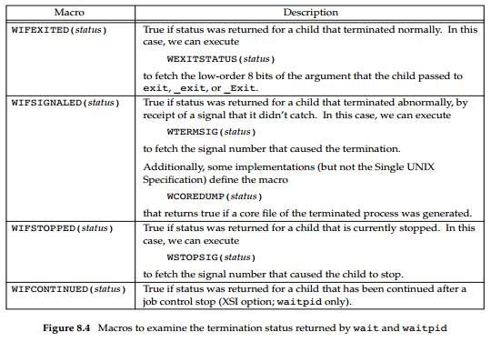

# 《Advanced Programming in the UNIX Environment》分析笔记

## Chapter 8: Process Control

### Q1：这一章的内容属于哪一类别

计算机/操作系统。

### Q2：这一章的内容是什么

### Q3：这一章的大纲是什么

- Process Identifiers
- `fork` Function
- `vfork` Function
- `exit` Functions
- `wait` and `waitpid` Functions
- `waitid` Function
- `wait3` and `wait4` Functions
- Race Conditions
- `exec` Functions
- Changing User IDs and Group IDs
- Interpreter Files
- `system` Function
- Process Accounting
- User Identification
- Process Scheduling
- Process Times

### Q4：作者想要解决什么问题

### Q5：这一章的关键词是什么

- Wall clock time (or Wall time): the actual time taken from the start of a computer program to the end.
  In other words, it is the difference between the time at which a task finishes and the time at which the task started.

- CPU time: the time during which the processor is actively working on a certain task.

### Q6：这一章的关键句是什么

#### 8.2 Process Identifiers

- Every process has a unique process ID, a non-negative integer.

- Although unique, process IDs are reused.
  - As processes terminate, their IDs become candidates for reuse.
  - Most UNIX systems implement algorithms to **delay reuse**,
    so that newly created processes are assigned IDs different from those used by processes that terminated recently.
    This prevents a new process from being mistaken for the previous process to have used the same ID.

- Process ID 0
  - Process ID 0 is usually the scheduler process and is often known as the swapper.
  - No program on disk corresponds to this process, which is part of the kernel and is known as a system process.

- Process ID 1
  - Process ID 1 is usually the `init` process and is invoked by the kernel at the end of the bootstrap procedure.
  - The program file for this process was `/etc/init` in older versions of the UNIX System and is `/sbin/init` in newer versions.
  - This process is responsible for bringing up a UNIX system after the kernel has been bootstrapped.
  - `init` usually reads the system-dependent initialization files —
    the `/etc/rc*` files or `/etc/inittab` and the files in `/etc/init.d` —
    and brings the system to a certain state, such as multiuser.
  - The init process never dies.
  - It is a normal user process, not a system process within the kernel, like the swapper,
    although it does run with superuser privileges.

- In addition to the process ID, there are other identifiers for every process.
  The following functions return these identifiers.

  ```c
  #include <unistd.h>

  pid_t getpid(void);
  // Returns: process ID of calling process

  pid_t getppid(void);
  // Returns: parent process ID of calling process

  uid_t getuid(void);
  // Returns: real user ID of calling process

  uid_t geteuid(void);
  // Returns: effective user ID of calling process

  gid_t getgid(void);
  // Returns: real group ID of calling process

  gid_t getegid(void);
  // Returns: effective group ID of calling process
  ```

#### 8.3 `fork` Function

- An existing process can create a new one by calling the `fork` function.

  ```c
  #include <unistd.h>

  pid_t fork(void);

  // Returns: 0 in child, process ID of child in parent, −1 on error
  ```

- Return value
  - This function is called once but returns twice.
  - The only difference in the returns is that the return value in the child is 0,
    whereas the return value in the parent is the process ID of the new child.
  - The reason the child's process ID is returned to the parent is that a process can have more than one child,
    and there is no function that allows a process to obtain the process IDs of its children.
  - The reason fork returns 0 to the child is that a process can have only a single parent,
    and the child can always call getppid to obtain the process ID of its parent.
    (Process ID 0 is reserved for use by the kernel, so it's not possible for 0 to be the process ID of a child.)

- The child is a copy of the parent.
  - For example, the child gets a copy of the parent’s data space, heap, and stack.
  - Note that this is a copy for the child; the parent and the child do not share these portions of memory.
  - However, the parent and the child do share the text segment.

- COW (Copy-On-Write)
  - Modern implementations don't perform a complete copy of the parent's data, stack, and heap,
    since a `fork` is often followed by an `exec`.
  - Instead, a technique called copy-on-write (COW) is used.
  - These regions are shared by the parent and the child and have their protection changed by the kernel to read-only.
  - If either process tries to modify these regions, the kernel then makes a copy of that piece of memory only,
    typically a "page" in a virtual memory system.

- File Sharing
  - All file descriptors that are open in the parent are duplicated in the child.
  - It is important that the parent and the child share the same file offset.
  - If both parent and child write to the same descriptor that was open before the `fork`,
    without any form of synchronization, such as having the parent wait for the child,
    their output will be intermixed.

- There are two normal cases for handling the descriptors after a `fork`.
  - The parent waits for the child to complete.
    - In this case, the parent does not need to do anything with its descriptors.
    - When the child terminates,
      any of the shared descriptors that the child read from or wrote to
      will have their file offsets updated accordingly.
  - Both the parent and the child go their own ways.
    - Here, after the fork, the parent closes the descriptors that it doesn't need,
      and the child does the same thing.
    - This way, neither interferes with the other's open descriptors.
    - This scenario is often found with network servers.

- Properties of the parent that are inherited by the child:
  - Open files
  - Real user ID, real group ID, effective user ID, and effective group ID
  - Supplementary group IDs
  - Process group ID
  - Session ID
  - Controlling terminal
  - The set-user-ID and set-group-ID flags
  - Current working directory
  - Root directory
  - File mode creation mask
  - Signal mask and dispositions
  - The close-on-exec flag for any open file descriptors
  - Environment
  - Attached shared memory segments
  - Memory mappings
  - Resource limits

- The differences between the parent and child are
  - The return values from `fork` are different.
  - The process IDs are different.
  - The two processes have different parent process IDs:
    - the parent process ID of the child is the parent;
    - the parent process ID of the parent doesn't change.
  - The child’s tms_utime, tms_stime, tms_cutime, and tms_cstime values are set to 0.
  - File locks set by the parent are not inherited by the child.
  - Pending alarms are cleared for the child.
  - The set of pending signals for the child is set to the empty set.

- The two main reasons for fork to fail are
  - if too many processes are already in the system, which usually means that something else is wrong.
  - if the total number of processes for this real user ID exceeds the system’s limit.

- There are two uses for fork:
  - When a process wants to duplicate itself
    so that the parent and the child can each execute different sections of code at the same time.
    This is common for network servers—
    - The parent waits for a service request from a client.
    - When the request arrives, the parent calls `fork` and lets the child handle the request.
    - The parent goes back to waiting for the next service request to arrive.
  - When a process wants to execute a different program.
    This is common for shells. In this case, the child does an exec right after it returns from the fork.

#### 8.4 `vfork` Function

- `vfork` vs `fork`
  - The `vfork` function was intended to create a new process for the purpose of executing a new program.
  - The `vfork` function creates the new process, just like `fork`,
    without copying the address space of the parent into the child, as the child won't reference that address space;
    the child simply calls `exec` (or `exit`) right after the `vfork`.
  - Instead, the child runs in the address space of the parent until it calls either `exec` or `exit`.

- Problem
  - This optimization is more efficient on some implementations of the UNIX System,
    but leads to undefined results if the child
    - modifies any data (except the variable used to hold the return value from `vfork`),
    - makes function calls,
    - or returns without calling `exec` or `exit`.

- Child first
  - Another difference between the two functions is that `vfork` guarantees that the child runs first,
    until the child calls `exec` or `exit`.
  - When the child calls either of these functions, the parent resumes.
  - This can lead to **deadlock**
    if the child depends on further actions of the parent before calling either of these two functions.

#### 8.5 `exit` Functions

- A process can terminate normally in five ways:
  - Executing a return from the main function.
  - Calling the `exit` function.
    - This function is defined by ISO C
      and includes the calling of all **exit handlers**
      that have been registered by calling atexit and closing all standard I/O streams.
    - Because ISO C does not deal with file descriptors, multiple processes (parents and children), and job control,
      the definition of this function is incomplete for a UNIX system.
  - Calling the `_exit` or `_Exit` function.
    - ISO C defines `_Exit` to provide a way for a process to terminate without running exit handlers or signal handlers.
    - Whether standard I/O streams are flushed depends on the implementation.
    - On UNIX systems, `_Exit` and `_exit` are synonymous and do not flush standard I/O streams.
    - The `_exit` function is called by exit and handles the UNIX system-specific details.
    - `_exit` is specified by POSIX.1.
  - Executing a return from the start routine of the last thread in the process.
    - The return value of the thread is not used as the return value of the process.
    - When the last thread returns from its start routine, the process exits with a termination status of 0.
  - Calling the `pthread_exit` function from the last thread in the process.
    - The exit status of the process in this situation is always 0, regardless of the argument passed to `pthread_exit`.

- The three forms of abnormal termination are as follows:
  - Calling `abort`.
    - This is a special case of the next item, as it generates the `SIGABRT` signal.
  - When the process receives certain signals.
    - The signal can be generated
      - by the process itself (e.g., by calling the `abort` function),
      - by some other process,
      - or by the kernel.
    - Examples of signals generated by the kernel
      include the process referencing a memory location not within its address space or trying to divide by 0.
  - The last thread responds to a cancellation request.
    - By default, cancellation occurs in a deferred manner:
      one thread requests that another be canceled, and sometime later the target thread terminates.

- The kernel code
  - Regardless of how a process terminates, the same code in the kernel is eventually executed.
  - This kernel code closes all the open descriptors for the process, releases the memory that it was using, and so on.

- Notify its parent
  - For any of the preceding cases, we want the terminating process to be able to notify its parent how it terminated.
  - For the three `exit` functions (`exit`, `_exit`, and `_Exit`),
    this is done by passing an exit status as the argument to the function.
  - In the case of an abnormal termination,
    the kernel—not the process — generates a termination status to indicate the reason for the abnormal termination.
  - In any case,
    the parent of the process can obtain the termination status from either the `wait` or the `waitpid` function.

- Exit status vs Termination status
  - **exit status** is the argument to one of the three exit functions or the return value from main.
  - The exit status is converted into a **termination status** by the kernel when `_exit` is finally called.

- Examine the termination status of a child
  - If the child terminated normally, the parent can obtain the exit status of the child.

    

- [The reason and the exit code][1]
  - The status stored by `waitpid()` encodes both the reason that the child process was terminated and the exit code.
  - The reason is stored in the least-significant byte (obtained by `status & 0xff`).
  - The exit code is stored in the next byte (masked by `status & 0xff00` and extracted by `WEXITSTATUS()`).
  - When the process terminates normally, the reason is 0
    and so `WEXITSTATUS` is just equivalent to shifting by 8 (or dividing by 256).
  - If the process is killed by a signal (such as SIGSEGV), there is no exit code,
    and you have to use WTERMSIG to extract the signal number from the reason byte.

- What happens if the parent terminates before the child?
  - The answer is that the `init` process becomes the parent process of any process whose parent terminates.
  - In such a case, we say that the process has been inherited by `init`.
  - What normally happens is that whenever a process terminates,
    the kernel goes through all active processes
    to see whether the terminating process is the parent of any process that still exists.
  - If so, the parent process ID of the surviving process is changed to be 1 (the process ID of `init`).
  - This way, we’re guaranteed that every process has a parent.

> Wu: On Ubuntu 18, The `systemd --user`, whose pid isn't 1,  becomes the parent process of any orphan process.

- What happens if the child terminates before the parent?
  - The kernel keeps a small amount of information for every terminating process,
    so that the information is available when the parent of the terminating process calls wait or waitpid.
  - Minimally, this information consists of the process ID,
    the termination status of the process,
    and the amount of CPU time taken by the process.
  - The kernel can discard all the memory used by the process and close its open files.

- Zombie
  - In UNIX System terminology, a process that has terminated, but whose parent has not yet waited for it,
    is called a **zombie**.

- What happens when a process that has been inherited by `init` terminates?
  - Does it become a zombie?
  - The answer is "no", because `init` is written so that whenever one of its children terminates,
    init calls one of the wait functions to fetch the termination status.
  - By doing this, init prevents the system from being clogged by zombies.

#### 8.6 `wait` and `waitpid` Functions

- `SIGCHLD` signal
  - When a process terminates, either normally or abnormally,
    the kernel notifies the parent by sending the **SIGCHLD** signal to the parent.
  - Because the termination of a child is an **asynchronous** event—
    it can happen at any time while the parent is running —
    this signal is the asynchronous notification from the kernel to the parent.
  - The parent can choose to ignore this signal,
    or it can provide a function that is called when the signal occurs: a signal handler.
  - The default action for this signal is to be ignored.

- Functions that wait for process to change state

  ```c
  #include <sys/wait.h>

  pid_t wait(int *statloc);
  pid_t waitpid(pid_t pid, int *statloc, int options);

  // Both return: process ID if OK, 0 (see later), or −1 on error
  ```

- `wait` vs `waitpid`
  - The `wait` function can block the caller until a child process terminates,
    whereas `waitpid` has an option that prevents it from blocking.
  - The `waitpid` function doesn't wait for the child that terminates first;
    it has a number of options that control which process it waits for.
  - The `waitpid` function provides 3 features that aren't provided by the `wait` function:
    - The `waitpid` function lets us wait for one particular process,
      whereas the `wait` function returns the status of any terminated child.
    - The `waitpid` function provides a nonblocking version of `wait`.
      There are times when we want to fetch a child's status, but we don't want to block.
    - The `waitpid` function provides support for job control with the `WUNTRACED` and `WCONTINUED` options.

- The value of `pid` in the `waitpid` function can be:
  - `< -1` meaning wait for any child process whose process group ID is equal to the absolute value of pid.
  - `-1`   meaning wait for any child process.
  - `0`    meaning wait for any child process whose process group ID is equal to that of the calling process.
  - `> 0`  meaning wait for the child whose process ID is equal to the value of pid.

- The value of `options` is an OR of zero or more of the following constants:
  - `WNOHANG` return immediately if no child has exited.
  - `WUNTRACED` also return if a child has stopped.
  - `WCONTINUED` also return if a stopped child has been resumed by delivery of `SIGCONT`.

  

- **fork twice**
  - If we want to write a process
    so that it forks a child
    but we don't want to wait for the child to complete
    and we don't want the child to become a zombie until we terminate,
    the trick is to call **fork twice**.

#### 8.7 `waitid` Function

- The `waitid` function is similar to `waitpid`, but provides extra flexibility.

  ```c
  #include <sys/wait.h>

  int waitid(idtype_t idtype, id_t id, siginfo_t *infop, int options);

  // Returns: 0 if OK, −1 on error
  ```

- Two separate arguments
  - Instead of encoding this information in a single argument combined with the process ID or process group ID,
    **two separate arguments** are used.
  - The `id` parameter is interpreted based on the value of `idtype`.

- idtype
  - `idtype == P_PID` Wait for the child whose process ID matches id.
  - `idtype == P_PGID` Wait for any child whose process group ID matches id.
  - `idtype == P_ALL` Wait for any child; id is ignored.

- options
  - `WCONTINUED` Wait for a process that has previously stopped and has been continued,
    and whose status has not yet been reported.
  - `WEXITED` Wait for processes that have exited.
  - `WNOHANG` Return immediately instead of blocking if there is no child exit status available.
  - `WNOWAIT` Don’t destroy the child exit status.
    The child's exit status can be retrieved by a subsequent call to wait, waitid, or waitpid.
  - `WSTOPPED` Wait for a process that has stopped and whose status has not yet been reported.

- **At least one of WCONTINUED, WEXITED, or WSTOPPED must be specified in the options argument.**

#### 8.8 `wait3` and `wait4` Funcitons

- `wait3` and `wait4` provides an additional argument
  - that allows the kernel to return **a summary of the resources**
    used by the terminated process and all its child processes.

  ```c
  #include <sys/types.h>
  #include <sys/wait.h>
  #include <sys/time.h>
  #include <sys/resource.h>

  pid_t wait3(int *statloc, int options, struct rusage *rusage);
  pid_t wait4(pid_t pid, int *statloc, int options, struct rusage *rusage);

  // Both return: process ID if OK, 0, or −1 on error
  ```

- The resource information includes such statistics as
  - the amount of user CPU time,
  - amount of system CPU time,
  - number of page faults,
  - number of signals received,
  - and the like.

- Refer to the **getrusage(2)** manual page for additional details.

#### 8.9 Race Conditions

- A **race condition** occurs
  when multiple processes are trying to do something with shared data
  and the final outcome **depends on the order** in which the processes run.

- The `fork` function is a lively breeding ground for race conditions,
  if any of the logic after the fork either explicitly or implicitly depends on
  whether the parent or child runs first after the `fork`.

- To avoid race conditions and to avoid polling,
  some form of **signaling** is required between multiple processes.
  - Signals
  - interprocess communication (IPC)

- A common scenario to avoid race conditions

  ```c
  #include "apue.h"

  TELL_WAIT(); /* set things up for TELL_xxx & WAIT_xxx */

  if ((pid = fork()) < 0) {
      err_sys("fork error");
  } else if (pid == 0) { /* child */
      /* child does whatever is necessary ... */

      TELL_PARENT(getppid()); /* tell parent we're done */
      WAIT_PARENT(); /* and wait for parent */

      /* and the child continues on its way ... */

      exit(0);
  }

  /* parent does whatever is necessary ... */

  TELL_CHILD(pid); /* tell child we’re done */
  WAIT_CHILD(); /* and wait for child */

  /* and the parent continues on its way ... */

  exit(0);
  ```

#### 8.10 `exec` Functions

- What `exec` does
  - The process ID does not change across an `exec`, because a new process is not created;
  - `exec` merely replaces the current process — its text, data, heap, and stack segments —
    with a brand-new program from disk.

> Question: How does exec work?

- `exec` Functions

  ```c
  #include <unistd.h>

  int execl(const char *pathname, const char *arg0, ... /* (char *)0 */ );
  int execv(const char *pathname, char *const argv[]);
  int execle(const char *pathname, const char *arg0, ... /* (char *)0, char *const envp[] */ );
  int execve(const char *pathname, char *const argv[], char *const envp[]);
  int execlp(const char *filename, const char *arg0, ... /* (char *)0 */ );
  int execvp(const char *filename, char *const argv[]);
  int fexecve(int fd, char *const argv[], char *const envp[]);

  // All seven return: −1 on error, no return on success
  ```

- How to remember these `exec` functions?
  - The letter p means that
    the function takes a filename argument and uses the PATH environment variable to find the executable file.
    - If the specified filename includes a slash character, then PATH is ignored,
      and the file at the specified pathname is executed.
  - The letter l means that
    the function takes a list of arguments and is mutually exclusive with the letter v,
    which means that it takes an `argv[]` vector.
  - The letter e means that
    the function takes an `envp[]` array instead of using the current environment.

  

- If the file isn't a machine executable
  - If either `execlp` or `execvp` finds an executable file using one of the path prefixes,
    but the file isn't a machine executable that was generated by the link editor,
    the function assumes that the file is a shell script
    and tries to invoke `/bin/sh` with the filename as input to the shell.

- Specify a certain environment for a child
  - Normally, a process allows its environment to be propagated to its children,
    but in some cases, a process wants to specify a certain environment for a child.
  - One example of the latter is the `login` program when a new login shell is initiated.
    - Normally, login creates a specific environment with only a few variables defined
      and lets us, through the shell start-up file, add variables to the environment when we log in.

- After an `exec`, the new program inherits additional properties from the calling process:
  - Process ID and parent process ID
  - Real user ID and real group ID
  - Supplementary group IDs
  - Process group ID
  - Session ID
  - Controlling terminal
  - Time left until alarm clock
  - Current working directory
  - Root directory
  - File mode creation mask
  - File locks
  - Process signal mask
  - Pending signals
  - Resource limits
  - Nice value
  - Values for tms_utime, tms_stime, tms_cutime, and tms_cstime

- Handle the open files
  - The handling of open files depends on the value of the `close-on-exec` flag for each descriptor.
  - Every open descriptor in a process has a `close-on-exec` flag.
  - If this flag is set, the descriptor is closed across an `exec`.
    Otherwise, the descriptor is left open across the `exec`.
  - The default is to leave the descriptor open across the `exec`
    unless we specifically set the `close-on-exec` flag using `fcntl`.

#### 8.11 Changing User IDs and Group IDs

- **Lease-privilege** model
  - In general, we try to use the **least-privilege** model when we design our applications.
  - According to this model, our programs should use the least privilege necessary to accomplish any given task.
  - This reduces the risk that security might be compromised by a malicious user
    trying to trick our programs into using their privileges in unintended ways.

- Set the real/effective user/group ID
  - We can set the real user ID and effective user ID with the `setuid` function.
  - Similarly, we can set the real group ID and the effective group ID with the `setgid` function.

  ```c
  #include <unistd.h>

  int setuid(uid_t uid);
  int setgid(gid_t gid);

  // Both return: 0 if OK, −1 on error
  ```

- Rules for who can change the IDs (Everything we describe for the user ID also applies to the group ID.)
  - If the process has superuser privileges,
    the `setuid` function sets the real user ID, effective user ID, and saved set-user-ID to uid.
  - If the process does not have superuser privileges, but uid equals either the real user ID or the saved set-user-ID,
    `setuid` sets only the effective user ID to uid. The real user ID and the saved set-user-ID are not changed.
  - If neither of these two conditions is true, `errno` is set to `EPERM` and -1 is returned.

- Real user ID
  - Only a superuser process can change the real user ID.
  - Normally, the real user ID is set by the `login` program when we log in and never changes.
  - Because `login` is a superuser process, it sets all three user IDs when it calls `setuid`.

- Effective user ID
  - The effective user ID is set by the `exec` functions only if the set-user-ID bit is set for the program file.
  - If the set-user-ID bit is not set, the `exec` functions leave the effective user ID as its current value.
  - We can call `setuid` at any time to set the effective user ID to either the real user ID or the saved set-user-ID.
  - Naturally, we can't set the effective user ID to any random value.

- Saved set-user-ID
  - The saved set-user-ID is copied from the effective user ID by `exec`.
  - If the file's set-user-ID bit is set, this copy is saved after `exec` stores the effective user ID from the file’s user ID.

- Historically, BSD supported the swapping of the real user ID and the effective user ID with the `setreuid` function.

  ```c
  #include <unistd.h>

  int setreuid(uid_t ruid, uid_t euid);
  int setregid(gid_t rgid, gid_t egid);

  // Both return: 0 if OK, −1 on error
  ```

- Set effective user/group ID
  - POSIX.1 includes the two functions `seteuid` and `setegid`.
  - These functions are similar to `setuid` and `setgid`, but only the effective user ID or effective group ID is changed.

  ```c
  #include <unistd.h>

  int seteuid(uid_t uid);
  int setegid(gid_t gid);

  // Both return: 0 if OK, −1 on error
  ```

#### 8.12 Interpreter Files

- All contemporary UNIX systems support interpreter files.
  - These files are text files that begin with a line of the following form.
  - The space between the exclamation point and the pathname is optional.
  - The pathname is normally an absolute pathname, since no special operations are performed on it (i.e., PATH is not used).

  ```shell
  #! pathname [ optional-argument ]
  ```

- How kernel executes these files
  - The recognition of these files is done within the kernel as part of processing the exec system call.
  - The actual file that gets executed by the kernel is not the interpreter file,
    but rather the file specified by the pathname on the first line of the interpreter file.
  - Be sure to differentiate
    between the interpreter file—a text file that begins with `#!`—
    and the interpreter, which is specified by the pathname on the first line of the interpreter file.

- A common use for the optional argument following the interpreter pathname is
  to specify the `-f` option for programs that support this option.

- Interpreter files are useful for the following reasons:
  - They hide that certain programs are scripts in some other language.
  - Interpreter scripts provide an efficiency gain.
  - Interpreter scripts let us write shell scripts using shells other than `/bin/sh`.

#### 8.13 system Function

- `system` function
  - It is convenient to execute a command string from within a program.
  - ISO C defines the `system` function, but its operation is strongly system dependent.
  - POSIX.1 includes the system interface, expanding on the ISO C definition to describe its behavior in a POSIX environment.

  ```c
  #include <stdlib.h>
  int system(const char *cmdstring);
  ```

- Return values of `system` function
  - If cmdstring is a null pointer, system returns nonzero only if a command processor is available.
  - Because `system` is implemented by calling `fork`, `exec`, and `waitpid`, there are three types of return values.
  - If either the `fork` fails or `waitpid` returns an error other than `EINTR`,
    `system` returns -1 with errno set to indicate the error.
  - If the `exec` fails, implying that the shell can't be executed,
    the return value is as if the shell had executed `exit(127)`.
  - Otherwise, all three functions—`fork`, `exec`, and `waitpid`—succeed,
    and the return value from system is the termination status of the shell, in the format specified for waitpid.

- Execute the command by shell
  - The shell parses this null-terminated C string and breaks it up into separate command-line arguments for the command.
  - The actual command string that is passed to the shell can contain any valid shell commands.
    For example, input and output redirection using `<` and `>` can be used.

- Execute the command ourself
  - If we didn't use the shell to execute the command, but tried to execute the command ourself, it would be more difficult.
  - First, we would want to call execlp, instead of execl, to use the `PATH` variable, like the shell.
  - We would also have to break up the null-terminated C string into separate command-line arguments for the call to execlp.
  - Finally, we wouldn't be able to use any of the shell metacharacters.

#### 8.14 Process Accounting

- Option of Process Accounting
  - Most UNIX systems provide an option to do process accounting.
  - When enabled, the kernel writes an accounting record each time a process terminates.

- Content of Process Accounting
  - These accounting records typically contain a small amount of binary data with the name of the command,
  - the amount of CPU time used,
  - the user ID and group ID,
  - the starting time,
  - and so on.

- `acct` and `accton`
  - `acct` function enables and disables process accounting
  - `accton` command turns process accounting on or off
  - The accounting records are written to the specified file, which is usually `/var/log/account/pacct` on Linux.

#### 8.15 User Identification

- The system normally keeps track of the name we log in under, and the `getlogin` function provides a way to fetch that login name.

  ```c
  #include <unistd.h>

  char *getlogin(void);

  // Returns: pointer to string giving login name if OK, NULL on error
  ```

- This function can fail if the process is not attached to a terminal that a user logged in to.
  We normally call these processes **daemons**.

#### 8.16 Process Scheduling

- Coarse Control by adjusting `nice` value
  - Historically, the UNIX System provided processes with only coarse control over their scheduling priority.
  - The scheduling policy and priority were determined by the kernel.
  - A process could choose to run with lower priority by adjusting its nice value
    (thus a process could be "nice" and reduce its share of the CPU by adjusting its nice value).
  - Only a privileged process was allowed to increase its scheduling priority.
    (Question: it seems that we can increase out process's priority by decreasing its nice value?)

- `nice` value
  - In the Single UNIX Specification, nice values range from 0 to `(2*NZERO)−1`,
    although some implementations support a range from 0 to `2*NZERO`.
  - Lower nice values have higher scheduling priority.
    Although this might seem backward, it actually makes sense: the more nice you are, the lower your scheduling priority is.
  - `NZERO` is the default nice value of the system.

- `nice` function
  - A process can retrieve and change its nice value with the `nice` function.
  - With this function, a process can affect only its own nice value; it can't affect the nice value of any other process.

  ```c
  #include <unistd.h>

  int nice(int incr);

  // Returns: (new nice value - NZERO) if OK, -1 on error
  // 伍注：成功时返回的是新的 nice 值减去 NZERO 的结果
  ```

> 伍注：我在 Ubuntu 20.04 上测试本书的 nice 函数样例代码，得到的结果跟书中不太一样：
> 将子进程的 nice 值增加 20 后，结果跟父进程并无明显区别，不像书中的两者相差 10 倍。

- `incr` argument
  - The incr argument is added to the nice value of the calling process.
  - If incr is too large, the system silently reduces it to the maximum legal value.
  - If incr is too small, the system silently increases it to the minimum legal value.
  - Because -1 is a legal successful return value, we need to clear `errno` before calling nice and check its value if nice returns -1.
    If the call to `nice` succeeds and the return value is -1, then `errno` will still be zero.
    If `errno` is nonzero, it means that the call to `nice` failed.

> 伍注：由于新的 nice 值的取值范围为(0, 2*NZERO - 1)，因此新的 nice 值减去 NZERO 的结果是可能为 -1 的。

- `getpriority` function
  - Can be used to get the nice value for a process, just like the nice function.
  - Can also get the nice value for a group of related processes.

  ```c
  #include <sys/resource.h>

  int getpriority(int which, id_t who);

  // Returns: nice value between −NZERO and NZERO−1 if OK, −1 on error
  ```

- `which` and `who` argument
  - The `which` argument can take on one of three values:
  - `PRIO_PROCESS` to indicate a process,
  - `PRIO_PGRP` to indicate a process group,
  - `PRIO_USER` to indicate a user ID.
  - The `which` argument controls how the who argument is interpreted.
  - The `who` argument selects the process or processes of interest.
  - If the `who` argument is 0, then it indicates the calling process, process group, or user
    (depending on the value of the `which` argument).
  - When `which` is set to `PRIO_USER` and `who` is 0, the real user ID of the calling process is used.
  - When `which` applies to more than one process, the highest priority (lowest value) of all the applicable processes is returned.

- `setpriority` function
  - Used to set the priority of a process, a process group, or all the processes belonging to a particular user ID.
  - The `which` and `who` arguments are the same as in the `getpriority` function.
  - The value is **added** to `NZERO` and this becomes the new nice value.

  ```c
  #include <sys/resource.h>

  int setpriority(int which, id_t who, int value);

  // Returns: 0 if OK, −1 on error
  ```

#### 8.17 Process Times

- Any process can call the `times` function to obtain time values for itself and any terminated children.

  ```c
  #include <sys/times.h>

  clock_t times(struct tms *buf);

  // Returns: elapsed wall clock time in clock ticks if OK, −1 on error
  ```

- The `times` function fills in the `tms` structure pointed to by `buf`:

  ```c
  struct tms {
      clock_t tms_utime; /* user CPU time */
      clock_t tms_stime; /* system CPU time */
      clock_t tms_cutime; /* user CPU time, terminated children */
      clock_t tms_cstime; /* system CPU time, terminated children */
  };
  ```

- The `times` function returns the **wall clock time**.
  - Note that the structure `tms` does not contain any measurement for the wall clock time.
  - Instead, the function `times` returns the wall clock time as the value of the function, each time it's called.
  - This value is measured from some arbitrary point in the past, so we can't use its absolute value; instead, we use its relative value.
  - For example, we call times and save the return value.
    At some later time, we call times again and subtract the earlier return value from the new return value.
    The difference is the wall clock time.

- The unit for all the `clock_t` values: **Second**.
  - All the `clock_t` values returned by this function are converted to seconds using the number of clock ticks per second—
    the `_SC_CLK_TCK` value returned by sysconf.

### Q7：作者是怎么论述的

### Q8：作者解决了什么问题

### Q9：我有哪些疑问

### Q10：这一章说得有道理吗？为什么

### Q11: 这一章讨论的知识的本质是什么

### Q12: 这一章讨论的知识的第一原则是什么

### Q13：这一章讨论的知识的结构是怎样的

### Q14：这一章讨论的知识为什么是这样的？为什么发展成这样？为什么需要它

### Q15：有哪些相似的知识？它们之间的联系是什么

### Q16：其他领域/学科有没有相关的知识？日常生活中有没有类似的现象

### Q17: 这一章对我有哪些用处/帮助/启示

### Q18: 我如何应用这一章的知识去解决问题

  [1]: https://stackoverflow.com/a/808995
