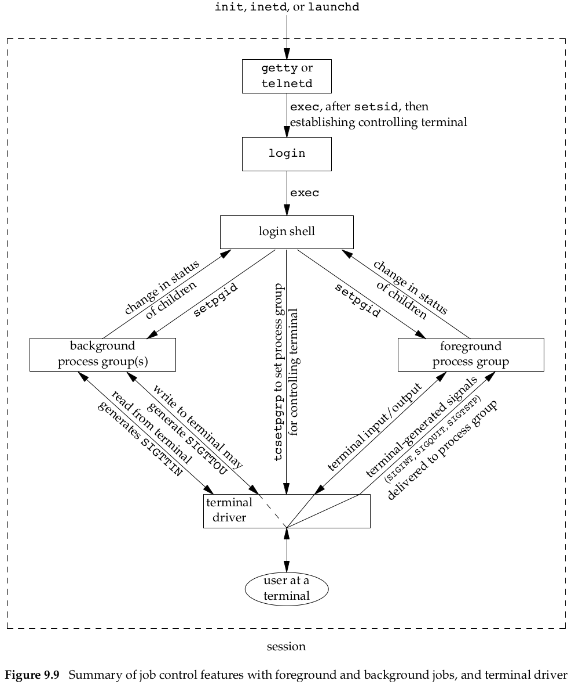

# 《Advanced Programming in the Unix Environment》分析笔记

## Chapter 9: Process Relationships

### Q1：这一章的内容是什么？

### Q2：这一章的大纲是什么？

- Terminal Logins
- Network Logins
- Process Groups
- Sessions
- Controlling Terminal
- `tcgetpgrp`, `tcsetgprp`, and `tcgetsid` Functions
- Job Control
- Shell Execution of Programs
- Orphaned Process Groups
- FreeBSD Implementation

### Q3：作者想要解决什么问题？

### Q4：这一章的关键词是什么？

### Q5：这一章的关键句是什么？

#### 9.4 Process Group

- Definition of Process Group
  - A process group is a collection of one or more processes,
    usually associated with the same job, that can receive signals from the same terminal.

- Process Group ID
  - Each process group has a unique process group ID.
  - Process group IDs are similar to process IDs,
    they are positive integers and can be stored in a pid_t data type.

- Get Process Group ID

  ```c
  #include <unistd.h>

  pid_t getpgrp(void);

  // Returns: process group ID of calling process
  ```

  ```c
  #include <unistd.h>

  pid_t getpgid(pid_t pid);

  // Returns: process group ID if OK, −1 on error
  // getpgid(0) is equivalent to getpgrp()
  ```

> 伍注：实测发现，在 shell 里运行一个程序，该程序直接调用 getpgid，
> 返回的将是该程序对应进程的 pid。
> 换而言之，shell 进程创建的子进程的 pgid 就是该子进程的 pid。

- Process Group ID Leader
  - Each process group can have a process group leader.
  - The leader is identified by its process group ID being equal to its process ID.

- Process Group Lifetime
  - The period of time that begins when the group is created
    and ends when the last remaining process leaves the group.

- Set Process Group ID
  - A process joins an existing process group or creates a new process group by calling `setpgid`.

  ```c
  #include <unistd.h>

  int setpgid(pid_t pid, pid_t pgid);

  // Returns: 0 if OK, −1 on error
  // If pid is 0, the process ID of the caller is used.
  // If pgid is 0, the process ID specified by pid is used as the process group ID.
  ```

> 伍注：实测发现，一个进程在设置自己的 pgid 时，只能将其设置为自己的 pid，否则会报错。

- Whose process group id can a process set
  - A process can set the process group ID of only itself or any of its children.
  - It can't change the process group ID of one of its children
    after that child has called one of the `exec` functions.

- Call `setpgid` twice to avoice race condition
  - In most job-control shells,
    this function is called after a fork to have the parent set the process group ID of the child,
    and to have the child set its own process group ID.
  - One of these calls is redundant, but by doing both,
    we are guaranteed that the child is placed into its own process group
    before either process assumes that this has happened.
  - If we didn’t do this, we would have a race condition,
    since the child’s process group membership would depend on which process executes first.

#### 9.5 Sessions

- A session is a collection of one or more process groups.

- The processes in a process group are usually placed there by a shell pipeline.

- A process establishes a new session by calling the `setsid` function.

  ```c
  #include <unistd.h>

  pid_t setsid(void);

  // Returns: process group ID if OK, −1 on error
  ```

- If the calling process is not a process group leader,
  this function creates a new session.
  - The process becomes the session leader of this new session.
    (A session leader is the process that creates a session.)
    The process is the only process in this new session.
  - The process becomes the process group leader of a new process group.
    The new process group ID is the process ID of the calling process.
  - The process has no controlling terminal.
    If the process had a controlling terminal before calling `setsid`,
    that association is broken.

- If the caller is already a process group leader,
  this function returns an error.
  - To ensure this is not the case, the usual practice is
    to call `fork` and have the parent terminate and the child continue.

> 伍注：实测发现，在 shell 里运行一个程序，并且该程序直接调用 setsid，
> 会返回失败；而采用书中说的先 fork 然后在子进程中 setsid，可以成功。
> 究其原因，可能是因为在 shell 里运行程序时，会 fork 一个 shell 进程，
> 这个 shell 进程被设置为 process group leader，然后再 exec 对应程序。

- The `getsid` function returns the process group ID of a process’s session leader.

  ```c
  #include <unistd.h>

  pid_t getsid(pid_t pid);

  // Returns: session leader’s process group ID if OK, −1 on error
  // If pid is 0,
  // getsid returns the process group ID of the calling process’s session leader.
  ```

#### 9.6 Controlling Terminal

- Controlling Terminal
  - A session can have a single controlling terminal.
  - This is usually the terminal device (in the case of a terminal login)
    or pseudo terminal device (in the case of a network login) on which we log in.

- Controlling Process
  - The session leader that establishes the connection to the controlling terminal

- Division
  - The process groups within a session can be divided into
    a single foreground process group and one or more background process groups.
  - If a session has a controlling terminal,
    it has a single foreground process group
    and all other process groups in the session are background process groups.
  - Examples: The login shell, proc1 and proc2 are background process groups,
    and proc3, proc4 and proc5 are foreground process group.

  ```sh
  proc1 | proc2 &
  proc3 | proc4 | proc5
  ```

- The Interrupt Signal
  - Whenever we press the terminal’s interrupt key (often DELETE or Control-C),
    the interrupt signal is sent to all processes in the foreground process group.

- The Quit Signal
  - Whenever we press the terminal’s quit key (often Control-backslash),
    the quit signal is sent to all processes in the foreground process group.

- The Hang-up Signal
  - If a modem (or network) disconnect is detected by the terminal interface,
    the hang-up signal is sent to the controlling process (the session leader).

- Automatically established
  - Usually, we don’t have to worry about the controlling terminal;
    it is established automatically when we log in.

- Talk to the controlling terminal
  - The way a program guarantees that it is talking to the controlling terminal is
    to open the file `/dev/tty`.
  - This special file is a synonym within the kernel for the controlling terminal.
  - If the program doesn't have a controlling terminal, the open of this device will fail.

#### 9.7 tcgetpgrp, tcsetpgrp, and tcgetsid Functions

- tcgetpgrp
  - Tell the kernel which process group is the foreground process group,
    so that the terminal device driver knows where to send the terminal input
    and the terminal-generated signals

  ```c
  #include <unistd.h>

  pid_t tcgetpgrp(int fd);

  // Returns: process group ID of foreground process group if OK, −1 on error
  ```

- tcsetpgrp
  - If the process has a controlling terminal,
    the process can call tcsetpgrp to set the foreground process group ID to pgrpid.
  - The value of pgrpid must be the process group ID of a process group in the same session,
    and fd must refer to the controlling terminal of the session.

  ```c
  #include <unistd.h>

  int tcsetpgrp(int fd, pid_t pgrpid);

  // Returns: 0 if OK, −1 on error
  ```

- tcgetsid
  - allows an application to obtain the process group ID for the session leader
    given a file descriptor for the controlling TTY.
  - Applications that need to manage controlling terminals can use tcgetsid to
    identify the session ID of the controlling terminal’s session leader

  ```c
  #include <termios.h>

  pid_t tcgetsid(int fd);

  // Returns: session leader’s process group ID if OK, −1 on error
  ```

#### 9.8 Job Control

- A job is simply a collection of processes, often a pipeline of processes.

> 伍注：Ubuntu 系统下使用 `jobs` 可以查看所有活跃的 jobs。

- Function of Job Control
  - allows us to start multiple jobs (groups of processes) from a single terminal
    and to control which jobs can access the terminal and which jobs are run in the background.

> 伍注：任务管理可以让我们在后台启动大量任务，并且控制这些任务对终端的访问（只有前台任务可以访问终端）。

- Job identifier
  - When we start a background job,
    the shell assigns it a job identifier and prints one or more of the process IDs.

- Press Enter
  - When the jobs are done and we press RETURN, the shell tells us that the jobs are complete.
  - The reason we have to press RETURN is to have the shell print its prompt.
  - The shell doesn’t print the changed status of background jobs at any random time—
    only right before it prints its prompt, to let us enter a new command line.
  - If the shell didn’t do this, it could produce output while we were entering an input line.

> 伍注：终端只会在我们按下 Enter 键时打印后台任务的状态变更，这样是为了避免影响用户输入。

- The terminal driver looks for three special characters,
  which generate signals to the foreground process group.
  - The interrupt character (typically `DELETE` or `Control-C`) generates `SIGINT`.
  - The quit character (typically `Control-\`) generates `SIGQUIT`.
  - The suspend character (typically `Control-Z`) generates `SIGTSTP`.

- When background job reads the terminal
  - It is not an error for a background job to try to read from the terminal,
  - but the terminal driver detects this and sends a special signal to the background job: `SIGTTIN`.
  - This signal normally stops the background job;
  - By using the shell,
    we are notified of this event and can bring the job into the foreground so that it can read from the terminal.

> 伍注：如果后台任务想读取标准输入，就会收到终端的 SIGTTIN 信号而被暂停。
> 值得注意的是，这时我们无法感知这个后台任务被暂停了，除非我们按下 Enter 键（见上）。

- What happens if a background job sends its output to the controlling terminal?
  - This is an option that we can allow or disallow.
  - Normally, we use the `stty` command to change this option.
  - If disallow, the terminal would send the job the `SIGTTOU` signal.

  ```sh
  # Disable ability of background jobs to output to controlling terminal
  stty tostop
  ```

- Summary of job control

  

#### Shell Execution of Programs

> 伍注：结合实测来梳理一下 process group, session 和 job 的关系：
> 1. 打开一个终端后，就创建了一个 session。在这个终端下输入任何命令，其 sid 都相同。
> 2. 在终端上输入一条命令（可以是简单命令或由若干简单命令配合管道组成的复杂命令），
> 就创建了一个 process group，同时也创建了一个 job。这种情况下 process group 和 job 类似。

- 查看 pgid, sid, pgid

  ```bash
  ps -o pid,ppid,pgid,sid,tpgid,comm
  ```

- The order in which a shell creates processes can differ depending on the particular shell in use.
  - The bourne shell created the last process in the pipeline first,
    and this final process was the parent of the first process.
  - The Bourne-again shell is the parent of both processes.

> 伍注：bash 里面，由管道连接的多个命令，其父进程都是 bash 进程。

#### 9.10 Orphaned Process Groups

- Orphaned Process Groups
  - One in which the parent of every member is either itself a member of the group
    or is not a member of the group’s session.
  - Another way of saying this is that the process group is not orphaned as long as
    a process in the group has a parent in a different process group but in the same session.

- Since the process group is orphaned when the parent terminates,
  and the process group contains a stopped process,
  POSIX.1 requires that every process in the newly orphaned process group be sent the hang-up signal (SIGHUP)
  followed by the continue signal (SIGCONT).

### Q6：作者是怎么论述的？

### Q7：作者解决了什么问题？

### Q8：我有哪些疑问？

### Q9：这一章说得有道理吗？为什么？

### Q10：如何拓展这一章？

#### Q10.1：为什么是这样的？为什么发展成这样？为什么需要它？

#### Q10.2：有哪些相似的知识点？它们之间的联系是什么？

#### Q10.3：其他领域/学科有没有相关的知识点？日常生活中有没有类似的现象？

### Q11：这一章和我有什么关系？
