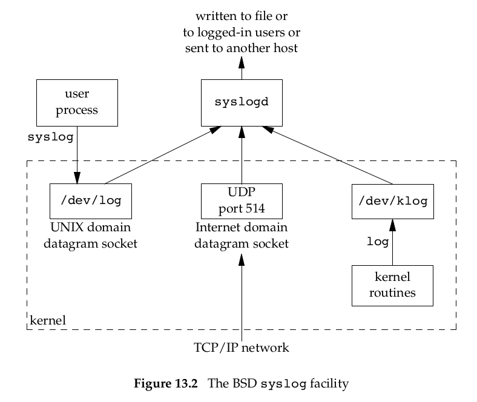

# 《Advanced Programming in the UNIX Environment》分析笔记

## Chapter 13: Daemon Process

### Q1：这一章的内容属于哪一类别？

计算机/操作系统/Unix

### Q2：这一章的内容是什么？

介绍后台进程的结构、实现方法及错误处理。

### Q3：这一章的大纲是什么？

- Introduction
- Daemon Characteristics
- Coding Rules
- Error Logging
- Single-Instance Daemons
- Daemon Conventions
- Client-Server Model

### Q4：作者想要解决什么问题？

### Q5：这一章的关键词是什么？

### Q6：这一章的关键句是什么？

#### 13.1 Introduction

- Daemon Processes
  - They are often started when the system is bootstrapped
  - They often terminate only when the system is shut down.
  - Because they don’t have a controlling terminal, we say that they run in the background.

#### 13.2 Daemon Characteristics

- `ps` command
  - In the sample `ps` output, kernel daemons appear with their names in **square brackets**.
  - Anything with a parent process ID of 0 is usually a kernel process started as part of the system bootstrap procedure.
  - If the process doesn't have a controlling terminal, the terminal name is set to `?`.

- Linux kernel daemon
  - `/sbin/init`: pid = 1, starting system services specific to various run levels.
  - `kthreadd`: pid = 2, create other kernel processes.
  - `kswapd`: supports the virtual memory subsystem by writing dirty pages to disk slowly over time, so the pages can be reclaimed.
  - `rsyslogd`: is available to any program to log system messages for an administrator.
  - `jbd`: helps implement the journal in the ext4 file system.
  - `cron`: executes commands at regularly scheduled dates and times.
  - `cupsd`: is a print spooler; it handles print requests on the system.

#### 13.3 Coding Rules

- `man 7 daemon` also introduces writing and packaging system daemons.
  - 这个 manpage 介绍了 SysV Daemons 和 New-Style Daemons 两种后台进程的编写规则，两者差异较大。

- Basic rules to coding a daemon
  - Call `umask` to set the file mode creation mask to a known value, usually 0.
  - Call `fork` and have the parent `exit`.
    - The child inherits the process group ID of the parent but gets a new process ID,
    - so we’re guaranteed that the child is not a process group leader.
    - This is a prerequisite for the call to `setsid` that is done next.
  - Call `setsid` to create a new session. The process
    - becomes the leader of a new session,
    - becomes the leader of a new process group,
    - is disassociated from its controlling terminal.
  - Change the current working directory to the root directory.
  - Unneeded file descriptors should be closed.
  - Some daemons open file descriptors 0, 1, and 2 to `/dev/null`
    - so that any library routines that try to read from standard input
      or write to standard output or standard error will have no effect.

> 伍注：
> 1. `setsid()` creates a new session if the calling process is not a process group leader.
> 2. `setsid()` fails if the calling process is already a process group leader.

- When our daemon is in an orphaned process group and is not a session leader,
  it has no chance of allocating a controlling terminal.

> 伍注：为什么？

#### 13.4 Error Logging

- The BSD `syslog` facility

  

- `syslog` function

  ```c
  #include <syslog.h>

  // `ident` will be added to each log message, it is normally the name of the program.
  void openlog(const char *ident, int option, int facility);
  void syslog(int priority, const char *format, ...);
  void closelog(void);

  // Returns: previous log priority mask value
  int setlogmask(int maskpri);
  ```

- `logger` program
  - is also provided by many systems as a way to send log messages to the syslog facility.

#### 13.5 Single-Instance Daemons

- Why we need single-instance daemon
  - `cron` daemon
  - the daemon that needs to access a device

- How to ensure that only one copy of a daemon is running.
  - Use the file- and record-locking mechanism

#### 13.6 Daemon Conventions

- Several common conventions are followed by daemons in the UNIX System.
  - If the daemon uses a lock file, the file is usually stored in `/var/run`.
    - The daemon might need superuser permissions to create a file here.
    - The name of the file is usually `name.pid`, where name is the name of the daemon or the service.
  - If the daemon supports configuration options, they are usually stored in `/etc`.
    - The configuration file is named `name.conf`, where name is the name of the daemon or the name of the service.
  - They are usually started from one of the system initialization scripts (`/etc/rc*` or `/etc/init.d/*`).
  - If a daemon has a configuration file, the daemon reads the file when it starts, but usually won’t look at it again.
    - If an administrator changes the configuration,
      the daemon would need to be stopped and restarted to account for the configuration changes.
    - To avoid this, some daemons will catch `SIGHUP` and reread their configuration files when they receive the signal.

#### 13.7 Client-Server Model

- `close-on-exec` flag
  - Leaving file descriptors open in the child process could pose a security problem.
  - An easy solution to this problem is to set the close-on-exec flag for all file descriptors that the executed program won’t need.

  ```c
  int set_cloexec(int fd) {
    int val;

    if ((val = fcntl(fd, F_GETFD, 0)) < 0) {
      return(-1);
    }

    val |= FD_CLOEXEC;

    /* enable close-on-exec */
    return(fcntl(fd, F_SETFD, val));
  }
  ```

### Q7：作者是怎么论述的？

### Q8：作者解决了什么问题？

### Q9：我有哪些疑问？

#### Q9.1: `/dev/null` 是什么设备？重定向到 `/dev/null` 具体有何后果？

#### Q9.2: 创建后台进程时为什么要使用 `umask` 修改文件掩码？

答：`man 7 daemon` 的输出文档中有以下解释，简而言之是为了后面的文件操作可以直接控制文件访问权限。

> In the daemon process, reset the umask to 0,
> so that the file modes passed to open(), mkdir() and suchlike directly control the access mode of the created files and directories.

#### Q9.3: 为什么不是 session leader 就没有机会分配一个控制终端？（见13.3节）

### Q10：这一章说得有道理吗？为什么？

### Q11: 这一章讨论的知识的本质是什么？

### Q12: 这一章讨论的知识的第一原则是什么？

### Q13：这一章讨论的知识的结构是怎样的？

### Q14：这一章讨论的知识为什么是这样的？为什么发展成这样？为什么需要它？

### Q15：有哪些相似的知识？它们之间的联系是什么？

### Q16：其他领域/学科有没有相关的知识？日常生活中有没有类似的现象？

### Q17: 这一章对我有哪些用处/帮助/启示？

### Q18: 我如何应用这一章的知识去解决问题？
