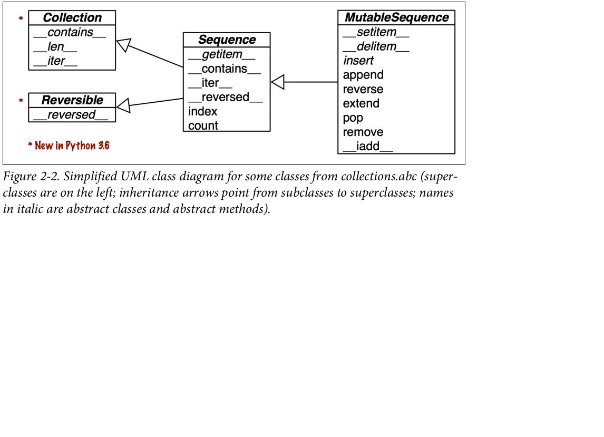

# Fluent Python 分析笔记

## 2 An Array of Sequences

这里说的「序列」包括列表、元祖、数组、队列、字符串、字节串等。

### 第2章讨论哪些内容

- 列表推导式和生成器表达式
- 作为记录的元祖和作为不可变列表的元祖
- 序列解包和序列模式匹配
- 切片读写
- 特殊序列类型，比如数组和队列

### 目前为止我知道什么

- 列表生成器。比如 `foo = [c for c in "hello, world"]`
- 生成器表达式，只记得关键字 `yield`，以及可以生成无穷序列，其他忘记了。
- 元组可以用作记录，比如表示二维坐标`(x, y)`；元组也可以作为不可变列表，可以作为 hash key。
- 序列解包。比如`name, age = ('guojing', 20)`。
- 切片读。比如`bar = foo[1:]`, `cat = foo[:5]` 或 `dog = foo[1:5]`等。
- Python 有个 array 库，array 跟 list 的区别是前者元素类型必须是相同的，因而内存利用效率和数据访问效率都更高。
- Python 有个 collections.deque 库，提供有队列的相关接口。

### 目前为止我不知道什么

- 生成器表达式的语法
- 序列解包的应用场景
- 序列模式匹配的语法
- 切片写的语法
- array 库的语法

### 第2章的主要内容是什么

- 序列分类
  - 按存储方式分类
    - 容器序列。例如 list，tuple，collections.deque
    - 平坦序列。例如 str，bytes，array.array
  - 按是否可变分类
    - 可变序列。例如 list，bytearray，array.array，collections.deque
    - 不可变序列。例如 tuple，str，bytes

  

- 可变序列是在继承不可变序列的所有方法后，增加一些方法得到的。

- 生成器表达式
  - 跟列表推导式语法相同，只是使用小括号代替方括号。
  - 举例：(chr(i) for i in range(0, 127))

- 元组 vs 列表

  ```python
  bar = (1)
  type(bar)  # int
  cat = (1,)
  type(cat)  # tuple
  ```

- 序列解包的应用场景
  - 同时赋值：`point = (3, 4); x, y = point`
  - 交换两个变量：`b, a = a, b`
  - 函数参数传递：`t = (20, 8); q,r = divmod(*t)`, `def func(arg, *args, **kwargs)`
  - 定义元组：`(*range(4), 4)`
  - 定义列表：`[*range(4), 4]`
  - 定义集合：`{*range(4), 4, *(5, 6, 7)}`

- 序列模式匹配
  - `_` 是通配符，可以匹配任意单个元素：`case [name, _, _]`
  - `*_` 可以匹配任意数量的元素：`case [name, *_, (lat, lon)]`
  - 支持序列解包：`case [name, (lat, lon)]`
  - 支持类型校验：`case [str(name), (float(lat), float(lon))]`
  - 支持绑定部分模式到变量：`case [name, (lat, lon) as coord]`

  ```python
  def handle_command(self, message):
      match message:
          case ['BEEPER', frequency, times]:
              self.beep(times, frequency)
          case ['NECK', angle]:
              self.rotate_neck(angle)
          case ['LED', ident, intensity]:
              self.set_brightness(ident, intensity)
          case ['LED', ident, red, green, blue]:
              self.set_color(ident, red, green, blue)
          case _:
              raise InvalidCommand(message)
  ```

- [序列切片负的步进][1]

  ```python
  "123456"[::-2]
  # This takes the whole string ([::])
  # Then it works backward (-)
  # and it does every other character (2)

  "123456"[1::-2]
  # This is also working backward (-)
  # every other character (2)
  # but starting at position 1, which is the number 2.

  "123456"[2::-2]
  # Again, working backward (-)
  # Every other character (2)
  # begin at position 2, so you end up with positions 2, and 0, or '31'
  ```

- 切片写的语法

  ```python
  >>> l = list(range(10))
  >>> l
  [0, 1, 2, 3, 4, 5, 6, 7, 8, 9]
  >>> l[2:5] = [20, 30]
  >>> l
  [0, 1, 20, 30, 5, 6, 7, 8, 9]
  >>> l[3::2] = [11, 22, 33]
  >>> l
  [0, 1, 20, 11, 5, 22, 7, 33, 9]
  ```

- 切片乘法

  ```python
  >>> l = [1, 2, 3]
  >>> l * 5
  [1, 2, 3, 1, 2, 3, 1, 2, 3, 1, 2, 3, 1, 2, 3]
  >>> 5 * 'abcd'
  'abcdabcdabcdabcdabcd'
  ```

- 创建二维列表

  ```python
  board = [['_'] * 3 for i in range(3)]
  ```

- 不要在元组中放置可变元素

  ```python
  >>> t = (1, 2, [30, 40])
  >>> t[2] += [50, 60]
  ---------------------------------------------------------------------------
  TypeError: 'tuple' object does not support item assignment

  >>> t
  >>> (1, 2, [30, 40, 50, 60])
  ```

- 序列排序
  - `list.sort` vs `sorted(list)`: 前者原地排序，后者创建一个新的列表
  - `sorted(list)` vs `reversed(list)`: 前者返回列表，后者返回迭代器（伍注：why?）

- Python API 的一个传统
  - 原地修改对象的函数或方法应该返回 None，代表输入对象已被修改，而非创建新对象。
  - 举例：`list.sort`, `random.shuffle`

- `array.array` 初始化
  - 伍注：typecode 有点难记

  ```python
  from array import array
  octers = array('B', range(6))
  ```

### 第2章的知识本质、第一原则和结构是什么

第2章介绍了序列，序列的本质是顺序存储的一连串数据。

我认为序列的第一原则是它的用法——也就是说，知道怎么使用它就可以了。
当然，如果要高效使用它，还需要理解内部存储原理。
内部存储原理也不难理解，只有两种情况：

1. 顺序存储指针，每个指针再指向具体的数据。
2. 顺序存储数据。比如 `array.array`。

对于每种数据结构，其知识结构包括：创建、访问和增删查改。
创建包括列表推导式和生成器表达式。
访问包括解包、切片和模式匹配等。
增删查改可以使用`dir`来查看相关的 API。

  [1]: https://stackoverflow.com/a/7770787
