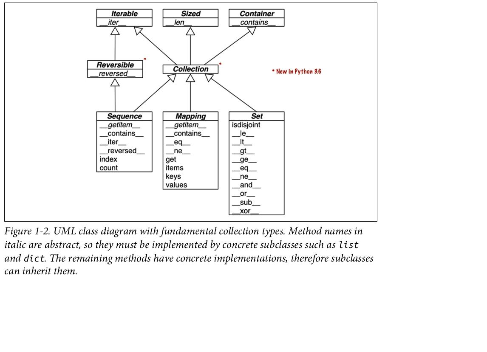
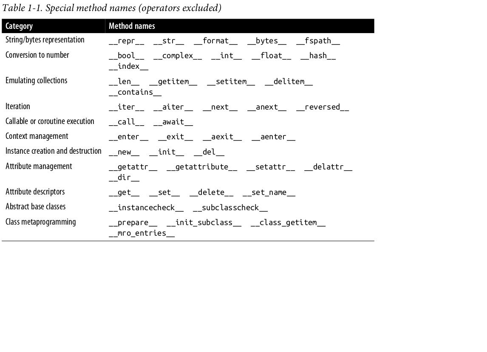
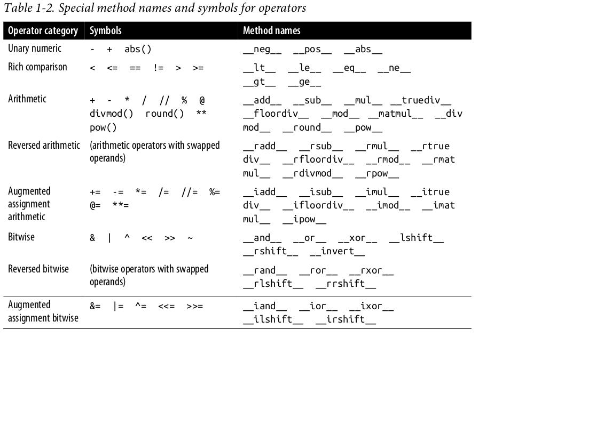

# Fluent Python

## 阅读目的

之前在网上看到有人推荐这本书，组员孙肖最近也推荐。
网上查了一下豆瓣和知乎的评价，这本书属于进阶级别，涉及到 Python 底层实现。
那么我看这本书的目的便是：了解 Python 的一些底层实现细节，写出高效的 Python 代码。

2023-01-22：从前言来看，这本书主要是介绍 Python 独有的一些特性。
那么我的阅读目的修改为：了解 Python 独有的一些特性，并善用它们来写出 Pythonic Code。

## 我的问题是什么

我主要有两个问题：

- 如何写出流畅、高效的 Python 代码？
- Python 底层是如何实现的？

其中问题2与问题1密切相关，解决问题2有助于解决问题1.
而问题2范围比较大，因为 Python 底层实现涉及太多内容，比如解析器、各种数据结构等。

2023-01-22：根据本书的内容，修改问题如下：

- Python 有哪些独有的特性？
- 如何写出 Pythonic Code？

## 目前为止我知道什么

### Python 解析器

Python 是一门解析性语言。
Python 代码需要经过解析器逐句解析后才能运行。
Python 解析器有 CPython、JPython 等，分别由 C、Java 等语言实现。
我没学过编译原理，也没研究过 Python 解析器。为集中精力解决当前问题，先不深入研究 Python 解析器的工作原理。

### Pythonic code

Python 程序员应该编写具有 Python 风格的代码，也就是 Pythonic code。
[The Zen of Python][1]、[PEP 8][2]、[PEP 257][3] 等有助于理解什么是 Pythonic Code.

- Tuple Unpacking

  ```python
  my_tuple = ['I', 'am', 'a', 'tuple']
  word_1, word_2, word_3, word_4 = my_tuple
  ```

- List Comprehensions

  ```python
  names = ['AKSHAT', 'laurie', 'BiLly', 'hUONg']
  names = [name.title() for name in names]
  ```

- for ... in

  ```python
  for element in mylist:
    do_something(element)
  ```

#### Python 之禅

编写 Python 程序应该遵循 Python 编程理念，这个理念部分体现在「Python 之禅」里面：

1. Beautiful is better than ugly.
2. Explicit is better than implicit.
3. Simple is better than complex.
4. Complex is better than complicated.
5. Flat is better than nested.
6. Sparse is better than dense.
7. Readability counts.
8. Special cases aren't special enough to break the rules.
9. Although practicality beats purity.
10. Errors should never pass silently.
11. Unless explicitly silenced.
12. In the face of ambiguity, refuse the temptation to guess.
13. There should be one-- and preferably only one --obvious way to do it.
14. Although that way may not be obvious at first unless you're Dutch.
15. Now is better than never.
16. Although never is often better than *right* now.
17. If the implementation is hard to explain, it's a bad idea.
18. If the implementation is easy to explain, it may be a good idea.
19. Namespaces are one honking great idea -- let's do more of those!

这里面共19条理念，有些我并没能产生共鸣——应该需要反复的实践才能深刻体会。
目前能够理解到的是，编程要注意可读性、简洁性和清晰性。这有助于写出流畅的代码，但与写出高效的代码关系不大。

我的理解，其实前面6条理念都是为第7条理念服务的，也就是说为追求可读性而提出来的。

#### PEP 8

PEP 8 大概有9节，前面几节讲的是代码布局（缩进、行长、空白字符、空行等）、单/双引号、空格、尾逗号等，
这些使用 black 等工具会自动处理，所以简单了解即可。

「注释」一节，注意少用行内注释。

「命名风格」一节，注意以下几点：

- 不用l、O或I等容易和数字混淆的单字母来命名
- 类型变量命名风格为 TypeVar
- 异常命名风格为 SomeExceptionError
- 全局变量命名风格为 some_global_var
- 常量命名风格为 MAX_OVERFLOW

「编程推荐」一节，可以看出来很多是反映 The Zen of Python 的编程理念的：

比如体现 「Readability counts. 」的有：

- Comparisons to singletons like None should always be done with `is` or `is` not, never the equality operators.
- Use `is not` operator rather than `not ... is`.
- Use `''.startswith()` and `''.endswith()` instead of string slicing to check for prefixes or suffixes.
- Object type comparisons should always use `isinstance()` instead of comparing types directly.
- For sequences, (strings, lists, tuples), use the fact that empty sequences are false.

体现 「Explicit is better than implicit.」的有：

- Context managers should be invoked through separate functions or methods whenever they do something other than acquire and release resources.
- Be consistent in return statements.
- Use of the flow control statements return/break/continue within the finally suite of a try...finally,
  where the flow control statement would jump outside the finally suite, is discouraged.
  This is because such statements will implicitly cancel any active exception that is propagating through the finally suite.
  （这里同样体现「Errors should never pass silently.」）

## Fluent Python 想要解决什么问题？

作者在前言中提到许多 Python 程序员的一个问题：不了解 Python 的很多语言特性。
因此这本书的重点是介绍 Python 独有的或其他主流语言不具有的特性。

## Fluent Python 的大纲是怎样的？

包括5个部分，分别是数据结构、函数、类/协议、控制流和元编程。

## Fluent Python 分析

### 01 The Python Data Model

参考：[The "Data Model" chapter of The Python Language Reference][3]

- 一致性
  - Python 最好的特点之一是一致性。

- 数据模型
  - 如果将 Python 语言视为一个框架
  - 那么数据模型就是对这个框架的描述
  - 具体地说，数据模型描述了 Python 这个框架各个组件的接口
  - 包括序列、函数、类、迭代器、协程、上下文管理器等
  - 比如：序列有 `__len__` 接口，类有 `__init__` 接口等

- 特殊方法
  - 名字前后各有两个下划线
  - 用来提供基本的对象操作
  - 特殊方法是用来给 Python 解析器调用的，而非用户调用的
  - `len(collection)` 实际上是调用 `collection.__len__()`
  - `obj[key]` 实际上是调用 `obj.__getitem__()`
  - `for i in x` 实际上是调用 `x.__iter__()` 或 `x.__getitem__()`
  - `value in collection` 实际上是调用 `collection.__contains__` 或者是顺序遍历

- 特殊方法的使用场景
  - 集合
  - 属性访问
  - 迭代
  - 运算符重载
  - 函数和方法调用
  - 字符串表示和格式化
  - 异步编程
  - 对象创建和销毁
  - 上下文管理

- 特殊方法的四个常用场景
  - 模仿数字类型（运算符重载）：`__abs__`, `__add__`, `__mul__`
  - 字符串表示：`__repr__`, `__str__`
  - 自定义类型的布尔值判断：`__bool__`, `__len__`
  - Collection API: `__iter__`, `__len__`, `__contains__`

  

  

  

  [1]: https://legacy.python.org/dev/peps/pep-0020/
  [2]: https://peps.python.org/pep-0008/
  [3]: https://docs.python.org/3/reference/datamodel.html
