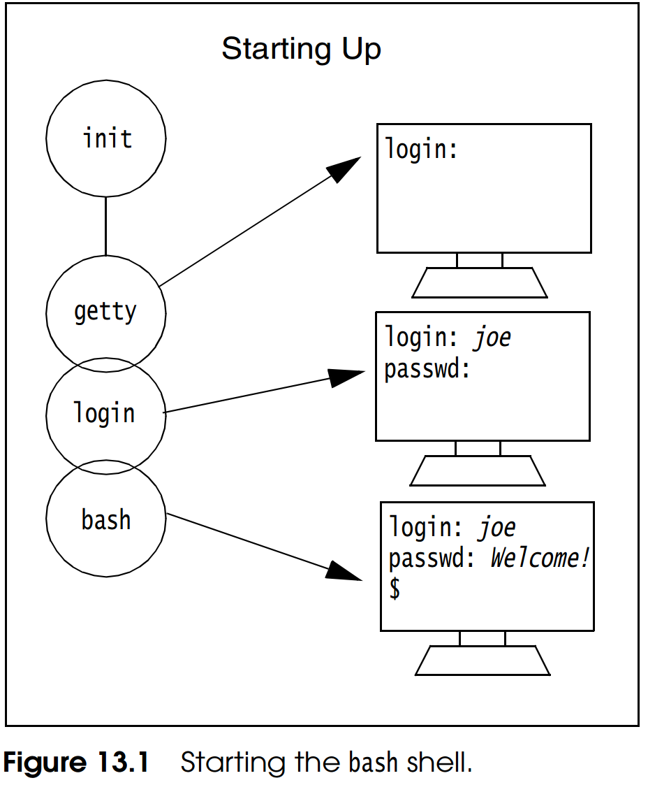

# 《Unix Shells by Example》分析笔记

## Chapter 13: The Interactive Bash Shell

### Q1：这一章的内容是什么？

介绍在命令行中使用bash的基础知识和定制个人工作环境的方法。

> This chapter focuses on how you interact with bash at the command line and how to customize your working environment.
> You will learn how to take advantage of all shortcuts and built-in features in order to create an efficient and fun working environment.

### Q2：这一章的大纲是什么？

- The Environment
- The Command Line
- Job Control
- Command-Line Shortcuts
- Aliases
- Manipulating the Directory Stack
- Metacharacters (Wildcards)
- Filename Substitution (Globbing)
- Variables
- Quoting
- Command Substitution
- Arithmetic Expansion
- Order of Expansion
- Arrays
- Functions
- Standard I/O and Redirection
- Pipes
- Shell Invocation Options
- Shell Built-In Commands

### Q3：作者想要解决什么问题？

- 如何在命令行中使用bash shell
- 如何定制个人开发环境

### Q4：这一章的关键词是什么？

- Job Control
- Command-Line Shortcuts
- Directory Stack
- Command Substitution
- Arithmetic Expansion
- Order of Expansion
- Shell Invocation Options

### Q5：这一章的关键句是什么？

#### 13.1 Introduction

- Bash provides you with a large assortment of built-in commands and command-line shortcuts,
  such as history, aliases, file and command completion, command-line editing, and many more. 

##### 13.1.1 Versions of bash

- The Bourne Again shell is a Capricorn, born on **January 10, 1988**, fathered by **Brian Fox** and 
  later adopted by **Chet Ramey**, who now officially maintains bash, enhances it, and fixes bugs.

##### 13.1.2 Startup

- Startup Process
  - the first process to run is called `init`, PID #1
  - `init` spawns a `getty` process
  - `getty` opens up the terminal ports, 
    providing a place where standard input comes from and a place where standard output and errors go,
    and puts a login prompt on your screen.
  - `/bin/login` program is then executed.
    The login program prompts for a password, encrypts and verifies the password, sets up an initial environment,
    and starts up the login shell, `/bin/bash`, the last entry in the passwd file.
  - The `bash` process first executes `/etc/profile`, then `.bash_profile`, then `.bashrc`,
    and finally the default dollar sign ($) prompt appears on your screen and the shell waits for commands. 

  

- Changing the Shell at the Command Line
  - just type the name of the shell, e.g. `bash`

#### 13.2 The Environment

- The environment of a process consists of 
  - variables,
  - open files,
  - the current working directory,
  - functions,
  - resource limits,
  - signals,
  - and so forth.

##### 13.2.1 The Initialization Files

- `.bash_profile`
  - When you log on, the `.bash_profile` in the user’s home directory is sourced.
  - It sets the user’s aliases and functions and then sets user-specific environment variables and startup scripts.
  - If the user doesn’t have a `.bash_profile`, but does have a file called `.bash_login`, that file will be sourced,
  - and if he doesn’t have a `.bash_login`, but does have a `.profile`, it will be sourced.
  - Bash will also check to see if the user has a `.bashrc` file and then source it.

- `/etc/profile`
  - A systemwide initialization file set up by the system administrator to perform tasks when the user logs on.

- `~/.profile`
  - It is sourced once at login if running sh (Bourne shell).
  - Because this file is used by the Bourne shell, it should not contain any bash-specific settings.
  - If running bash, `.profile` will be run if bash cannot find any other of the initialization files listed previously.
  - It allows a user to customize and modify his or her shell environment.
  - Environment and terminal settings are normally put here,
    and if a window application or database application is to be initiated, it is started here.

- `/etc/bashrc`
  - Systemwide functions and aliases can be set in the `/etc/bashrc` file. The primary prompt is often set here.

- `~/.bash_logout`
  - When the user logs out (exits the login shell), if `~/.bash_logout` exists, it is sourced.
  - It normally clean up temporary files, truncate the history file, record the time of logout, and perform other housekeeping tasks.

- Options to Prevent Startup Files from Being Executed
  - `--noprofile`

- `.inputrc`
  - Contains variables to customize keystroke behavior and settings that bind strings, macros, and control functions to keys. 

##### 13.2.2 Setting bash Options with the Built-In set and shopt Commands

- The `set` Commands Format

  ```shell
  set -o        # Lists all the options currently set or not set.
  set -o option # Turns on the option.
  set +o option # Turns off the option.
  set -[a-z] # Abbreviation for an option; the minus turns it on.
  set +[a-z] # Abbreviation for an option; the plus turns it off.
  ```

> Wu: Read the "OPTIONS" sections and the `set` command in the "SHELL BUILTIN COMMANDS" section of bash manpage for more details.

- The `shopt` Built-In (Version 2.x+) Command
  - In many ways shopt duplicates the set built-in command, but it adds more options for configuring the shell.

  ```shell
  shopt -p           # lists all settable shell options and their current values, either set (-s) or unset (-u).
  shopt -p option    # lists the value of the option, either set (-s) or unset (-u).
  shopt -s option    # Sets (or turns on) the option.
  shopt -u option    # Unsets (or turns off) the option.
  ```

##### 13.2.3 The Prompts

- The bash shell provides four prompts:
  - The primary prompt is a dollar sign ($);
  - The secondary prompt is a right angle bracket symbol (>);
  - The third prompt `PS3`
  - The fourth prompt `PS4`

- Setting the Prompt with Special Escape Sequences.
  - By inserting special backslash/escape sequences into the prompt string, you can customize the prompts.

> Wu: Read the "PROMPTING" section of the bash manpage for more details. 

##### 13.2.4 The Search Path

- The dot
  - The dot at the end of the path represents the current working directory.
  - If the dot is not included in the path and you are executing a command or script from the current working directory,
    the name of the script must be preceded with a `./`.

##### 13.2.5 The hash Command

- The `hash` command
  - Controls the internal hash table used by the shell to improve efficiency in searching for commands.
  - `hash -r` clears the hash table.
  - Hashing is automatically implemented by bash.
  - Although you can turn it off, if there isn’t any compelling reason to do so, don’t.

- How the `hash` command works
  - Instead of searching the path each time a command is entered, the first time you type a command,
    the shell uses the search path to find the command, and then stores it in a table in the shell’s memory.
    The next time you use the same command, the shell uses the hash table to find it.

##### 13.2.6 The source or dot Command

- The dot command, simply a period (from the Bourne shell), is another name for source.

- Environment
  - The script will be executed in the environment of the current shell; that is, a child process will not be started.
  - All variables set in the script will become part of the current shell’s environment.
  - Likewise, all variables set in the current shell will become part of the script’s environment.

- The source (or dot) command is normally used to re-execute any of the initialization files,
  such as `.bash_profile`, `.profile`, and so on, if they have been modified.

- A file does not need execute permissions to be sourced with either the dot or the source commands.

#### 13.3 The Command Line

##### 13.3.1 The Order of Processing Commands

- The command is executed according to its type in the following order:
  - Aliases
  - Keywords (such as if, function, while, until)
  - Functions
  - Built-in commands
  - Executables and scripts

- Efficiency
  - Special built-in commands and functions are defined within the shell,
    and therefore are executed from within the context of the current shell, making them much faster in execution.
  - Scripts and executable programs such as ls and date are stored on disk,
    and the shell must first locate them within the directory hierarchy by searching the PATH environment variable;
    the shell then forks a new shell that executes the script.

- `type` command
  - Find out the type of command you are using.

##### 13.3.2 Built-In Commands and the help Command

- `help` command
  - Bash has added a new online help system so that you can see all the built-ins, or a description for a particular builtin;
  - help itself is a built-in command.

##### 13.3.3 Changing the Order of Command-Line Processing

- Bash provides three built-in commands that can override the order of command-line processing:
  - `command` eliminates aliases and functions from being looked up in the order of processing.
    Only built-ins and executables, found in the search path, will be processed.
  - `builtin` looks up only built-ins, ignoring functions and executables found in the path.
  - `enable`  turns built-ins on and off. By default, built-ins are enabled.
    Disabling a built-in allows an executable command to be executed without specifying a full pathname,
    even if it has the same name as a built-in.

    ```shell
    builtin cd        # use the builtin cd
    enable -n test    # the `test` built-in is disabled
    enable            # prints a list of all the built-ins
    ```

##### 13.3.4 The Exit Status

- The exit status is a number between 0 and 255.

- By convention, when a program exits,
  - if the status returned is 0, the command was successful in its execution.
  - When the exit status is nonzero, the command failed in some way.
  - If a command is not found by the shell, the exit status returned is 127.
  - If a fatal signal causes the command to terminate, the exit status is 128 plus the value of the signal that caused it to die.

##### 13.3.5 Multiple Commands at the Command Line

- A command line can consist of multiple commands. Each command is separated by a **semicolon**.
  ```shell
  $ ls; pwd; date;
  ```

- The exit status is that of the last command in the chain of commands.

##### 13.3.6 13.3.6 Command Grouping

- Commands may also be grouped so that all of the output is either piped to another command or redirected to a file.

  ```shell
  $ ( ls; pwd; date ) > outputfile
  ```

##### 13.3.7 Conditional Execution of Commands

- With conditional execution, two command strings are separated by the special metacharacters, `&&` and `||`.
  ```shell
  $ cc prgm1.c –o prgm1 && prgm1
  $ cc prog.c >& err || mail bob < err
  ```

- The command on the right metacharacters will or will not be executed based on the exit condition of the command on the left.

##### 13.3.8 Commands in the Background

- When you place an ampersand (&) at the end of the command line,
  the shell will return the shell prompt immediately and execute the command in the background concurrently. 

- The `!` variable contains the PID number of the last job put in the background.

> Wu: Even if the last job has finished, The `!` variable still store its PID number.

#### 13.4 Job Control

##### 13.4.1 Job Control Commands and Options

- Job Control Commands
  - `bg` Starts running the stopped job in the background
  - `fg` Brings a background job to the foreground
  - `jobs` Lists all the jobs running
  - `kill` Sends the kill signal to a specified job
  - `stop` Suspends a background job
  - `stty tostop` Suspends a background job if it sends output to the terminal
  - `wait [n]` Waits for a specified job and returns its exit status; n is a PID or job number
  - `^Z (Ctrl-Z)` Stops (suspends) the job; the prompt appears on the screen

- Argument to Jobs Command
  - `%n` Job number n
  - `%string` Job name starting with string
  - `%?string` Job name containing string
  - `%%` Current job
  - `%+` Current job
  - `%-` Previous job, before current job
  - `-r` Lists all running jobs
  - `-s` Lists all suspended jobs

- Simply naming a job can be used to bring it into the foreground:
  - `%1` is a synonym for `fg %1`, bringing job 1 from the background into the foreground.
  - Similarly, `%1 &` resumes job 1 in the background, equivalent to `bg %1`.

#### 13.5 Command-Line Shortcuts

##### 13.5.1 Command and Filename Completion

- To save typing, bash implements command and filename completion, a mechanism that 
  allows you to type part of a command or filename, press the Tab key, and the rest of the word will be completed for you.

##### 13.5.2 History

- The `history` built-in command displays the history list.

- The default name for the history file is `.bash_history`, and it is located in your home directory.

- The `fc -l` command can be used to display or edit commands in the history list.

- History Variables
  - `HISTFILE` Specifies file in which to store command history.
    The default value is `~/.bash_history`.
    If unset, the command history is not saved when an interactive shell exits. 
  - `HISTFILESIZE` The maximum number of lines contained in the history file.
    When this variable is assigned a value, the history file is truncated, if necessary, to contain no more than that number of lines.
    The default value is 500.
  - `HISTSIZE` The number of commands to remember in the command history.
    The default value is 500.

> Wu: Read `help history`, `help fc` and the "HISTORY" section of `man bash` for more details.

##### 13.5.3 Accessing Commands from the History File

- The Arrow Keys
  - Up arrow moves up the history list.
  - Down arrow moves down the history list.
  - Right arrow moves cursor to right on history command.
  - Left arrow moves cursor to left on history command.

- The fc Command
  - `-e editor` Puts history list into editor
  - `-l n m` Lists commands in range from n to m
  - `-n` Turns off numbering of history list
  - `-r` Reverses the order of the history list
  - `-s string` Accesses command starting with string. You can create a bash alias `alias r='fc -s'`

##### 13.5.4 Command-Line Editing

- The bash shell provides two built-in editors, emacs and vi, that allow you to interactively edit your history list. 

  ```shell
  set -o vi       # Sets the built-in vi editor for command-line editing of the history list.
  set -o emacs    # Sets the built-in emacs editor for command-line editing of the history list.
  ```

- FCEDIT and Editing Commands
  - `fc -e vi -1 -3` will invoke the vi editor, create a temporary file in /tmp,
    with the last three commands from the history list in the vi buffer.
  - The commands can be edited or commented out. (Preceding the command with a # will comment it.)
  - If the user quits the editor, the commands will all be echoed and executed.
  - When editing is complete, and you exit the editor, all of the edited commands are echoed and executed.

> Wu: It seems that `FCEDIT` will never be defined on my Ubuntu.

#### 13.6 Aliases

- Listing Alias
  - The `alias` built-in command lists all set aliases.

- Creating Alias
  - `alias r='fc -s'`
  - Bash aliases cannot take arguments.
  - Multiple commands are separated by a semicolon, and commands containing spaces and metacharacters are surrounded by single quotes.

- Deleting Alias
  - The `unalias` command is used to delete an alias.
  - To temporarily turn off an alias, precede the alias name by a backslash.

#### 13.7 Manipulating the Directory Stack

- `dirs`
  - Display directory stack, e.g., the list of currently remembered directories.
  - `dirs +N` Displays the Nth entry counting from the left of the list shown by dirs, starting with zero.
  - `dirs -N` Displays the Nth entry counting from the right of the list shown by dirs, starting with zero.

- `pushd`
  - Adds a directory to the top of the directory stack, 
    or rotates the stack, making the new top of the stack the current working directory.
  - With no arguments, exchanges the top two directories.

- `popd`
  - Removes entries from the directory stack.
  - With no arguments, removes the top directory from the stack, and changes to the new top directory.

> Wu: Read `help dirs`, `help pushd` and `help popd` for more details.

#### 13.8 Metacharacters (Wildcards)

- `\` Interprets the following character literally
- `&` Processes in the background
- `;` Separates commands
- `$` Substitutes variables
- `?` Matches for a single character
- `[abc]` Matches for one character from a set of characters; for example, a, b, or c
- `[!abc]` Matches for one character not from the set of characters; for example, not a, b, or c
- `*` Matches for zero or more characters
- `(cmds)` Executes commands in a subshell
- `{cmds}` Executes commands in current shell

#### 13.9 Filename Substitution (Globbing)

- Shell Metacharacters and Filename Substitution
  - `*` Matches zero or more characters
  - `?` Matches exactly one character
  - `[abc]` Matches one character in the set a, b, or c
  - `[!abc]` Matches one character not in the set, not a, b, or c
  - `{a,ile,ax}` Matches for a character or set of characters. (Wu: There must be **no blanks** in the curly braces.)
  - `[a–z]` Matches for one character in the range from a to z
  - `[!a–z]` Matches one character not in the range from a to z
  - `\` Escapes or disables the metacharacter

- Tilde Expansion
  - The tilde by itself evaluates to the full pathname of the user’s home directory.
  - When the tilde is appended with a username, it expands to the full pathname of that user.
  - `~+` evaluates to the value of the PWD (present working directory).
  - `~-` evaluates to the value of the OLDPWD (the previous working directory).

- Controlling Wildcards (Globbing)

  ```shell
  # Turn off globing
  set -o noglob
  set -f

  # Turn on globing
  set +o noglib
  set +f
  ```

- Extended Pattern Matching
  - `abc?(2|9)1` ? matches zero or one occurrences of any pattern in the parentheses.
    The vertical bar represents an OR condition; for example, either 2 or 9. Matches abc21, abc91, or abc1.
  - `abc*([0–9])` * matches zero or more occurrences of any pattern in the parentheses.
    Matches abc followed by zero or more digits; for example, abc, abc1234, abc3, abc2, and so on.
  - `abc+([0–9])` + matches one or more occurrences of any pattern in the parentheses.
    Matches abc followed by one or more digits; for example, abc3, abc123, and so on.
  - `no@(one|ne)` @ matches exactly one occurrence of any pattern in the parentheses.
    Matches noone or none.
  - `no!(thing|where)` ! matches all strings except those matched by any of the patterns in the parentheses.
    Matches no, nobody, or noone, but not nothing or nowhere.

#### 13.10 Variables

##### 13.10.1 Types of Variables

- There are two types of variables: local and environment.
  - Local variables are known only to the shell in which they were created.
  - Environment variables are available to any child processes spawned from the shell from which they were created.

> 伍注：上述local variable的定义相比其他语言来说太不local了——作用域为当前shell，其他语言一般是指作用域为函数内。

##### 13.10.3 The declare Built-In

-  The `declare` command
  - Declare variables and give them attributes.
  - If no NAMEs are given, display the attributes and values of all variables.
  - When used in a function, `declare` make each name local, as with the local command, unless the `-g` option is supplied.

> Wu: Read `help declare` for more details.

##### 13.10.4 Local Variables and Scope

- Setting local Variables
  - `declare [-aAfFgilnrtux] [-p] [name[=value] ...]`
  - `local [option] [name[=value] ... | - ]`
  - It is an error to use local when not within a function.

- Setting Read-Only Variables.
  - A read-only variable is a special variable that cannot be redefined or unset.
  - `declare -r name=value`
  - `readonly name=value`

##### 13.10.5 Environment Variables

- Bash Environment Variables
  - `_` The last argument to the previous command.
  - `BASH` Expands to the full pathname used to invoke this instance of bash.
  - `BASH_VERSINFO` Version information about this version of bash.
  - `BASH_VERSION` Expands to the version number of this instance of bash.
  - `RANDOM` Each time this parameter is referenced, a random integer is generated.
  - `SECONDS` Each time SECONDS is referenced, the number of seconds since shell invocation is returned.

> Wu: Read the "Shell Variable" section of `man bash` for more details.

- Setting Environment Variables
  - `export variable=value`
  - `declare -x variable=value`

- The export Command and Its Options
  - `--` Marks the end of option processing; the remaining parameters are arguments.
  - `-f` Name-value pairs are treated as functions, not variables.
  - `-n` Converts a global (exported) variable to a local variable. The variable will not be exported to child processes.
  - `-p` Displays all the global variables.

##### 13.10.6 Unsetting Variables

- Both local and environment variables can be unset by using the unset command, unless the variables are set as read-only.

##### 13.10.7 Printing the Values of Variables

- echo Options
  - `-e` Enable interpretation of backslash escapes.
  - `-E` Disables the interpretation of these escape characters, even on systems where they are interpreted by default.
    Not available in bash versions prior to 2.x.
  - `-n` Suppresses newline at the end of a line of output.

- The printf Command

##### 13.10.8 Parameter Expansion

- Expansion is performed on the command line after it has been split into words
  - Brace expansion. e.g., `a{d,c,b}e` expands into `ade ace abe`
  - Tilde expansion. e.g., `~` expands to the shell parameter `HOME`
  - Parameter and variable expansion.
  - Command substitution. e.g., `command` or $(command).
  - Arithmetic expansion. e.g., `$((expression))`
  - Word splitting
  - Pathname expansion

- Parameter Expansion
  - `${parameter:-word}` Use Default Values.
    If parameter is unset or null, the expansion of word is substituted. Otherwise, the value of parameter is substituted.
  - `${parameter:=word}` Assign Default Values.
    If parameter is unset or null, the expansion of word is assigned to parameter. The value of parameter is then substituted.
    Positional parameters and special parameters may not be assigned to in this way.
  - `${parameter:?word}` Display Error if Null or Unset.
    If parameter is null or unset, the expansion of word or a message is written to the standard error and the shell,
    if it is not interactive, exits. Otherwise, the value of parameter is substituted.
  - `${parameter:+word}` Use Alternate Value.
    If parameter is null or unset, nothing is substituted, otherwise the expansion of word is substituted.
  - `${parameter:offset}` or `${parameter:offset:length}` Substring Expansion.
    Expands to up to length characters of the value of parameter starting at the character specified by offset.
  - `${#parameter}` Parameter length.  The length in characters of the value of parameter is substituted.
  - `${parameter#word}` Matches the smallest leading portion of the value of variable to pattern and removes it.
  - `${parameter##word}` Matches the largest leading portion of the value of variable to pattern and removes it.
  - `${parameter%word}` Matches the smallest trailing portion of the value of variable to pattern and removes it.
  - `${parameter%%word}` Matches the largest trailing portion of the value of variable to pattern and removes it.
  - `${parameter/pattern/string}` Pattern substitution. 

##### 13.10.10 Positional Parameters

- `set --` Unsets all positional parameters

#### 13.11 Quoting

- Quoting is used to protect special metacharacters from interpretation and prevent parameter expansion.

- There are three methods of quoting:
  - Backslash
    - Used to quote (or escape) a single character from interpretation.
    - The backslash is not interpreted if placed in single quotes.
    - The backslash will protect the dollar sign ($), backquotes (` `), and the backslash from interpretation if enclosed in double quotes.
  - Single quotes
    - They protect all metacharacters from interpretation.
    - To print a single quote, it must be enclosed in double quotes or escaped with a backslash.
  - Double quotes
    - Allow variable and command substitution
    - Protect any other special metacharacters from being interpreted by the shell

#### 13.12 Command Substitution

- Command substitution is used when assigning the output of a command to a variable or when substituting the output of a command within a string.

- Two Forms of Command Substitution
  - All shells use backquotes to perform command substitution.
  - Bash allows two forms: 
    - `command`, the older form
    - $(command), the new Korn-style form

- Bash performs the expansion by executing the command and returning the standard output of the command,
  **with any trailing newlines deleted**.
  - When you put the whole command substitution expression in double quotes, **the trailing newlines are preserved**.

> Wu: e.g., after running `data=$(cat /tmp/datafile)`, `data` doesn't contains any newlines.

- `command` vs $(command)
  - When using the `command` form, the backslash retains its literal meaning except when followed by $, \`, or \.
  - When using the $(command) form, all characters between the parentheses make up the command; none are treated specially.

- Nested Command
  - Command substitutions may be nested.
  - To nest when using the old form, the inner backquotes must be escaped with backslashes.

#### 13.14 Order of Expansion

- When you are performing the expansion of variables, commands, arithmetic expressions, and pathnames,
  the shell is programmed to follow a specific order when scanning the command line.
  Assuming that the variables are not quoted, the processing is performed in the following order: 
  - Brace expansion
  - Tilde expansion
  - Parameter expansion
  - Variable substitution
  - Command substitution
  - Arithmetic expansion
  - Word splitting
  - Pathname expansion

#### 13.15 Arrays

- Create an array
  - The declare, local, and read-only built-ins can take the `-a` option to declare an array.

  ```shell
  # Method 1: Create by declare command
  declare -a nums=(1 2 3)
  declare -a -r names=(GuoJing Huangrong YangGuo)  # readonly array
  
  # Method 2: Create by local command (Only works inside function)
  local -a nums=(1 2 3)

  # Method 3: Create by Giving a subscript to a variable name
  x[0]=5
  ```

- Unset an array

  ```shell
  # Unset an array
  unset arr

  # Unset one element of the array
  unset arr[0]
  ```

- Read an array from stdin
  - `read -a` is used to read in a list of words from standard input into array elements.

- Array Index
  - The index value is an integer starting at 0.
  - There is no maximum size limit on the array.
  - Indices do not have to be ordered numbers, such as, x[0], x[1], x[2], and so on.
  - Use `${arrayname[index]}` to extract an element of an array.
  - Use `${#arrayname[*]}` to get the size of an array.

#### 13.16 Functions

- Defining Functions

  ```shell
  # The old Bourne Shell way (no function keyword)
  function_name () { commands ; commands; }

  # The new Korn Shell way (use function keyword)
  # If using the new way, the parentheses are optional.
  function function_name { commands ; commands; }
  function function_name () { commands ; commands; }
  ```

- Exporting function

  ```shell
  export -f func    # The -f option is necessary.
  ```

- Listing Functions

  ```shell
  declare -f  # Display function name and definition.
  declare -F  # Display only function name.
  ```

- Unset Functions
  - `unset -f func`

#### 13.17 Standard I/O and Redirection

- Redirection
  - `&> filename` Redirects output and error
  - `>& filename` Redirects output and error (preferred way)
  - `>|` Overrides noclobber when redirecting output. (Wu: e.g., override existing file.)
  - `<> filename` Uses file as both standard input and output if a device file (from /dev)

> Wu: read the "REDIRECTION" section of `man bash` for more details.

- The exec Command
  - `exec ls` ls executes in place of the shell. When ls is finished, the shell in which it was started does not return.
  - `exec < filea` Opens filea for reading standard input.
  - `exec > filex` Opens filex for writing standard output.
  - `exec 3< datfile` Opens datfile as file descriptor 3 for reading input.
  - `exec 4>newfile` Opens newfile as file descriptor (fd) 4 for writing.
  - `exec 5<&4` Makes fd 5 a copy of fd 4.
  - `exec 3<&-` Closes fd 3.

#### 13.19 Shell Invocation Options

- There are two types of options: 
  - single-character options and multicharacter options.
  - The single-character options consist of a single leading dash followed by a single character.
  - The multicharacter options consist of two leading dashes and any number of characters.
  - Multicharacter options must **appear before** single-character options.

> Wu: Read the "OPTIONS" section of `man bash` for more details.

- The set Command and Options

> Wu: Read `help set` for more details.

- The shopt Command and Options

> Wu: Read `help shopt` and the "shopt" section of `man bash` for more details.

#### 13.20 Shell Built-In Commands

- The help feature (Wu: e.g., `help` command) provided with bash gives you online help for any built-in command. 

> Wu: Read the "SHELL BUILTIN COMMANDS" section for more details.

#### LAB

- What command will allow you to change your login shell?
  - `usermod`
  - `chsh`

- Why use shopt instead of set?
  - As the number of options grew, set became more difficult to use because options are represented by single letter codes.
  - As a result, Bash provides the shopt (shell option) command to turn options on and off by name instead of a letter.
  - You can set certain options only by letter. Others are available only under the shopt command.
    This makes finding and setting a particular option a confusing task.


### Q6：作者是怎么论述的？

### Q7：作者解决了什么问题？

### Q8：我有哪些疑问？

### Q9：这一章说得有道理吗？为什么？

### Q10：如何拓展这一章？

#### Q10.1：为什么是这样的？为什么发展成这样？为什么需要它？

#### Q10.2：有哪些相似的知识点？它们之间的联系是什么？

- [Bash Reference Manual][man]

  [man]: https://www.gnu.org/software/bash/manual/bash.html

- man bash
  - 研究一下bash manpage的组织结构，分析如何快速找到自己想要的东西。

#### Q10.3：其他领域/学科有没有相关的知识点？日常生活中有没有类似的现象？

### Q11：这一章和我有什么关系？

