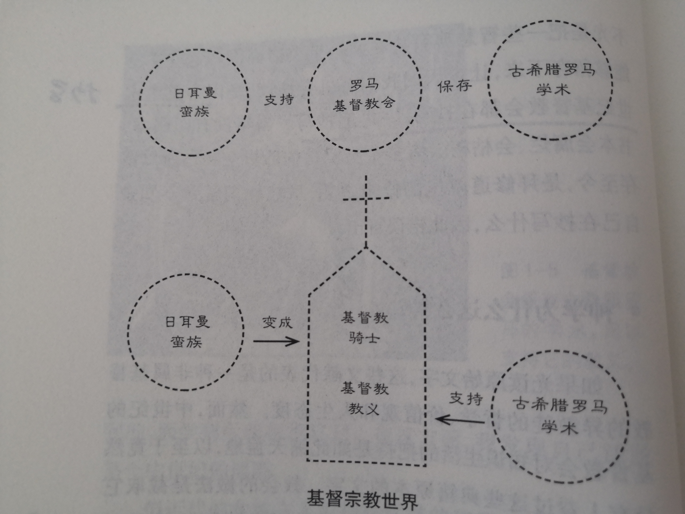

# 《你一定爱读的极简欧洲史》书籍分析笔记

## 第1章 从希腊说起，讲到日耳曼 —— 古典时期到中世纪

### Q1：这一章的内容是什么？

介绍古希腊罗马、基督教和日耳曼蛮族这三个欧洲文明的元素。

### Q2：这一章的大纲是什么？

- 现代文明的源头：古希腊
  - 城邦分区统治
  - 开拓殖民地
- 罗马国·希腊味
  - 庞大帝国、骁勇善战
  - 仿效希腊文化
- 希腊人与科学精神
  - 以几何学为例
  - 简单、符合逻辑、能用数学表达
- 基督教
  - 十诫
  - 道德与宗教密不可分
  - 宇宙大爱
  - 世界性的宗教（保罗）
- 日耳曼蛮族
  - 为打仗而活
  - 三个元素
- 罗马人对基督教的态度：从追杀到独尊
  - 罗马帝国变成了基督教的天下
  - 基督教教会变成了罗马人的教会
- 基督教对古希腊罗马的态度：从利用到融合
  - 教会把希腊和罗马的学术成就保存了下来（抄写）
  - 古希腊罗马学术被利用来支持基督教
- 日耳曼蛮族支持基督教
  - 信上帝更能克敌制胜

### Q3：作者想要解决什么问题？

### Q4：这一章的关键词是什么？

### Q5：这一章的关键句是什么？

- 在欧洲文明发端之初，它的组成元素有三：
  - 古希腊和罗马文化
  - 基督教——犹太教的一个奇特分支
  - 对罗马帝国进行侵略的日耳曼蛮族的战士文化

#### 现代文明的源头：古希腊

- 随着城邦人口日益增长，希腊开始派人到地中海其他地区去开拓殖民地。

#### 罗马国·希腊味

- 罗马人建立起一个庞大帝国
  - 北以两大河流「莱茵河」及「多瑙河」为界，不过有时也会超越。
  - 西边则是大西洋。英格兰是罗马帝国的一部分，但苏格兰和爱尔兰不是。
  - 帝国南边远达北非沙漠，东边疆界最难确定，因为此处还有一些与它敌对的帝国。
  - 罗马帝国涵盖了整个地中海；但它的领土只有一部分属于今日的欧洲，大部分是在土耳其、中东和北非地区。

#### 希腊人有多聪明？

- 在他们看来，几何学是引导人类认知宇宙本质的一个途径。
  - 希腊人相信这一切（指世界万物）都可用简单的道理来解释。
    这些多元样貌的背后，必然有种**简单、规律、有逻辑的原理**在支撑，像几何学就是。

- 现代科学一开始就推翻了当时依然是主流和权威的希腊科学的中心教义，
  但它之所以能推翻希腊科学，遵循的正是这种希腊灵感：**答案应该简单、符合逻辑、能以数学表达。**

#### 日耳曼蛮族的逻辑

- 三个元素造就了欧洲的文明
  - 古希腊罗马学术：这是个简单、符合逻辑、能以数学表达的世界。
  - 基督教教义：这是个邪恶的世界，唯有耶稣能拯救它。
  - 日耳曼蛮族：打仗是好玩的事

#### 土地你拿去，其他留给我

- **对政府有所设限**
  - 「并非所有东西都归国王所有」，是欧洲政府思维的基石。
  - 从**私有财产权**出发，衍生出**人权**观念，是西方价值的核心。
  - 欧洲经济之所以能一飞冲天，「商人有保障」是个关键。

- 日耳曼战士接受了基督教
  - 主教告诉他们，只要接受基督教的上帝，就更能克敌制胜。

- 三个元素的关系
  - 日耳曼蛮族 **支持** 罗马基督教会 **保存** 古希腊罗马学术

  

- 欧洲历史可分为三个时代
  - 古代（古典时代）：公元476年前
  - 中世纪：公元476年（西罗马帝国灭亡）—公元1453年（东罗马帝国灭亡）
  - 近现代：公元1453年后

#### 神学为什么这么神

- 希腊和罗马的学术被拿来支持基督教
  - 教会截取它想要的段落，把这些断章取义的点点滴滴汇集起来，
  - 再将它和摘自《圣经》的段落编在一起，构筑出一套基督教神学，
  - 也就是一套关于上帝的世界和上帝救赎计划的记述。

### Q6：作者是怎么论述的？

### Q7：作者解决了什么问题？

### Q8：我有哪些疑问？

### Q9：这一章说得有道理吗？为什么？

### Q10：如何拓展这一章？

#### Q10.1：为什么是这样的？为什么发展成这样？为什么需要它？

#### Q10.2：有哪些相似的知识点？它们之间的联系是什么？

#### Q10.3：其他领域/学科有没有相关的知识点？日常生活中有没有类似的现象？

### Q11：这一章和我有什么关系？

