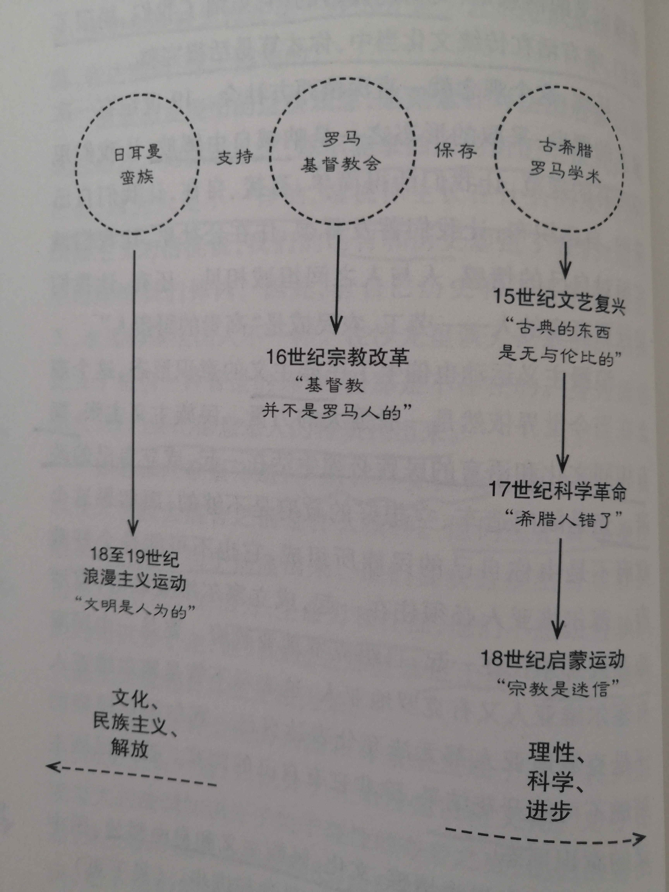

# 《你一定爱读的极简欧洲史》书籍分析笔记

## 第2章 神性到理性，科学到浪漫 —— 近代欧洲

### Q1：这一章的内容是什么？

介绍欧洲近代历史，包括文艺复兴、宗教改革、科学革命、启蒙运动和浪漫主义运动等。

### Q2：这一章的大纲是什么？

- 15世纪文艺复兴
  - 重视人的力量
  - 「古典的东西是无与伦比的」
- 16世纪宗教改革
  - 马丁·路德
  - 因信称义、反求诸己
  - 「基督教并不是罗马人的」
  - 天主教与新教从相残到相容
- 17世纪科学革命
  - 日心说
  - 万有引力定律
  - 「希腊人错了」
- 18世纪法国启蒙运动
  - 将理性用于人类生活
  - 百科全书
  - 「宗教是迷信」
  - 相信进步
- 18—19世纪浪漫主义运动
  - 德意志的浪漫主义运动
    - 寻找德意志人的特质
    - 走向平民百姓
  - 「文明是人为的」
  - 情感、文化、民族主义和自由解放

### Q3：作者想要解决什么问题？

### Q4：这一章的关键词是什么？

### Q5：这一章的关键句是什么？

#### 文艺复兴的古典主张

- 文艺复兴的改变在于不再使用古代知识来支持基督教会的神学，而是有很多学者，主要是在教会体系之外，向往希腊和罗马在创造这些知识时的世界样貌而意图加以拟造。

- 宗教不该钳制生活和思想的一切，而这正是教会一贯的目的。

- 随着文艺复兴来到，欧洲社会开启了它漫长的**世俗化**过程。
  - 宗教属于私人事务
  - 宗教不能左右社会，不能强制每个人遵守规定和仪式，也不能宰制思想

#### 马丁·路德之时势英雄

- 宗教改革的目的，是要基督教会回复到尚未罗马化之前的样貌。

- 在中世纪，大部分的神父、主教和总主教加入教会，并不是因为宗教情怀或特别虔诚；他们加入教会，**是因为它是当时最庞大也最有钱的组织**。

- 《圣经》是以拉丁文书写，因而极少人能够阅读。教会说，自己是第一个也是最后一个解读《圣经》的权责单位。

- 「因信称义」是路德教派的中心教义
  - 保罗说：「你只要相信耶稣基督就能得救。」
  - 马丁·路德从这句话里做出推论：「你根本不必做任何事就能得救，尤其不必对神父的指示言听计从。你只要相信上帝、抱持信仰就行了。」
  - 这算是一种**反求诸己**的宗教。

- 宗教改革运动，是以《圣经》的训示和教诲为据，对罗马教廷进行改革的运动。它希望重塑早年的教会生活。

- 宗教改革所带来的信息是：**基督教并不是罗马人的宗教。**

- 被教会视为异端的马丁·路德逃过受火刑烧死的劫数
  - 拜印刷术发明所赐，马丁·路德对教会的批评和谴责立即被印成文字，传遍了整个欧洲
  - 马丁·路德攻击罗马教廷，德意志王侯见猎心喜

#### 两派人马从相残到相容

- 文艺复兴 vs 宗教改革
  - 都是**向过去看齐**的运动
  - 意图都是将欧洲这个混合体的某个部分分离出来
  - 文艺复兴着眼的是**古希腊和罗马的智识成就**，新教改革者则是频频回顾**罗马教廷承袭罗马习性之前的基督教会**。

- 天主教教会保存的文献在这两个运动中都占有核心地位
  - 它所保存的希腊和罗马学术，被文艺复兴运动拿来规避它对知识的钳制
  - 它所创造并予以神圣化的《圣经》，被新教改革者拿来颠覆它的神学和单一性

#### 牛顿、达尔文让谁低头

- **相信进步**，是17世纪科学革命的结结果。这段时期是现代科学的发轫期。（伍注：相信进步，是指相信世界会变得更好——比古典时代更好。这意味着不再盲目崇拜古典文化）

- 万有引力定律提醒我们：
  - **数学确是科学的中心**，希腊人的直觉果然是对的——这个世界是简单的，它的运行规则可以用数学来表达。
  - 17世纪的科学家推翻了希腊的宇宙说，但他们之所以推翻得了，用的还是希腊的数学方法。

- 科学革命带来的信息是：**希腊人错了。**

- 这是西方普遍面对的困境：我们很聪明，可是我们不断在发现自己的无足轻重。
  - 人类并不是宇宙的中心；人类其实微不足道
  - 人类跟猿猴来自同一个祖先；人类不是什么特别的生物，我们只是借由一种偶然机制，从动物王国里繁衍出来的后代

#### 法国启蒙运动——你会在哪里找到「上帝」？

- 相信理性
  - 启蒙运动的驱动力：以理性为尊的渴望——我们可以把这份理性用于人类生活，让它得到脱胎换骨的改善。
  - 启蒙运动的目的：发挥理性，将它运用在政府、道德观念、神学和社会的改造上。

- 百科全书
  - 法国启蒙运动的伟大成果，是汇整出一部百科全书。
  - 它的根本不同在于将理性用于一切事物，让知识领域里没有层级之分。

- 启蒙运动的信息是：**宗教是迷信。**
  - 跟着理性和科学走，未来就有进步。

- 相信进步 vs 相信循环
  - **进步是个新观念**
  - 古代的人不相信有进步这回事。他们相信天道循环，由荣就有枯；所有的组织和社会在轻壮之年都是蓬勃焕发、朝气十足，但之后就自然进入腐朽过程。

#### 「浪漫」源自德意志？

- 浪漫主义运动崇尚**感受、情绪以及所有强烈的情感**。

- 身为德意志人，我们要把德意志人的特质找出来 （伍注：这里也体现了民族主义）
  - 德意志人说，你不能拿抽象的词汇空谈人类和社会，因为人是不一样的，端视你生长在什么国家而定。
  - 浪漫主义的信徒说，我们的语言和历史塑造了我们，这些东西深植我们体内。
  - 知识分子开始搜集民俗文化

- 对于傲慢自大的法国知识分子关于理性的夸夸之言，他们的答复是：
  - 穿上你的靴子去走走路吧，走向平民百姓，走向农村耕民，记下他们的故事和歌谣，从中你会找到真正的启迪。

- 浪漫主义的信息是：**文明是人为的**，它束缚了我们、局限了我们，唯有活在传统文化当中，你才算是活得完整。

- 浪漫主义运动也催生了**民族主义**的意识形态。
  - 民族主义主张，拥有相同文化和语言的民族必须生活在一起，成立自己的政府。

- 浪漫主义 vs 启蒙运动
  - 启蒙运动崇尚理性、科学和进步，而浪漫主义与之背道而驰——它崇尚情感、文化、民族主义和自由解放

- 文艺复兴、宗教改革、科学革命、启蒙运动、浪漫主义运动，各以不同的方式削减了教会的权威。

  

### Q6：作者是怎么论述的？

### Q7：作者解决了什么问题？

### Q8：我有哪些疑问？

#### Q8.1 德意志与日耳曼的联系是什么？

### Q9：这一章说得有道理吗？为什么？

### Q10：如何拓展这一章？

#### Q10.1：为什么是这样的？为什么发展成这样？为什么需要它？

#### Q10.2：有哪些相似的知识点？它们之间的联系是什么？

#### Q10.3：其他领域/学科有没有相关的知识点？日常生活中有没有类似的现象？

### Q11：这一章和我有什么关系？

