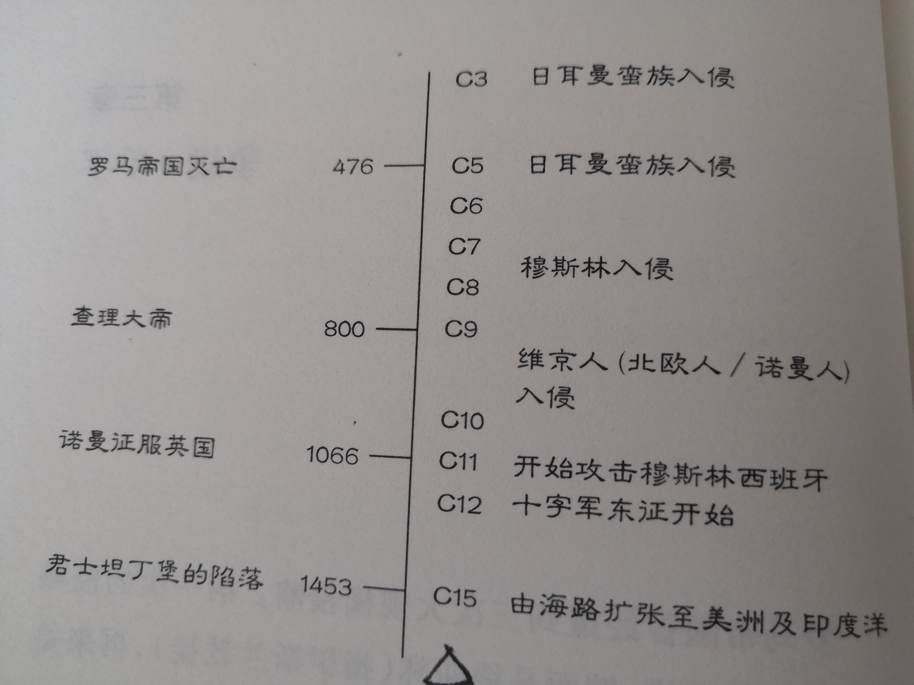

# 《你一定爱读的极简欧洲史》书籍分析笔记

## 第3章 争战一千年

### Q1：这一章的内容是什么

介绍欧洲中世纪的战争史。

### Q2：这一章的大纲是什么

- 日耳曼民族入侵罗马帝国
  - 从佣兵变事主
  - 罗马法令与日耳曼私刑并行
  - 日耳曼人支持罗马基督教会
- 日耳曼民族入侵英格兰
  - 盎格鲁、萨克森和朱特入侵英格兰
  - 英格兰成为异教之邦
- 穆斯林入侵东罗马帝国
  - 穆斯林入侵中东、北非、西班牙
  - 不信伊斯兰教就得纳税
  - 阿拉伯人保存和传播希腊学术
- 维京人入侵西欧
  - 掠夺、恐怖分子、制造恐慌
  - 诺曼底公爵威廉征服英格兰
- 十字军东征
  - 收复西班牙
  - 东征圣地耶路撒冷
  - 土耳其人攻占东罗马帝国

### Q3：作者想要解决什么问题

### Q4：这一章的关键词是什么

### Q5：这一章的关键句是什么

- 罗马帝国曾经遭到三次大规模侵略
  - 第一次：日耳曼蛮族
  - 第二次：穆斯林
  - 第三次：北欧人，或称维京人

- 欧洲的对外扩张
  - 十字军东征圣地
  - 将穆斯林逐出西班牙
  - 经由海上掠取世界各地的珍宝文物

  

#### 「法国」源自日耳曼民族

- 法兰克王国
  - 版图包括今天的法国，以及德国、西班牙和意大利的部分区域
  - 于查理大帝在位期间到达鼎盛，他死后王国便告分裂

#### 伊斯兰入侵，遇到「铁钟」

- 伊斯兰教
  - 始祖穆罕默德原为阿拉伯商人，得到神的天启后创立该教
  - 穆斯林深信穆罕默德是世上最后一位先知，能指引大家走向唯一真神安拉的怀抱
  - 穆斯林征服了波斯、中东、北非和西班牙，但被法兰西王国打败

- 阿拉伯人将希腊学术带到了西班牙。

- 三次征战的结果 （伍注：三次征战指日耳曼入侵罗马帝国、日耳曼入侵英格兰、穆斯林入侵罗马帝国）
  - 在西欧，日耳曼民族、古罗马和基督教因此熔于一炉
  - 整个英格兰被日耳曼蛮族占领，之后又回归基督教信仰
  - 在伊斯兰世界（中东、北非和西班牙），基督教完全隐没，但希腊学术被保存下来，且被传播到欧洲

#### 维京人横行两百年

- 维京人之所以能不断进袭却没有遭受抵抗，是因为政府力薄势弱。
  - 它们没有正常的征税体制
  - 西欧的小王国没有一个设有海军

- 维京人的入侵范围
  - 地图上可以看到他们的部落，广布在法国北部、英格兰和爱尔兰
  - 诺曼底公爵威廉带领一些随众于1066年征服了英格兰

- 外界对欧洲的侵略在10世纪后偃旗息鼓。现在，欧洲社会不但变得稳定，甚至强盛到可以远征去攻掠别人了。

#### 十字军东征

- 东征的目的
  - 首要任务是把穆斯林赶回他们的老家
  - 一开始是为了收复西班牙
  - 继而以夺回耶路撒冷为目标

- 十字军东征 vs 航海扩张
  - 十字军是**多国合作**的成果
  - 从15世纪开始跨海朝美洲和亚洲发展的扩张，则是几个新兴民族国家间的**竞赛**——
    首先是西班牙和葡萄牙，接着是英国、法国和荷兰

### Q6：作者是怎么论述的

### Q7：作者解决了什么问题

### Q8：我有哪些疑问

#### Q8.1 法兰克人与法国的联系是什么

#### Q8.2 查理大帝是哪个国家的皇帝

### Q9：这一章说得有道理吗？为什么

### Q10：如何拓展这一章

#### Q10.1：为什么是这样的？为什么发展成这样？为什么需要它

#### Q10.2：有哪些相似的知识点？它们之间的联系是什么

#### Q10.3：其他领域/学科有没有相关的知识点？日常生活中有没有类似的现象

### Q11：这一章和我有什么关系
