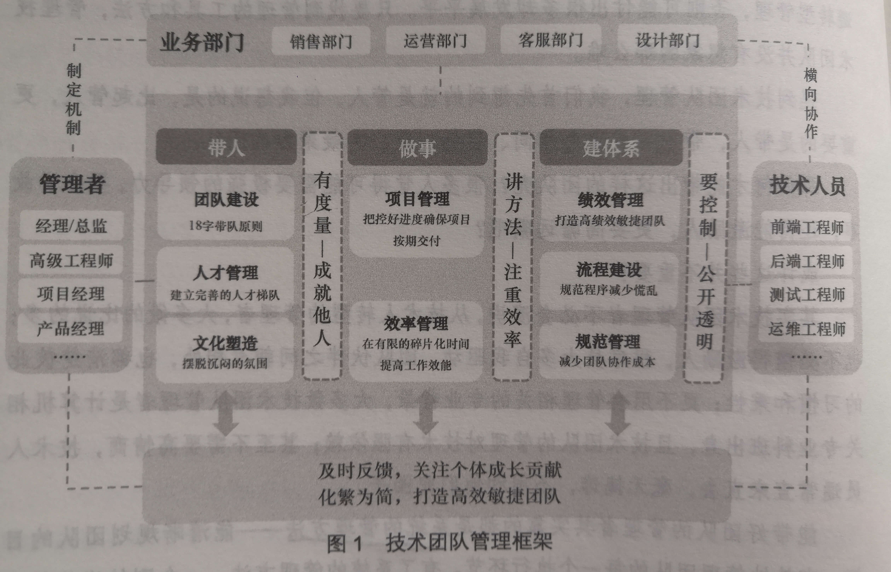
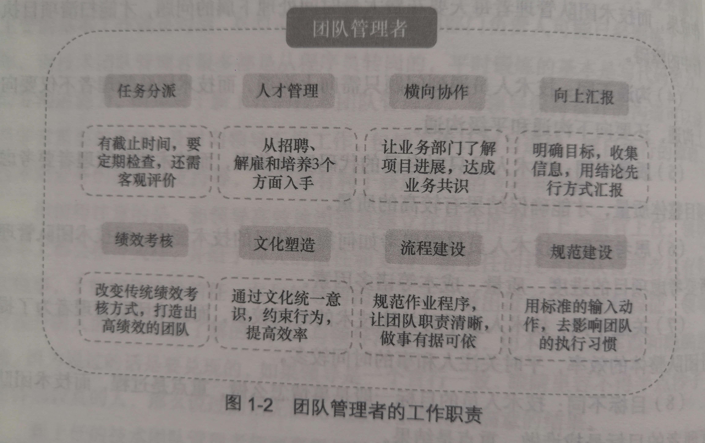

# 《技术团队管理者的第一堂管理课》分析笔记

作者：王海东

## Q1：这本书属于哪一类别的书？

管理学。

## Q2：这本书的内容是什么？

## Q3：这本书的大纲是什么？

### 一级提纲

- 第1章 团队建设
- 第2章 人才管理
- 第3章 文化塑造
- 第4章 项目管理
- 第5章 效率管理
- 第6章 绩效管理
- 第7章 流程建设
- 第8章 规范管理

### 二级提纲

- 第1章 团队建设
  - 1.1 新官上任
  - 1.2 角色认知
  - 1.3 带队原则

- 第2章 人才管理
  - 2.1 招聘
  - 2.2 解雇
  - 2.3 培养

- 第3章 文化塑造
  - 3.1 守一个「诚」字
  - 3.2 构建学习型组织
  - 3.3 在复盘中成长
  - 3.4 新人指南
  - 3.5 新人访谈
  - 3.6 周会
  - 3.7 坦然面对失败
  - 3.8 直言不讳

- 第4章 项目管理
  - 4.1 项目启动
  - 4.2 需求管理
  - 4.3 进度管理
  - 4.4 风险管理
  - 4.5 质量管理

- 第5章 效率管理
  - 5.1 提高时间质量
  - 5.2 高效地学习和工作
  - 5.3 精通技术，更要懂业务
  - 5.4 沟通管理

- 第6章 绩效管理
  - 6.1 认知绩效考核
  - 6.2 传统绩效考核的弊端
  - 6.3 敏捷的绩效考核
  - 6.4 责任
  - 6.5 价值
  - 6.6 成长

- 第7章 流程建设
  - 7.1 认知流程建设
  - 7.2 产品开发流程
  - 7.3 产品测试流程
  - 7.4 用例评审流程
  - 7.5 运维巡检流程

- 第8章 规范管理
  - 8.1 走出混乱
  - 8.2 bug 管理规范
  - 8.3 新人指导规范
  - 8.4 项目上线规范
  - 8.5 Git Flow 工作规范
  - 8.6 Git 和域名命名规范
  - 8.7 数据库使用规范
  - 8.8 产品需求登记规范
  - 8.9 需求评审纪要规范
  - 8.10 技术设计规范
  - 8.11 VPN 使用规范

## Q4：作者想要解决什么问题？

## Q5：这本书的关键词是什么？

## Q6：这本书的关键句是什么？

### 前言

- 能带好团队的管理者其实靠的都是系统的管理方法
  - 能清晰规划团队的目标
  - 有效地管理团队的每一个执行环节

- 技术团队管理者的核心工作是 **带人、做事、建体系**。
  - 带人：团队建设、人才管理、文化塑造
  - 做事：项目管理、效率管理
  - 建体系：绩效管理、流程建设、规范管理

> 伍注：「带人」这个词比「管人」好，「带人」表达出大家有着一个共同的前进目标的含义。

  

### 第1章 团队建设

- 团队管理者的工作职责
  - 任务分派、人才管理、横向协作、向上汇报、绩效考核、文化塑造、流程建设、规范建设

  

- 任务分派的5点注意事项
  - 所有分派的任务一定要有目标和截止时间。
  - 对任务阶段性成果要及时审查，并帮助团队成员解决执行中遇到的问题。
  - 不要做「老好人」，而要及时指正下属的问题，打造一支能打硬仗的团队。
  - 教会下属分析、解决问题的方法，避免他们陷入问题陷阱。
  - 对优秀的下属要及时给予肯定，激励他们做出更好的成绩。

> 伍注：有些小任务，组员的积极性不够，所以最好还是要制定截止时间。

### 第2章 人才管理

#### 2.1 招聘

- 行为面试法：基于 STAR 原则进行提问和考察
  - 情景（Situation）：项目在什么前提条件下，遇到了什么问题
  - 任务（Task）：项目要完成的任务及达到的目标是什么
  - 行为（Action）：要确保达到项目目标，采取了哪些行动
  - 结果（Result）：最终项目的结果如何，有什么收获

- 软素质
  - 在采用行为面试法之前，需要先确定招聘岗位的「软素质」。
  - 接下来需要设计考察这些「软素质」的问题。

#### 2.1.1 一些行为面试法中评估各项能力的常见问题

- 自驱力
  - 你长期坚持做一件事情，动力来自哪？
  - 你有没有改掉过一些不好的行为或习惯？
  - 请举一件在没有任何人帮助情况下，长期坚持才完成的工作？
  - 详细说一下你曾经设定的计划，结果如何？
  - 项目中有没有引进过新技术，对传统的工作方法进行了改进并极大提高了效率？
  - 你设定过哪些目标？是否有挑战性？为达成目标做了哪些关键举措？
  - 请讲一件给你带来极大满足感的事情，并说明原因。

- 责任心
  - 项目中你遇到的最大难题是什么？你坚持了多久才解决的？
  - 当你遇到的难题超出你的能力之外，且时间紧迫，你怎么办？
  - 当周边没有人看好你坚持的事情时，你怎么办？
  - 请你介绍一个压力最大的项目，过程是怎样的？你在其中做了什么工作？
  - 请你介绍一个被领导误解，你却坚持做完并完成得很出色的项目。
  - 如果你中途放弃一件事情，会有哪些原因？
  - 工作中哪些事情的失败会让你无法忍受？

- 兴趣度
  - 你是如何保持对工作的激情的？
  - 你是如何学习新技术的？
  - 你对工作中的哪些事情最有兴趣？
  - 你坚持最长的一个习惯是什么？
  - 对于你自己认为最成功的一段工作经历，你在其中做了什么？
  - 你如何对头衔、薪水、工作环境、领导、工作内容这几项的优先级进行排序？

> 伍注：这个面试问题清单值得参考。

#### 2.2 解雇

- 从某种意义上讲，一个没有亲自解雇过下属的技术团队管理者是没有资格独立进行招聘面试的。
  - 因为一个技术团队管理者如果没有经历过解雇下属，就很难体会到解雇的难处，
    进而更不知道招聘时需要多么谨慎。
  - 把「宁缺毋滥」作为招聘的底线

- 自检清单
  - 反思：员工是如何被招聘进来的
  - 指导：任务安排后是否对他进行过技术方案的指导
  - 指正：管理者及时跟员工沟通，让对方认识到自身的不足，并做好相应的改进措施
  - 转岗
  - 解雇

> 伍注：管理者需要对员工的表现负一定责任。

### 第3章 文化塑造

#### 3.4 新人指南

- 新人指南清单的内容包括：
  - 产品篇、账号篇、环境篇、流程篇、规范篇、制度篇、技术篇、安全篇、工具篇和经验篇。

- 新人指南
  - 产品指南
    - 项目介绍、项目进度、产品职责明细、评审规范、评审流程、版本编号规则等。
  - 账号指南
    - 包括账号的申请、审批、开通、分配、使用和删除等规范。
    - 账号包括邮箱、wiki 知识系统、禅道系统、Git 代码仓库、VPN、Jenkins、服务器环境、数据库、Redis、MQ、ZK等。
  - 环境指南
    - 开发环境、测试环境、预发布环境和生产环境的使用说明及注意事项等。
  - 流程指南
    - 产品设计流程、研发流程、测试流程、上线流程、服务器使用流程、禅道使用流程、复盘流程等。
  - 规范指南
    - bug 处理规范、新人培养规范、项目上线规范、
    - Git Flow 工作规范、Git 和域名命名规范、数据库使用规范、
    - 产品需求登记规范、需求评审纪要规范、运维安全规范、技术设计规范、VPN 使用规范等。
  - 制度指南
    - 周会与周报制度、产品设计制度、安全制度、代码评审制度、需求设计制度、绩效考核制度等。
  - 技术指南
    - 技术栈及应用、项目结构、数据库设计说明、设计模式、技术架构说明、第三方框架应用说明等。
  - 安全指南
    - VPN 使用安全、运维安全、项目上线安全、网络安全、账号安全、系统安全等。
  - 工具指南
    - 邮件、通信工具、数据库、IDE、JDK、Maven、Tomcat、抓包工具、Office、Vision 等工具的下载和使用说明。
  - 经验指南
    - 分享、纪要、调研、资料、面试考察点和前沿信息等。

> 伍注：
> 1. 这个新人指南清单比较全面，值得参考。
> 2. 由于这个清单十分全面，需要投入不少人力和精力才能完成。最好能够分工合作，并共同分享。

### 第6章 绩效管理

- 我的团队有一个黄牌制度
  - 在一个季度内没有任何成长且没有犯过任何错误的人将会得到一个黄牌警告。

- 要帮助团队成员制订一份成长计划
  - 首先，知道对方当前的能力阻碍
  - 其次，客观评估预期目标
  - 再次，时间周期内设定关键动作
  - 最后，考核指标要可衡量

> 伍注：打算在组内实施这个制度。

## Q7：作者是怎么论述的？

## Q8：作者解决了什么问题？

## Q9：我有哪些疑问？

## Q10：这本书说得有道理吗？为什么？

## Q11: 这本书讨论的知识的本质是什么？

## Q12: 这本书讨论的知识的第一原则是什么？

## Q13：这本书讨论的知识的结构是怎样的？

## Q14：这本书讨论的知识为什么是这样的？为什么发展成这样？为什么需要它？

## Q15：有哪些相似的知识？它们之间的联系是什么？

## Q16：其他领域/学科有没有相关的知识？日常生活中有没有类似的现象？

## Q17: 这本书对我有哪些用处/帮助/启示？

- 流程体系建设需要投入较多时间和精力，对于小部门来说难以面面俱到，最好在大一级的部门分工合作，并相互分享。

- 新人指南清单值得参考。

- 行为面试法和「软素质」的面试问题清单值得参考。

- 技术团队管理者需要对员工的离职负一定责任：入职应该全面考察、工作应该耐心指导、及时帮助改正错误等。

- 黄牌制度、制定成长计划
  - 针对的问题是：团队技术成长慢，组员业余时间不怎么看技术、也很少看书。

## Q18: 我如何应用这本书的知识去解决问题？
