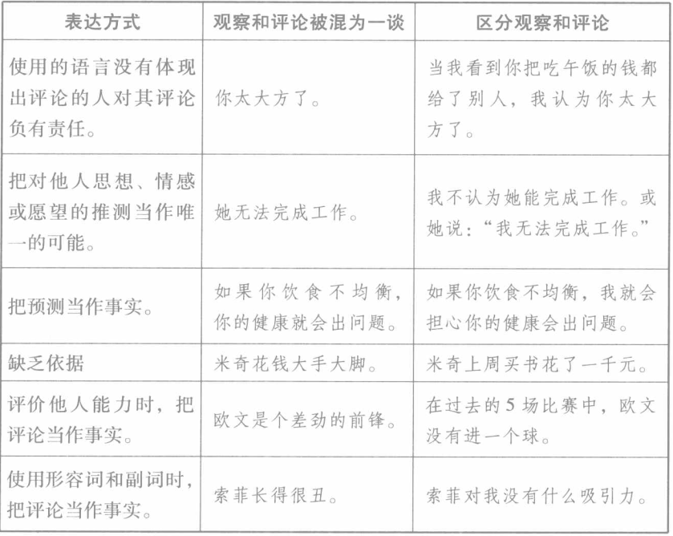

# 《非暴力沟通》分析笔记

## 第三章 区分观察和评论

### Q1：这一章的内容属于哪一类别？

心理学/沟通技巧。

### Q2：这一章的内容是什么？

### Q3：这一章的大纲是什么？

- 人类智力的最高形式
- 区分观察和评论
- 小结
- 非暴力沟通实例：「我们遇到的最傲慢的演讲者」

### Q4：作者想要解决什么问题？

### Q5：这一章的关键词是什么？

### Q6：这一章的关键句是什么？

- 并非不作评论
  - 非暴力沟通并不要求我们保持完全的客观而不做任何评论。
  - 它只是强调区分观察和评论的重要性。

- 只是不要将评论和观察混为一谈
  - 将观察和评论混为一谈，人们将倾向于听到批评，甚至会产生逆反心理。

#### 人类智力的最高形式

- 印度哲学家克里希那穆提曾经说：“不带评论的观察是人类智力的最高形式。”

- 不带评论的观察的难度
  - 对于大多数的人来说，观察他人及其行为，而不评判、指责或以其他方式进行分析，是难以做到的。

#### 区分观察和评论

- 一些区分观察和评论的例子

  

- 如果我们的表达言过其实，别人就可能产生逆反心理，而不愿做出友善的回应。

- “总是”、“从不”、“经常”和“很少”这样的词语可能混淆观察和评论。

### Q7：作者是怎么论述的？

### Q8：作者解决了什么问题？

### Q9：我有哪些疑问？

### Q10：这一章说得有道理吗？为什么？

### Q11: 这一章讨论的知识的本质是什么？

### Q12: 这一章讨论的知识的第一原则是什么？

### Q13：这一章讨论的知识的结构是怎样的？

### Q14：这一章讨论的知识为什么是这样的？为什么发展成这样？为什么需要它？

### Q15：有哪些相似的知识？它们之间的联系是什么？

### Q16：其他领域/学科有没有相关的知识？日常生活中有没有类似的现象？

### Q17: 这一章对我有哪些用处/帮助/启示？

### Q18: 我如何应用这一章的知识去解决问题？
